<body style="background-color:WhiteSmoke;"></body>

## Índice

1. [Aspectos tecnológicos: Leyes de Moore y de Dennard](#Punto1)
2. [Clasificación de Flynn. Principales figuras de mérito](#Punto2)
3. [Aspectos paralelos: Leyes de Amdahl y Gustafson](#Punto3)
4. [De sistemas empotrados a supercomputadores](#Punto4)
5. [Bibliografía](#Bibliografia)

## Aspectos tecnológicos: Leyes de Moore y de Dennard 

### Arquitectura de computadores

La arquitectura de un computador está compuesta por:

- ISA (Instruction Set Architecture)
  
  - Conjunto de instrucciones que pueden ser ejecutadas por el procesador.
  
  - Ejemplos: x86, ARM, RISC-V

- Microarquitectura
  
  - Cómo se implementan las instrucciones del ISA

- Diseño tecnológico del sistema, es decir, el hardware

### Un resumen de la evolución de las microarquitecturas

- Monociclo: Simple, pero eficiente

- Multiciclo

- Segmentación
  
  - Permite la ejecución **solapada** de varias instrucciones
  
  - Deben realizarse **detenciones** debido a los riesgos y **dependencias**.

- Explotando el ILP
  
  - Superescalares, Superpipelinning...
  
  - MultiThreading, Vectorización...

- **CMPs** (multiprocesadores en un chip)

- GPUs, DSPs, TPUs, XPUs (aceleradores)

- Supercomputadores

### Transistores y Cables

Denominamos **tamaño característico** (*Feature size*) al tamaño mínimo del transistor en la dimensión *X* o *Y* (aunque habitualmente son la misma ya que suelen ser cuadrados). En el año 1971 este tamaño era de 10 micras, en el año 2019 ya se había reducido a tan solo **10 nanómetros**.

El tamaño del transistor escala linealmente, es decir, el retardo en los cables no mejora con el tamaño característico. La densidad de integración escala cuadráticamente.

**Densidad de Integración** : Número de componentes electrónicos implantados por unidad de superficie en un circuito integrado, sea cual sea su tamaño.

### Tendencias en tecnología

- Circuitos Integrados (Ley de Moore)
  - Densidad de los transistores: +35% al año.
  - Tamaño del chip (dado): +10-20% al año.
  - Mejora global: 40-55% al año.
- Capacidad DRAM: +25-40% al año (enlenteciéndose)
  - 8 Hb (2014), 16 Gb (2017), 32 y 64 Gb (2019).
- Capacidad Flash: +50-60% al año
  - Es de 8 a 10 veces más barato el bit que en DRAM.
- Capacidad de los Discos Duros (HDDs): recientementa ha bajado al 5% el año
  - No es posible mejorar la densidad, quizás pasar de 7 a 9 discos.
  - Es de 8 a 10 vecesa más barato el bit que en las memorias Flash.

### La ley de Moore (1965)

Se trata de una ley empírica formulada por el cofundador de Intel, Gordon E. Moore.

> La industria podrá poner el doble de transistores en un chip cada 18-24 meses.

Esta *ley* se cumplió durante los años 1955-2005 gracias a la ley de Dennard: 

> A medida que los transistores se hacen más pequeños, la densidad de potencia consumida por el circuito se mantiene constante.

Es importante destacar que en parte esta ley se *hizo cumplir*, ya que en realidad los transistores podrían haber reducido su tamaño con menos de 18 meses de diferencia, pero esto interesaba a Intel de cara a sus inversores.

### La ley de Dennard (1974)

La ley de Dennard (*Dennard scaling*), también conocida como *MOSFET scaling*, fue propuesta en un artículo de 1974 escrito por Robert H. Dennard junto a otros autores.

> Conforme los transistores van escalando, es decir, haciéndose más pequelos, la densidad de potencia que consumen permanece constante.

Siendo la densidad de potencia:

$$
\frac{potencia}{área}\frac W {cm^2}
$$

Ejemplo:

Si suponemos una reducción lineal en el tamaño de los transistores en un factor de 2x, habrá una reducción en el área ocupada por cada transistor igual de 4x. Por lo tanto, podré poner 4x más transistores.

La ley de Dennard predice que la potencia disipada por cada transistor disminuye también en un factor de 4x (gracias a que disminuye el voltaje y la corriente). Es decir, el chip consume lo mismo mientras sea del mismo tamaño.

### Consecuencias Dennard & Moore

Cuando el [tamaño característico](#TamañoCaracteristico) del transistor se reduce por un factor de $x$, el número de transistores en el chip aumenta por $x^2$, y el tamaño dado del chip también podría aumentar hasta un facor ~$x$. Por lo tanto, ¡el rendimiento "bruto" del chip podría aumentar por ~$x^4$!

Es decir, podíamos tener $x^3$ más transistores, que se dedicaban a:

- Paralelismo: ILP (y últimamente vectorial)

- Localidad: cachés

Además, el *clock rate* (o frecuencia de funcionamiento) podía mejorar hasta ~$x$, porque los transistores pueden cambiar de estado más rápido.

Gracias a estas mejoras, la mayoría de los programas se ejecutaban $x^2$ veces más rápido sin tener que cambiarlos.

Los procesadores (CPUs) doblaban su velocidad cada 18-24 meses si teníamos una miniaturización de $\sqrt 2$.

### Problemas (*Walls*)

Al reducirse el tamaño de los transistores (10 nm actualmente) y mantenerse constante el tamaño del chip en torno a 2-4 cm$^2$, caben más transistores y memoria caché en un procesador, sin embargo, aparecen los siguientes problemas:

- [Potencia consumida](#ProblemaPotencia)

- [Bajo paralelismo a nivel de instrucciones (ILP)](#ProblemaILP)

- [Memoria: latencia y ancho de banda](#ProblemaMemoria)

- [Fiabilidad](#ProblemaFiabilidad)

#### Potencia, energía y temperatura

La **energía** es el consumo (gasto) de potencia a lo largo del tiempo, se mide en **Julios** ($J = W·s$) o kWh (kW gastados en 1 hora):

$$
Energía_{dinámica}∝ \frac {1}{2}\ CargaCapacitiva\ ·\ V^2
$$

**Nota**: El símbolo ∝ representa que algo es [proporcional](https://en.wiktionary.org/wiki/∝).

La **potencia** (eléctrica) debe ser traída y distribuida a lo largo del chip, de ahí el número de pines y las diversas capas (*layers*) que tiene el chip. Se mide en Vatios ($W = J/s$):

$$
Potencia_{dinámica}∝ \frac {1}{2}\ CargaCapacitiva\ ·\ V^2\ ·\ FrecuenciaCambio
$$

$$
Potencia_{estática}∝ \frac {1}{2}\ Corriente_{estática}\ ·\ V
$$

#### Problema de la potencia 

Componentes de la potencia:

$$
Potencia_{dinámica}∝ \frac {1}{2}\ CargaCapacitiva\ ·\ V^2\ ·\ FrecuenciaCambio
$$

$$
Potencia_{estática}∝ \frac {1}{2}\ Corriente_{estática}\ ·\ V=\frac {1}{2}\ Corriente_{fuga}\ ·\ NTransistores\ ·\ V
$$

Inicialmente, solo se tenía en cuenta la **Potencia Dinámica**, ya que la componente **Estática** era casi despreciable.

Al no poder bajar el voltaje mucho más de ≈0.5V, la densidad de potencia empezó a aumentar (se dejó de cumplir la ley de Dennard):

- La $P_{dinámica}$ aumenta porque se sigue aumentando la frecuencia.

- La $P_{estática}$ aumenta porque el número de transistores sigue creciendo.

- En la actualidad, la potencia estática puede estar en torno al 25-50% de la potencia total.

#### Potencia, energía y temperatura

La potencia y la temperatura están directamente relacionadas:

- El procesador disipa potencia que se emite en forma de calor cada segundo. Esta potencia incrementa la temperatura del procesador.

- Hay que evitar que la temperatura se incremente demasiado disipando la energía emitida.

La **potencia de diseño térmico** o TDP (*thermal design power*) se refiere a la potencia máxima disipada por el procesador suponiendo un uso sostenido (a máximo rendimiento). Se utiliza como objetivo para la fuente de alimentación y el sistema de refrigeración.

#### ¿Cómo reducir la potencia?

Técnicas habituales para reducir la potencia disipada:

- Reducir la frecuencia del reloj dinámicamente para limitar el consumo de energía.

- Reducir el voltaje dinámicamente cuando se reduce la frecuencia.

- Haciendo un apagado selectivo de zonas del procesador (p.ej: núcleos).

- Situando en estados de bajo consumo de energía las memorias, los discos duros, etc.

#### El problema de la densidad de potencia

La potencia se disipa en forma de calor. La **densidad de potencia** ($W/cm^2$) es proporcional a la temperatura y determina la existencia de puntos calientes.

La CPU Intel 80286 disipaba unos 2 W, mientras que el actual Intel Core i7 a 3.3 GHz disipa unos 130 W.

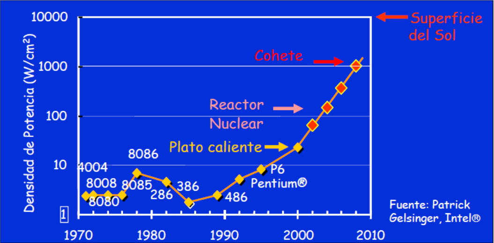

#### Rendimiento por potencia disipada

Otra métrica de interés es el rendimiento por vatio disipado (*FLOPs/watt*).

El objetivo es lograr tener 1 ExaFlop con un consumo de 20 MWatts, lo que equivale a unos 50 GFLOPs/Watt. Una central nuclear proporciona entre 50 y 1000 MWatts, una central hidroeléctrica entre 500 y 20000 MWatts.

En su momento, el [UNIVAC I](https://es.wikipedia.org/wiki/UNIVAC_I) tenía un consumo de 0.0015 FLOPs/Watt; en la actualidad:

- Kepler K80 (GPU): 9.8 GFLOPs/Watt

- Pascal chips P100 (GPU): 17.6 GFLOPs/Watt

- Knights Landing (CPU): 5.8 GFLOPs/Watt

- Xeon (CPU): menos de 5 GFLOPs/Watt

#### Eficiencia energética

La **energía** es la potencia consumida durante un tiempo determinado ($1\ J = 1\ W·s$). Estando relacionadas, la métrica correcta para comparar procesadores es la de la energía (**eficiencia energética**). En concreto, el consumo de energía está relacionado con la realización de una determinada tarea en un tiempo determinado con un procesador determinado.

Por ejemplo: un procesador A podría tener un 20% más de potencia disipada (watts) que el procesador B, pero si A ejecuta la tarea en un 70% del tiempo de B, el consumo de energía será: $1,2 · 0,7 = 0,84$ lo que representa un 16% de mejora energética para el procesador A.

#### Problema del calor (temperatura)

Las soluciones de *cooling* para altas frecuencias son o caras o poco prácticas.

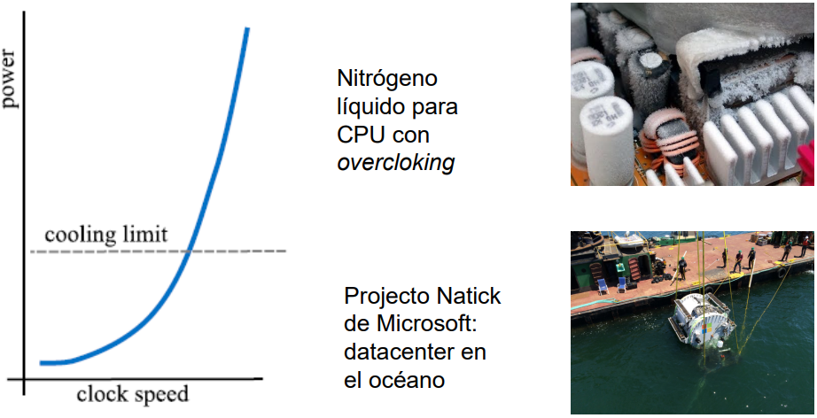

#### El problema de aumentar el [ILP](https://en.wikipedia.org/wiki/Instruction-level_parallelism) 

El **tiempo de ejecución** se define como:

$$
TiempoEjecución=NI·CPI·\frac {1}{FrecuenciaReloj}
$$

Para disminuir el CPI podemos:

- Aumentar el bus de datos

- Hacer segmentación (pero a partir de las 10 etapas aparecen muchos conflictos)

- Replicar cauce, lo que da lugar a una **ejecución superescalar** (ejecutar más de una instrucción por ciclo de reloj):
  
  - Se produce una [ejecución fuera de orden (OoO)](https://es.wikipedia.org/wiki/Ejecución_fuera_de_orden) y especulativa (predicción de saltos)
  
  - Hay que ser muy eficiente para resolver los frecuentes riesgos de datos y de control
  
  - Se utiliza mucho hardware, lo que provoca que se consuma mucha energía

#### El problema de la memoria 

La mejora de las CPUs es más rápida que la mejora en el tiempo de acceso a la memoria RAM, por lo que cada vez las instrucciones pierden más ciclos esperando a la memoria (latencia).

La ejecución fuera de orden (OoO) solo puede mitigar parcialmente este problema. La mejora en el ancho de banda de memoria (número de canales entre la CPU y la memoria) tampoco puede solucionar este problema.

#### El problema de la fiabilidad 

Es necesario un sistema de **tolerancia a fallos**, ya que, al ser los componentes cada vez más pequeños, son más sensibles a las partículas cargadas en el ambiente (pudiéndose cambiar 0 por 1 y viceversa), dando lugar a fallos. Cada vez es más complicado que no falle una parte del circuito debido a la miniaturización.

En la actualidad, es común tener memorias y cachés con soluciones ECC (*Error Correction Code*). Pero por otro lado, cada vez es más complicado comprobar un nuevo diseño para la (micro)arquitectura de un procesador.

Métricas:

- Tiempo medio hasta un fallo ($MTTF$)

- Tiempo medio para reparaciones ($MTTR$)

- Tiempo medio entre fallos ($MTBF$) = $MTTF + MTTR$

- Disponibilidad = $\frac {MTTF}{MTBF}$

#### Otros problemas de diseño monolítico

Adicionalmente, el procesador presenta los siguientes problemas importantes:

- ***Clock skew* (sesgo de reloj)**: Un procesador es un circuito que funciona síncronamente. Los transistores reciben y alteran la señal de reloj, por lo que, al haber muchos transistores, puede haber modificaciones perceptibles en la señal de reloj.

- **Problemas eléctricos**: impedancia y capacitancia.

Esto da lugar al fenómeno conocido como [***Dark silikon***](https://en.wikipedia.org/wiki/Dark_silicon): no podremos utilizar una parte del procesador como consecuencia a estos problemas.

### Solución: CMPs (*Chips Multiprocessors*)

- **Potencia**: Con núcleos más pequeños se puede reducir la frecuencia y el voltaje para conseguir un mismo rendimiento, por consiguiente, varios núcleos pueden alcanzar más rendimiento/watt.

- **ILP**: El CMP tiene más transistores útiles que el diseño de un único procesador, lo que permite obtener un mejor rendimiento.

- **Memoria**: Se usan nodos NUMA, con localidad y menor latencia. Además, cada núcleo usa su caché privada (L1 y L2, habitualmente).

- **Fiabilidad**: También mejoran la fiabilidad del chip por tener redundancia entre los núcleos, y usar un mismo diseño para los diferentes núcleos.

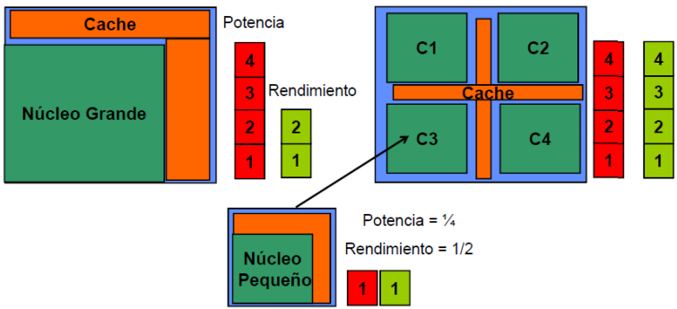

Ventajas:

- [x] En los CMP, cada núcleo cuenta con su propio reloj, así que **desaparece** el sesgo de reloj y se **mitigan** los problemas eléctricos.

- [x] Es más fácil verificar y validar el funcionamiento de varios chips simples que el de uno muy complejo (*time-to-market*).

- [x] **Redundancia y tolerancia a fallos**: Al tener los CMPs varios núcleos, podemos dedicar uno o varios de ellos a comprobar lo que hacen los otros (redundancia).

Por tanto, se consigue un mayor rendimiento con menos consumo energético y teniendo que disipar menos calor.

### CMPs: explotando el paralelismo

A varios niveles:

- ILP, especulación y réplica de cauces.

- Vecotres: Una instrucción sobre múltiples datos.

- Núcleos/hilos: Múltiples instrucciones sobre múltiples datos.

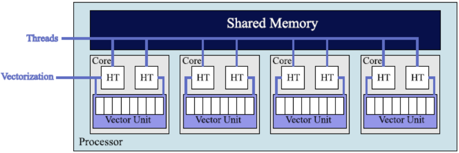

### La ley de Moore reinterpretada

- El número de núcleos por chip se puede doblar cada 2 años.

- La frecuencia de reloj ya no se va a incrementar (de hecho, posiblemente se decremente).

- Es necesario manejar el paralelismo:
  
  - Dentro del núcleo (*intra-core*): ILP y **unidades vectoriales**.
  
  - Entre los diversos núcleos (*inter-core*): **Múltiples núcleos** en el procesador.

Actualmente necesitamos manejar procesadores con miles y millones de hilos de forma concurrente.

### Evolución de los microprocesadores

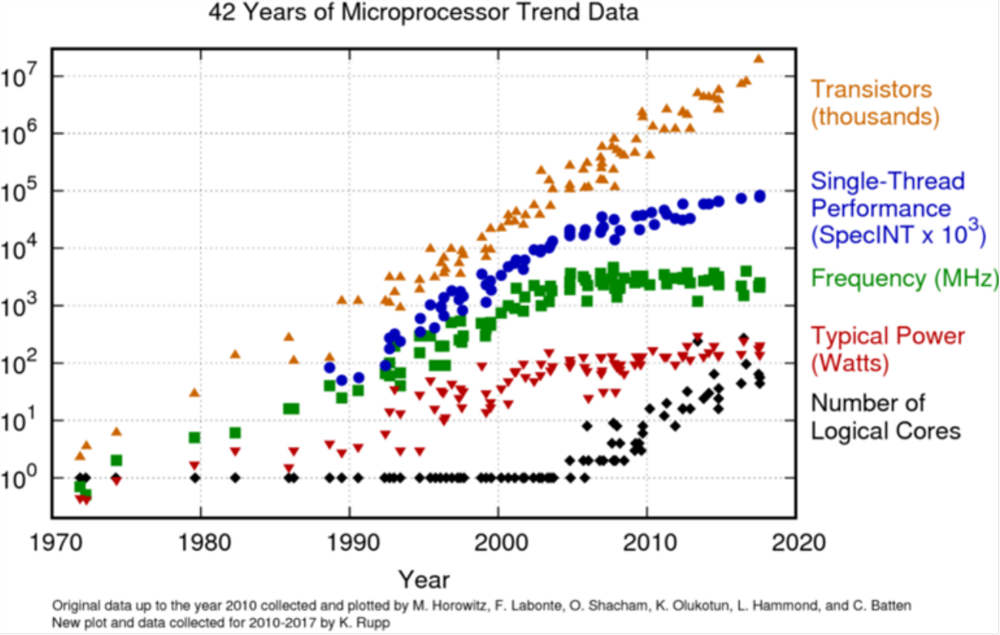

### Rendimiento de un único procesador

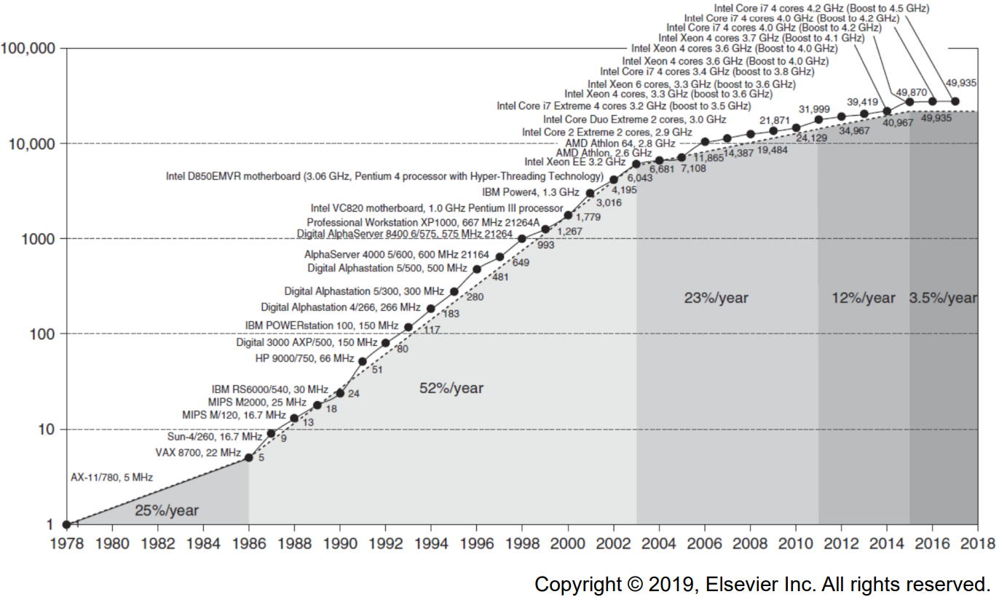

## Clasificación de Flynn. Principales figuras de mérito 

### Clasificación de arquitecturas

Taxonomía de Michael J. Flynn (1972):

- **SISD**, *Single Instruction Single Data*
  
  - Sistemas monoprocesador basados en microprocesadores monocore como PCs antiguos (no CMPs).

- **SIMD**, *Single Instruction Multiple Data*
  
  - Procesadores vectoriales, GPUs.

- **MISD**, *Multiple Instruction SIngle Data*
  
  - Ninguna máquina comercial existente.

- **MIMD**, *Multiple Instruction Multiple Data*
  
  - Arquitectura adoptada por los computadores de hoy en día.
  
  - Procesadores multinúcleo, clusters, servidores, supercomputadores, etc.

### MIMD: Memoria compartida o distribuida

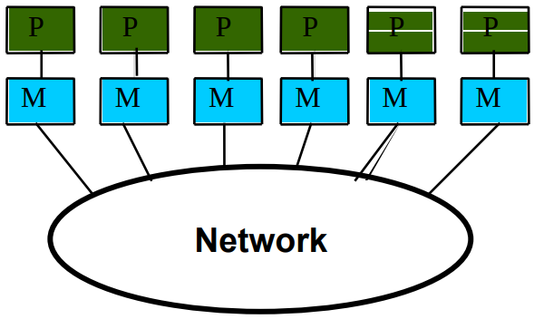

En la **memoria distribuida** cada procesador tiene su propia memoria local. Para comunicar datos se necesita usar explícitamente instrucciones de paso de mensajes (por ejemplo, un [clúster](http://www.revista.unam.mx/vol.4/num2/art3/cluster.htm)).

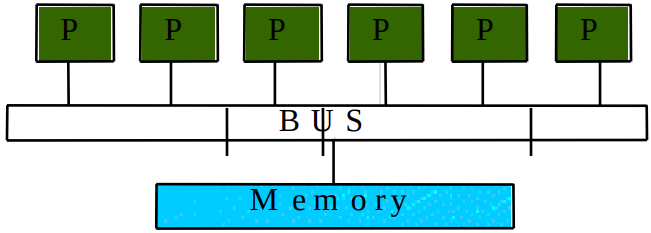

En la **memoria compartida** hay un único espacio de direcciones al que todos los procesadores tienen acceso. La comunicación de datos se realiza a través de operaciones típicas de lectura/escritura de datos (por ejemplo, la arquitectura multinúcleo). Se accede a la memoria:

- Bus, Crossbar

- Red directa (por ejemplo, una malla)

> 

### Niveles de paralelismo explícito

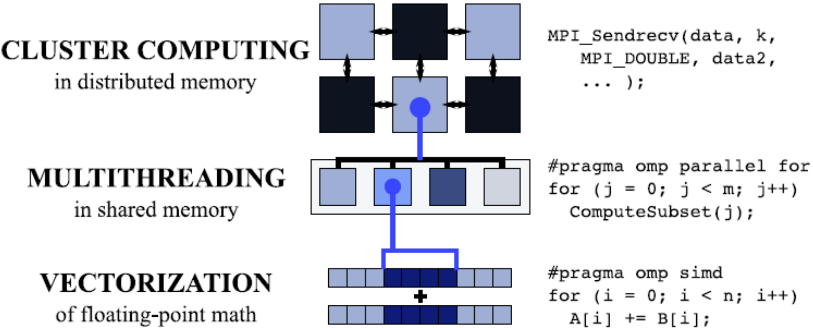

### Paralelismo

Clases de paralelismo en aplicaciones:

- Paralelismo de datos (DLP)

- Paralelismo de tareas (TLP)

Clases de paralelismo en arquitectura:

- Paralelismo de instrucciones (ILP, implícito o explícito)

- Arquitecturas vectoriales/Unidades de Procesamiento Gráficos (GPUs)

- Paralelismo de hilos (CMPs, varios hilos por núcleo, varios chips...)

### Principales figuras de mérito

- Métricas típicas de rendimiento:
  
  - Tiempo de ejecución
  
  - Productividad (*throughput*), a veces no interesa ser muy rápidos haciendo una cosa, sino poder hacer muchas cosas al mismo tiempo.

- Tiempo de ejecución:
  
  - Tiempo de reloj de pared: incluye todos los *overheads* del sistema.
  
  - Tiempo de CPU (solo tiempo de cálculo)

- Aceleración de X con respecto a Y:
  
  $$
  \frac {Tiempo_{ejecucion}Y}{Tiempo_{ejecucion}X}
  $$

- Benchmarks:
  
  - Kernels (por ejemplo, la multiplicación de matrices)
  
  - Programas de juguete (por ejemplo, sorting)
  
  - Benchmarks sintéticos (por ejemplo, Dhrystone)
  
  - Benchmarks suites (por ejemplo, SPEC06fp, TPC-C)

- Ecuación del rendimiento del procesador:
  
  $$
  CPU\ time = CPU\ clock\ cycles\ for\ a\ program\ ·\ Clock\ cycle\ time
  $$

$$
CPU\ time=\frac {CPU\ clock\ cycles\ for\ a\ program}{Clock\ rate}
$$

$$
CPI=\frac {CPU\ clock\ cycles\ for\ a\ program}{Instruction\ count}
$$

$$
CPU\ time = Instruction\ count\ ·\ Cycles\ per\ instruction\ ·\ Clock\ cycle\ time
$$

$$
CPU\ time=\frac {Instructions}{Program}·\frac {Clock\ cycles}{Instruction}·\frac {Seconds}{Clock\ cycle}=\frac {Seconds}{Program}
$$

- Instrucciones diferentes tienen diferentes CPIs

$$
CPU\ clock\ cycles=\sum_{i=1}^{n}IC_i\ ·\ CPI_i
$$

$$
CPU\ time=(\sum_{i=1}^{n}IC_i\ ·\ CPI_i)\ ·\ Clock\ cycle\ time
$$

- Ancho de banda (a veces productividad)
  
  - Es el trabajo total realizado en un tiempo determinado.
  
  - Hay una mejora de entre el 32000 y el 40000 para los procesadores.
  
  - Hay una mejora de entre el 300 y el 1200 para la memoria y HDs.

- Latencia o tiempo de respuesta
  
  - Es el tiempo entre el comienzo y el fin de un evento.
  
  - Una mejora de entre el 50 y el 90 para procesadores.
  
  - Una mejora de entre el 6 y el 8 de mejora para memoria y HDs.

- Algunos valores que nos interesa conocer:
  
  - El rendimiento pico (*peak performance*) hace referencia, normalmente, de forma exclusiva a las operaciones en coma flotante.
  
  - MFLOPS (*Mega Floating point Operations Per Second*): millones de instrucciones en coma flotante ejecutadas por segundo.
  
  - TDP (*Thermal Design Power*): potencia máxima que puede llegar a disipar.
  
  - Frecuencia

- Tamaños comunes:

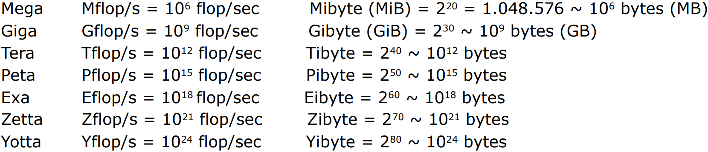

- A modo de referencia, el [ordenador más rápido del mundo](http://www.top500.org/) tiene alrededor de 442 PFLOPS, 7.63M de cores y un consumo de 29.899 MW.

- Otros aspectos relevantes también:
  
  - Frecuencia del reloj
  
  - Número de transistores
  
  - Tamaño de la caché (y niveles)
  
  - Cantidad de memoria direccionable
  
  - Ancho de banda del bus a memoria
  
  - Número de núcleos/hilos por chip
  
  - Tamaño de la litografía
  
  - Tamaño de los operandos

### Modelo de rendimiento *Roofline*

La idea es poner el rendimiento pico en coma flotante como función de la intensidad aritmética. Esto ofrece en un único valor el rendimiento de punto flotante y el rendimiento de memoria para una máquina de destino.

> Denominamos **intensidad aritmética** al número de operaciones en coma flotante por byte (u operando) leído de memoria. Es una propiedad de la implementación del algoritmo.

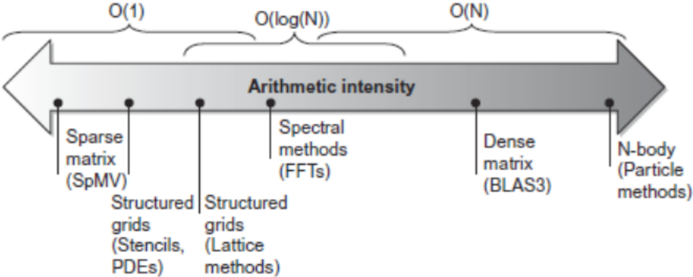

$$
GFLOPs/s = min(AnchoBandaPicoMemoria ×
IntensidadAritmetica, RendimientoPicoFP)
$$

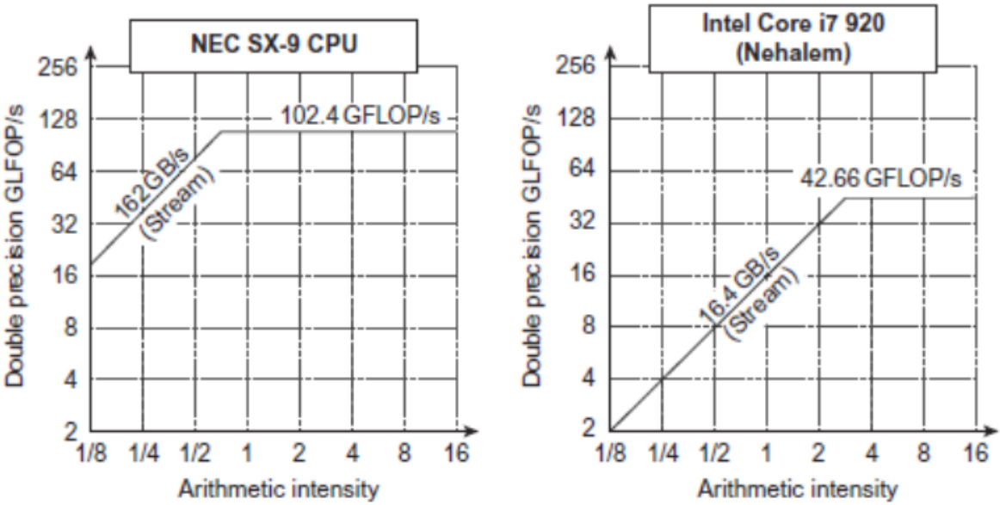

Esto significa que, aunque le pueda dar más datos de los que necesita, no puede hacer más. Es decir, con un procesador con más recursos, podríamos obtener más GFLOPs.

## Aspectos paralelos: Leyes de Amdahl y Gustafson 

### Paralelismo: *Speedup*

> La ganancia de prestaciones o *speedup* indica la medida en que se inrementan las prestaciones al ejecutar una aplicación en paralelo en un sistema con varios procesadores frente a su ejecución uniprocesador.

El *speedup* permite evaluar un computador paralelo, o la implementación de la aplicación paralela:

$$
S(p)=\frac {Rendimiento(p)}{Rendimiento(1)}=\frac {T_o}{T_p(p)}
$$

Donde:

- $S(p)$ es la aceleración o *speed-up* con *p* procesadores

- $Performance(p)$ es la velocidad con *p* procesadores (en FLOPS, MIPS, etc)

- $T_o$ es el tiempo de ejecución del programa secuencial (la mejor versión secuencial)

- $T_p(p)$ es el tiempo de ejecución del programa con *p* procesadores, puede verse como la suma de dos componentes:
  
  - $T_c(p)$, que es el tiempo de cómputo en paralelo de las tareas de la aplicación
  
  - $T_o(p)$, que es el tiempo de penalización o sobrecarga debido a: la comunicación/sincronización entre procesos, la creación/terminación de los procesos, y las operaciones añadidas en la versión paralela que no están presentes en la secuencial

$T_o$ será siempre mayor que $T_p$.

La escalabilidad se evalúa a partir de la representación de la ganancia (speedup) en función del número de procesadores.

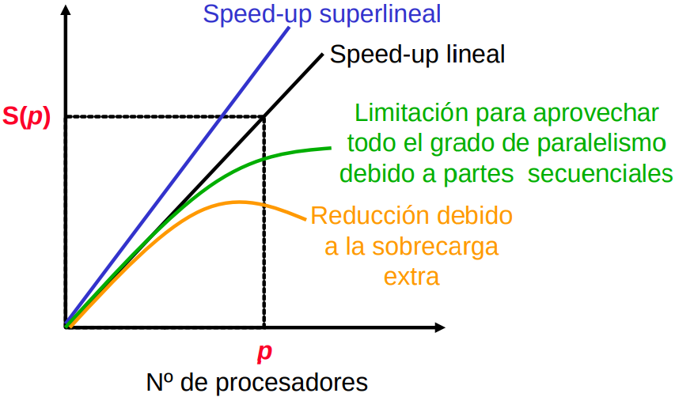

Lo normal es tener la curva verde, siendo la naranja la que más se aproxima a la realidad, ya que la coordinación entre programadores a la hora de hacer una aplicación da lugar a la sobrecarga.

Si ejecutamos una aplicación con varios cores, al tener cada uno su propia caché y hacer una parte de la aplicación, nos estamos ahorrando traer ciertos datos que en el caso de la ejecución con un solo core tendríamos que llevar de vuelta a memoria por falta de almacenamiento: esto se conoce como speedup lineal.

### Paralelismo: Límite teórico superior

Todos los programas paralelos tienen secciones paralelas y secciones secuenciales.

Las secciones secuenciales son debidas a varios procesadores que realizan el mismo trabajo (duplicación). Solo un procesador está haciendo algo útil, mientras que el resto espera a que este acabe sin hacer nada útil.

Las secciones secuenciales limitan la efectividad del rendimiento obtenido por el paralelismo, ya que la aceleración obtenida está en función de la cantidad de código secuencial que tiene una aplicación. Solo habrá aceleración perfecta si no hay parte secuencial. Esta idea se formaliza con la **ley de Amdahl**.

### Ley de Amdahl

La ley de Amdahl permite calcular el speedup conseguido gracias a una mejora que afecta a una parte de un proceso. Aplicándola a la paralelización, nos da una cota superior de la mejora que podemos obtener usando un cierto número de procesadores **manteniendo el trabajo total constante** (escalado **fuerte**).

> En el escalado **fuerte**, el problema no cambia, lo que hacemos es aumentar los recursos para hacerle frente (por ejemplo, más procesadores).

$$
S_{strong}=\frac {T_o}{T_p}
$$

Siendo $T_p$:

$$
T_p=f_s·T_o+\frac {f_p·T_o}{p}
$$

Sustituyendo $T_p$ en la primera fórmula y simplificando:

$$
S_{strong}=\frac {1}{1-f_p+\frac {f_p}{p}}
$$

Donde:

- $T_o$ es el tiempo original

- $T_p$ es el tiempo mejorado

- $f_p$ es la fracción mejorable (paralelizable) = $1-f_s$

- $f_s$ es la fracción no mejorable (secuencial) = $1-f_p$

- $p$ es el factor de mejora (número de procesadores)

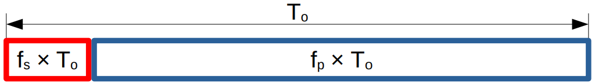    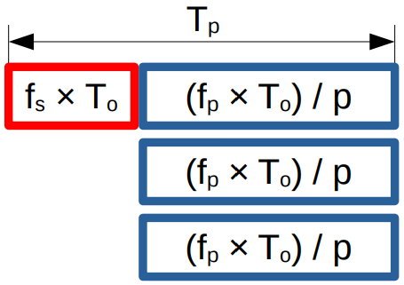

Suponiendo una paralelización ideal (todo el proceso es paralelizable):

$$
f_p=1-f_s=1
$$

$$
f_s=1-f_p=0
$$

$$
T_p=f_s·T_o+\frac {f_p·T_o}{p}=\frac {T_o}{p}
$$

$$
S_{strong}=\frac {1}{1-f_p+\frac{f_p}{p}}=\frac{1}{\frac{1}{p}}=p
$$

La consecuencia de la ley de Amdahl es que, incluso utilizando un número infinito de procesadores, el speedup máximo que se puede obtener está limitado por la parte secuencial (escalado fuerte).

$$
S_{strong}=\frac{1}{1-f_p+\frac{f_p}{p}}\ ⇒\ \lim_{p→∞}{S_{strong}}=\frac{1}{1-f_p}=\frac{1}{f_s}
$$

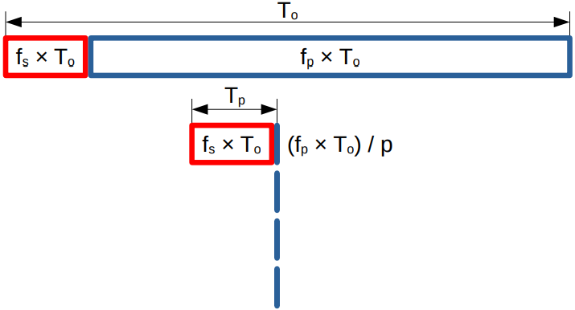

Una pequeña fracción de código secuencial limita enormemente el rendimiento paralelo alcanzable.

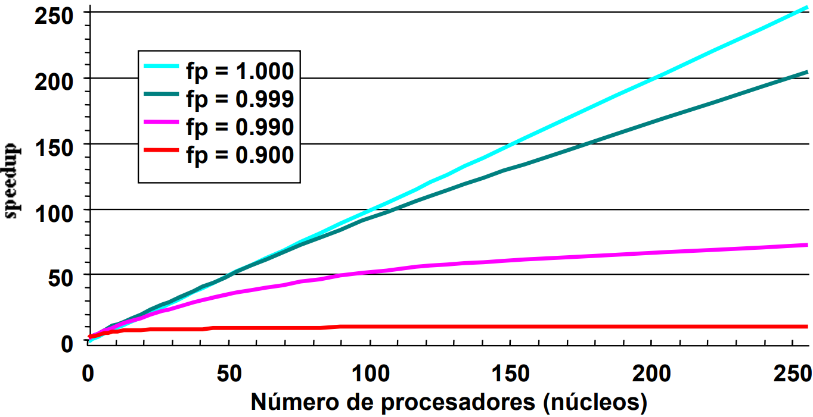

Por la tanto, no es necesario aumentar mucho el número de cores, porque muchas aplicaciones no podrán aprovechar esta ventaja.

### Sobrecoste del Paralelismo

Aunque tengamos un problema bastante paralelo, hay que tener cuidado con el sobrecoste de:

- Comenzar un hilo o proceso

- Comunicar los datos compartidos

- Sincronizar los datos

- Computación extra (redundante) que hay que hacer

Cada problema de los anteriores puede estar en el rango de milisegundos, lo que da lugar a millones de flops.

### La Ley de Amdahl y la realidad

La ley de Amdahl da una cota superior, pero debido a las comunicaciones, el speedup real puede ser mucho menor. El tiempo añadido por esto ($T_c$) suele crecer con el número de hilos ($p$).

$$
T_p=f_s·T_o+\frac{f_p·T_o}{p}+T_c
$$

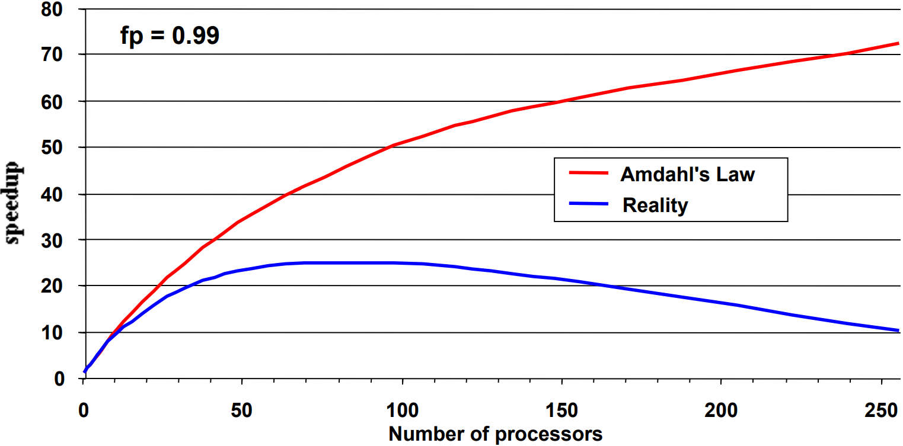

### Escalado débil

Los resultados que hemos visto al aplicar la let de Amdahl nos indican que, **manteniendo constante la cantidad total de trabajo** (escalado fuerte), es muy difícil obtener buenos speedups para un número elevado de procesadores. Solo con que un 5% no sea paralelizable, el speedup máximoe es de 20, aunque utilicemos cientos de miles de hilos.

De esta forma, los beneficios de la comuptación paralela serían muy limitados y, por ejemplo, no valdría la pena diseñar procesadores con muchos cores.

Afortunadamente, en muchos problemas es razonable suponer que queremos aumentar la cantidad de trabajo a la vez que aumentamos el número de procesadores. Por ejemplo: al procesar imágenes con mayor resolución, usar redes neuronales complejas, aumentar el número de [ATMs](https://handsonbanking.org/es/resources/cajero-automatico-atm/#:~:text=ATM%20son%20las,manera%20conveniente.) que puede gestionar un banco...

El escalado débil permite que podamos abordar problemas más grandes sin aumentar el tiempo de proceso.

### Ley de Gustafson-Barsis

La ley de Gustafson permite calcular el speedup conseguido al paralelizar cuando <mark>la cantidad de trabajo paralelizable aumenta proporcionalmente con el número de procesadores</mark>.

Denominaremos $T_o$ al tiempo original, que será igual que $T_s(1)$ y $T_p(1)$. El trabajo no paralelizable (constante) será: $W_s=T_o·f_s$, el trabajo paralelizable original será: $W_p(1)=T_o·f_p$, y el trabajo paralelizable (va creciendo) será: $W_p(p)=W_p(1)·p$, donde $p$ es el número de hilos.

Así, el tiempo secuencial con $p$ hilos es:

$$
T_s(p)=W_s+W_p(p)=W_s+W_p(1)·p
$$

Y el tiempo paralelo con $p$ hilos:

$$
T_p(p)=W_s+W_p(p)=W_s+\frac{W_p(1)·p}{p}=W_s+W_p(1)
$$

Dando lugar a que el escalado débil sea:

$$
S_{weak}=\frac{T_s(p)}{T_p(p)}=\ ...\ =1-f_p+f_p·p=p-f_s·(p-1)
$$

Como consecuencia de la ley de Gustafson podemos extraer que, utilizando un número infinito de procesadores, el speedup máximo que se puede obtener es ilimitad, si estamos dispuestos a aumentar el tamaño del problema proporcionalmente.

$$
S_{weak}=1-f_p+f_p·p⇒lim_{p→∞}S_{weak}=∞
$$

Podemos incrementar el tamaño del problema tanto como queramos, si disponemos de suficientes procesadores.

A partir de este momento, los objetivos de investigación pasaron a centrarse en tratar de resolver problemas cada vez de mayor tamaño en el mismo intervalo de tiempo.

## De sistemas empotrados a supercomputadores 

### Principios de la Computación Paralela

- Encontrar bastante con paralelismo (Ley de Amdahl) o problemas cuyo tamaño aumente (Ley de Gustafson)

- Granularidad: cómo de grande debe ser cada tarea paralela

- Localidad: mover los datos cuesta más que procesarlos

- Carga balanceada: el hilo más lento limita el rendimiento

- Coordinación y sincronización: compartir datos de forma segura

- Modelado del rendimiento / depuración / ajuste

Todas estas cosas hacen la programación paralela incluso más complicada que la secuencial.

### Clases de Computadores

- Internet of Things (IoT) / Computadores empotrados
  
  - Énfasis en el coste económico

- Personal Mobile Device (PMD)
  
  - Énfasis en la eficiencia energéitca y el tiempo real

- Desktop Computing
  
  - Énfasis en la relación coste/rendimiento (*price-performance*)

- Servidores
  
  - Énfasis en la disponibilidad, la escalabilidad y la productividad

- Clusters/Warehouse Scale Computers
  
  - Usados como "*Software as a Service* (SaaS)"
  
  - Énfasis en la disponibilidad y la relación coste/rendimiento

- Supercomputadores
  
  - Énfasis en la velocidad a la hora de realizar operaciones en coma flotante (PFLOPs), el consumo de energía, y la red de interconexión

### Supercomputadores vectoriales

El término fue acuñado originalmente en 1976 para el Cray-1. Utilizan una unidad escalar (arquitectura carga/almacenamiento) con extensión vectorial (registros e instrucciones vectoriales). Para su implementación se utiliza un control cableado, unidades funcionales muy segmentadas y un sistema de memoria multi-banco. No tienen caché de datos ni memoria virtual.

El término *supercomputador* puede referirse a:

- La máquina más rápida del mundo realizando una tarea determinada

- Cualquier máquina que cueste más de 30 millones de dólares

- Cualquier máquina diseñada por Seymour Cray

El CDC6600 (Cray, 1964) es considerado el primer *supercomputador* de la historia.

## Bibliografía 

Información extraída de los apuntes de la asignatura.

Bibliografía de los apuntes:

- Intel Xeon Phi Processor High Performance Programming, Knights Landing Edition by James Reinders, Jim Jeffers and Avinash Sodani, copyright 2016, published by Morgan Kaufmann, ISBN 978-0-12-809194-4.

- Programming and Optimization for Intel® Architecture Hands-On Workshop (HOW) Series "Deep Dive” 2017. Session 1. Colfax International — [colfaxresearch.com](https://colfaxresearch.com)

- Slides from CS267 “Applications of Parallel Computers”. Prof. Jim Demmel, EECS & Math Departments @ Berkeley (USA), 2015. demmel@berkeley.edu

- Lecture Slides from the Companion Site for the book Computer Architecture: A Quantitative Approach, Sixth Edition (from Ch. 01 to Ch. 07)
