# Tema 2: Algoritmos y Protocolos de Encaminamiento

## Índice

- [Breve revisión de red en Internet](#Punto1)
  
  - [Tablas de rutas](#Punto1.1)
  
  - [Direccionamiento](#Punto1.2)
  
  - [Encaminamiento intradominio vs. interdominio](#Punto1.3)

- [Introducción al encaminamiento en redes](#Punto2)

- [Algoritmos de encaminamiento](#Punto3)
  
  - [Encaminamiento por inundación](#Punto3.1)
  
  - [Encaminamiento por el camino más corto](#Punto3.2)
  
  - [Algoritmo de vector de distancias](#Punto3.3)
  
  - [Algoritmo de estado de enlace](#Punto3.4)
  
  - [Comparativa de vector de distancias vs. estado de enlace](#Punto3.5)

- [El protocolo RIP](#Punto4)

- [El protocolo OSPF](#Punto5)
  
  - [Visión general](#Punto5.1)
  
  - [Formato de los mensajes OSPF](#Punto5.2)
  
  - [Intercambio de mensajes Hello](#Punto5.3)
  
  - [Intercambio de bases de datos](#Punto5.4)
  
  - [Tipos de LSAs](#Punto5.5)
  
  - [Tipos de áreas](#Punto5.6)
  
  - [Encaminamiento multi-métrica](#Punto5.7)

- [El protocolo BGP](#Punto6)
  
  - [Introducción y conceptos iniciales](#Punto6.1)
  
  - [Funcionamiento del protocolo BGP](#Punto6.2)
  
  - [Integración de routing interdominio y routing intradominio](#Punto6.3)

- [Bibliografía](#Bibliografía)

## Breve revisión del nivel de red en Internet <a name="Punto1"></a>

Internet puede verse como un conjunto de redes basadas en distintas tecnologías, pero que comparten una pila de protocolos comunes.

A nivel de red, el protocolo común a todos los hosts y routers que forman parte de Internet es el protocolo IP, el cual ofrece un servicio de entrega de datagramas no orientado a conexión y sin garantías de calidad de servicio, es decir, los routers podrían descartar paquetes sin previo aviso. Por lo tanto, IP es un servicio [*best effort*](https://en.wikipedia.org/wiki/Best-effort_delivery#:~:text=Best-effort%20delivery%20describes%20a,meets%20any%20quality%20of%20service.&text=Under%20best-effort,%20network%20performance,the%20current%20network%20traffic%20load.) sin calidad de servicio.

Para cualquier aplicación de Internet, independientemente del protocolo de transporte (TCP o UDP) que utilice, todos los datos acaban viajando por la red en datagramas IP, cuya cabecera tendrá el siguiente formato:

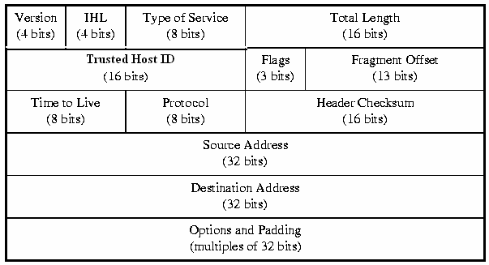

En el caso más habitual no se incluyen opciones ni relleno, por lo que el tamaño de la cabecera IP suele ser de 20 bytes.  Los datos básicos que incluye un datagrama IP en su cabecera son la longitud de la cabecera, los *flags* y el *fragment offset* para poder controlar el proceso de fragmentación de datagramas, el tiempo de vida (*TTL*), el tipo de protocolo de nivel superior y, evidentemente, las direcciones origen y destino del datagrama.

Nos centraremos fundamentalmente en lo referente a los campos de dirección IP origen y dirección IP destino, así como en el proceso básico de comunicación en una red IP. En Internet, cada interfaz de red de cada equipo, sea host o router, ha de estar identificada de forma única, y para eso se le asigna una dirección IP de 32 bits.

Las direcciones IP se organizan de forma jerárquica de tal forma que los primeros bits de la dirección IP identifican al conjunto de hosts y routers dentro de una red, y el resto representa al nodo dentro de esa red. Inicialmente, en Internet se definieron tres clases de redes en función de su tamaño: **A**, **B** y **C**:

- En las redes **de clase A**: los primeros 8 bits representan el identificador de la red, teniendo que estar el primero de esos bits a 0. Los restantes 24 representan el identificador de la interfaz de un equipo dentro de esa red. Así, podría haber $2^7=128$ redes de clase A, cada una de ellas con $2^24=16777216$ interfaces cada una de ellas.

- En las redes **de clase B**: los primeros bits siguen el patrón '10'; los primeros 16 bits son la dirección de red y los siguientes 16 bits son los dispositivos de la red. Podría haber $2^{14}$ redes con $2^{16}$ direcciones cada una.

- En las redes **de clase C**: los primeros bits siguen el patrón '110', siendo los primeros 24 bits el campo de red y los restantes 8 bits las direcciones para equipos. De esta manera, podría haber $2^{21}$ redes con $2^8=256$ direcciones posibles dentro de ella.

Para indicar qué parte de la dirección corresponde a la red y qué parte al identificador dentro de la red se usa una notación denominada **máscara de red**, la cual consiste en poner a 1 todos los bits de la parte de red y a 0 todos los bits de la parte de la interfaz.

Existen también direcciones **de clase D**, cuyos primeros 4 bits valen '1110', que se usan para grupos multicast; y direcciones **de clase E**, que comienzan por '1111', pero no se usan de momento, ya que están reservadas de cara al futuro.

| Clase | Bits iniciales | Máscara       | Rango de direcciones        |
|:-----:| -------------- | ------------- | --------------------------- |
| A     | 0—             | 255.0.0.0     | 0.0.0.0 a 127.255.255.255   |
| B     | 10–            | 255.255.0.0   | 128.0.0.0 a 191.255.255.255 |
| C     | 110-           | 255.255.255.0 | 192.0.0.0 a 223.255.255.255 |
| D     | 1110           |               | 224.0.0.0 a 239.255.255.255 |
| E     | 1111           |               | 240.0.0.0 a 255.255.255.255 |

De todas estas direcciones, algunas son especiales y no pueden asignarse a interfaces:

- La red 10.0.0.0/8

- Las redes que van desde la 172.16.0.0/16 hasta la 172.31.0.0/16

- Las redes que van desde la 192.168.0.0/24 hasta la 192.168.255.0/24

Todas ellas se consideran redes privadas ([RFC 1918](https://www.rfc-es.org/rfc/rfc1918-es.txt)), por lo que no son enrutables en Internet y solo pueden usarse tras un *firewall* o una [NAT](https://es.wikipedia.org/wiki/Traducción_de_direcciones_de_red#:~:text=La%20traducción,transportados.) para construir *intranets*.

<u>Direcciones especiales</u>:

- La **dirección de red** es aquella donde la parte del identificador está a 0. Se utiliza para identificar a una red al completo, por lo que no puede asignarse a una interfaz ni aparecer como IP origen/destino. 

- La **dirección de broadcast** es aquella en la que todo el identificador está a 1. Se utiliza como destino para inundar un mensaje a toda la red.

- La dirección 127.0.0.1 se denomina ***loopback*** y se usa para que un equipo pueda enviarse a sí mismo tráfico sin que salga a la red, por lo que no debe asignarse a ninguna interfaz física.

Por lo tanto, dada una determinada red IP, de todas las direcciones disponibles siempre tendremos que dejar 2 sin usar para la dirección de red y la dirección de broadcast.

El funcionamiento general del nivel de red en Internet es el siguiente: cada equipo cuenta con una o varias interfaces de red a las que se le asignan direcciones IP. Cuando dos equipos se encuentran en la misma red IP, pueden comunicarse directamente. Si se encuentran en redes diferentes, entonces es imprescindible el uso de *routers* intermedios para interconectar las redes.

La <u>comunicación directa</u> sucede cuanto tanto el origen como el destino se encuentran en la misma subred a nivel IP y, además, disponen de un enlace físico entre ambos.

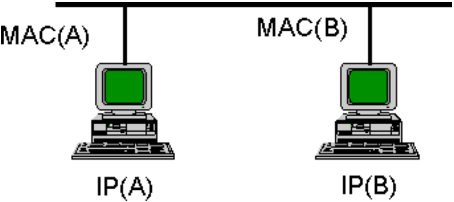

En este caso, el equipo origen encapsulará el datagrama IP directamente en una trama de nivel de enlace dirigida a la dirección de enlace del equipo destino. Será necesario, por tanto, algún protocolo de resolución de direcciones (p.ej. ARP) para que el equipo origen pueda averiguar la dirección de enlace que corresponde a la dirección IP del otro equipo.

Un ejemplo de intercambio de mensajes sería el siguiente:

1. El host A enviará un *ARP-Request* preguntando por la dirección de enlace del host con dirección *IP (B)*.

2. El host B responderá con *ARP-Reply* indicando que su dirección de enlace es *MAC(B)*.

3. El host A enviará el datagrama con IP origen *IP (A)*, IP destino* IP (B)* encapsulado en una trama con dirección MAC origen *MAC(A)* y dirección MAC destino *MAC(B)*.

En caso contrario, cuando es necesario pasar por uno o más <u>*routers*</u>, el equipo origen deberá encapsular el datagrama IP en una trama de nivel de enlace dirigida al router. El router se encargará de averiguar el camino hacia el destino y encaminar dicho datagrama.

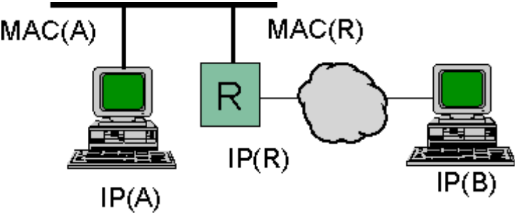

Un ejemplo de intercambio de mensajes sería el siguiente:

1. El host A enviará un *ARP-Request* preguntando por la dirección de enlace del host con dirección *IP (R)*.

2. El router R responderá con *ARP-Reply* indicando que su dirección de enlace es *MAC(R)*.

3. El host A enviará el datagrama con IP origen *IP (A)*, IP destino *IP (B)* encapsulado en una trama con dirección MAC origen *MAC(A)* y dirección MAC destino *MAC(**R**)*.

4. El router R es ahora el responsable de encaminar el datagrama.

No obstante, ciertas situaciones —como el caso de que un host tenga varias interfaces o que haya varios routers en la misma red— hacen necesario el uso de las *tablas de rutas*.

### Tablas de rutas <a name="Punto1.1"></a>

Una tabla de rutas no es más que una tabla que almacena como mínimo dos entradas: el identificador de la red destino y la dirección IP o la interfaz por la que alcanzar dicha red destino. En algunos casos, la tabla de rutas podría contener también información como si la entrada está activa o el tiempo que falta para expirar en caso de ser una entrada dinámica, entre otros.

Si ejecutamos el comando `netstat -rn` en un host Linux podremos ver su tabla:

```bash
pedrom@libra:~> netstat -rn
Kernel IP routing table
Destination   Gateway      Genmask       Flags MSS Window  irtt Iface
155.54.210.0  0.0.0.0      255.255.255.0 U       0 0          0 eth0
169.254.0.0   0.0.0.0      255.255.0.0   U       0 0          0 eth0
127.0.0.0     0.0.0.0      255.0.0.0     U       0 0          0 lo
0.0.0.0       155.54.210.1 0.0.0.0       UG      0 0          0 eth0
```

Aquellas redes con *gateway* a 0 se pueden alcanzar directamente —en el caso de la $127.0.0.0$ es evidente porque es él mismo—, la última se accederá a través del router con IP $155.54.210.1$.

Aunque muchas veces tendemos a pensar que los routers son los únicos dispositivos con una tabla de rutas, la realidad es que en Internet tanto routers como hosts disponen de una tabla para poder decidir el siguiente salto cuando han de enviar un datagrama y puede haber varias opciones o disponen de varias interfaces.

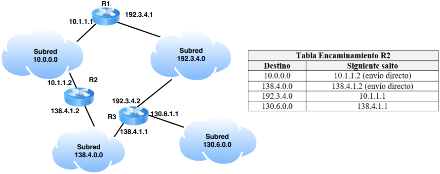

La importancia de las tablas de rutas radica en que, una vez que cada equipo conectado a Internet tiene la suya configurada, el encaminamiento de los mensajes por la red es casi inmediato, ya que basta con mirar la IP destino del datagrama y comprobar la entrada de la tabla de rutas correspondiente para poder enviar el datagrama como corresponde en el siguiente salto. Este proceso de reenviar un datagrama que sigue cada elemento de la red IP queda descrito en el **algoritmo de reenvío de datagramas**:

```pascal
NETd ⬅ IPd && mask;
if NETd está directamente conectada then
    Averiguar MAC destino usando ARP y enviar trama directamente;
else
    if existe ruta específica para IPd then
        Enviar datagrama al siguiente salto especificado por la ruta;
    else
        if existe ruta para NETd then
            Enviar datagrama al siguiente salto especificado por la ruta;
        else
            if existe ruta por defecto then
                Enviar datagrama al siguiente salto especificado por la ruta;
            else
                Error!. Generar ICMP Destination Unreachable.;
```

Como puede verse, existe una prioridad a la hora de seleccionar las rutas en la tabla de rutas:

1. Mirar si el destino está entre las mismas redes.

2. Ver si existe una ruta específica para ese destino en concreto.
   Este tipo de rutas, también conocidas como *host specific routes* indican una ruta para llegar a un host concreto (no a una red), y son las que tienen pioridad antes que el resto de entradas.

3. Ver si hay una entrada en la tabla de rutas en la red destino y usarla.

4. Usar una ruta por defecto.

5. Error, no hay información en la tabla de rutas de cómo alcanzar el destino.

En caso de haber varias rutas para la red destino, se aplica lo que se llama **Longest Prefix Match**, que consiste en que, de todas las entradas de la tabla de rutas en las que la IP destino está englobada, se elige la ruta más específica. Es decir, se elige la que tenga un prefijo de red más largo.

Generalmente, en caso de empate a longitud de máscara entre más de una entrada que incluye la IP destino, se suele elegir la que aparece primero en la tabla de rutas, aunque esto puede variar entre diferentes sistemas operativos tanto de hosts como de routers.

### Direccionamiento <a name="Punto1.2"></a>

Como se ha explicado previamente, las direcciones IP se dividieron inicialmente entre clases distintas para tener redes de diferente tamaño. La ventaja era que permitía la posibilidad de ofrecer encaminamiento jerárquico de un nivel, es decir, que en las tablas de rutas se podía incluir una entrada para cada red destino (en lugar de para cada IP destino), asumiendo que todos los hosts dentro de esa red están interconectados entre sí. De esta forma, el número de entradas en la tabla de rutas se reduce bastante.

Esta división tan rígida pronto resultó muy incómoda porque en redes no muy grandes se podían desperdiciar direcciones, mientras que en otras interesaba subdividir la clase más para poder subdividir la red en subredes de menor tamaño.

Como resultado, surgen una serie de **soluciones de direccionamiento**:

#### Subnetting

La primera idea consiste en permitir que la longitud de la parte de red de una dirección IP no tuviese que ser exclusivamente de 8, 16 o 24 bits, sino que pudiesen emplearse otros valores. Para ello, se emplea el ***subnetting***, el cual permite que una red pueda subdividirse en subredes mediante el uso de una nueva máscara. Esta subdivisión y cambio de máscara obliga a que dos hosts que estén en una **subnet-id** diferente requieran de la existencia de uno o varios routers intermedios para poder comunicarse.

Al igual que antes, la parte de las direcciones IP correspondiente a los hosts no puede estar todo a ceros o todo a unos, ya que esas direcciones están reservadas para indicar la dirección de subred y la dirección de broadcast de esa subred respectivamente. Por lo tanto, al hacer *subnetting* se desperdician siempre como mínimo dos subredes de todas las creadas, lo cual puede ser un gran desperdicio.

##### Subnet-zero

Para evitar ese desperdicio, muchas implementaciones sí que permiten el uso de una subred todo a ceros y todo a unos, ya que realmente siguen representado subredes y no hosts.

> La relación entre el número de bits ($n$) necesarios para obtener $X$ direcciones IPs es: $2^n=X$.

Al aplicar subnetting, todas las subredes que se crean tienen el mismo tamaño. Es decir, la red se subdivide en subredes de idéntico tamaño. Con el paso del tiempo se vió que esto tamvién puede presentar limitaciones en muchos casos.

##### Variable Length Subnet Masks (VLSM)

Es un mecanismo por el cual se permite que, usando máscaras de red de tamaño variable, cada subred de forma independiente pueda adecuarse al número de hosts que realmente pueda llegar a contener.

Usando VLSM cada subred se puede seguir dividiendo en múltiples subredes adicionales, cada una de ellas con el tamaño que se requiera.

Una buena regla para hacer un buen reparto de direcciones suele ser empezar primero dividiendo para satisfacer las necesidades de las subredes más grandes y continuar subdividiendo conforme vaya siendo necesario.

#### Supernetting

Hay veces que sucede al contrario, en lugar de subdividir un rango de direcciones en subredes más pequeñas, queremos juntar subredes pequeñas para formar una sola. Esto se da en aquellas situaciones en las que una empresa no tiene suficiente con un bloque de, por ejemplo, clase C, pero utilizar una clase B es excesivo y supone un desperdicio.

En estos casos, la solución requiere el poder asignar a este tipo de organizaciones varios bloques de clase C que puedan combinar para conseguir una red del tamaño necesario. No obstante, si bien esto ayuda  a mitigar el problema del desperdicio de direcciones, crea un nuevo problema: aumenta el tamaño de las tablas de rutas. Esto es así porque, cada vez que se conecta una nueva red a Internet, los diferentes routers acabarán aprendiendo de uno u otro modo cómo deben alcanzarla.

Si para una misma red se añade una entrada a la tabla de rutas por cada rango de direcciones de clase C que sele asigna, los routers tendrían que disponer de una memoria RAM inmensa.

Para intentar minimizar este problema, se ha intentado permitir, al menos en el backbone de la red, que las redes se puedan resumir. Es decir, que si para varias redes distintas, pero contiguas, el siguiente salto es el mismo, se puede incluir una sola entrada en la tabla de rutas, en lugar de una para cada red. En concreto, para esto se propuso la **Classless InterDomain Routing** (**CIDR**), que consiste en dos propuestas implantadas simultáneamente:

1. El <mark>reparto de direcciones de forma geográfica</mark>.
   Esto permite que sea más probable que puedan agregarse direcciones de red, porque en lugar de asignarse por orden de solicitud, se asignan de forma geográfica. Si dos redes están geográficamente muy cerca, es muy posible que un router lejano use el mismo vecino para llegar a ambas y, por tanto, sería factible agregar ambas en una única entrada en la tabla de rutas.
   Reparto geográfico de direcciones en CIDR:

| Región                     | Direcciones                 |
|:--------------------------:|:---------------------------:|
| Multiregional              | 192.0.0.0 a 193.255.255.255 |
| Europa                     | 194.0.0.0 a 195.255.255.255 |
| Otros                      | 196.0.0.0 a 197.255.255.255 |
| USA y Canadá               | 198.0.0.0 a 199.255.255.255 |
| Centroamérica y Sudamérica | 200.0.0.0 a 201.255.255.255 |
| Asia                       | 202.0.0.0 a 203.255.255.255 |
| Otros                      | 204.0.0.0 a 205.255.255.255 |
| Otros                      | 206.0.0.0 a 207.255.255.255 |

2. Extender el concepto de subnetting al contrario para agregar redes (<mark>*supernetting*</mark>).
   La segunda propuesta consiste en permitir que una organización pida a su ISP un número de rangos de direcciones que realmente se adapten a sus necesidad y que puedan agruparse. Es importante que puedan agruparse porque, de lo contrario, no se podría reducir el tamaño de las tablas de rutas. Así pues, <mark>es requisito de esta solución que los rangos de direcciones asignados sean contiguos</mark>. Además, la aplicación de CIDR implica también que, si una organización cambia de ISP, deberá devolver sus direcciones y solicitar unas nuevas al nuevo ISP.

Para hacer *supernetting* solo es necesario seleccionar la máscara de red más pequeña tal que la parte de red englobe a todas las redes que queremos agregar, pero no incluya aquellas redes que no deben agregarse.

--------------

Ejemplo:

Tenemos las siguientes entradas en la tabla de rutas:

```
194.13.10.0/24 via 195.15.1.1
194.13.11.0/24 via 195.15.1.1
194.13.12.0/24 via 195.15.1.1
194.13.13.0/24 via 195.15.1.1
194.13.14.0/24 via 195.15.1.1
194.13.15.0/24 via 195.15.1.1
```

Podemos ver como, efectivamente, son contiguos. Ahora veremos si son también agregables:

```
194.13.00001010.0/24 via 195.15.1.1
194.13.00001011.0/24 via 195.15.1.1
194.13.00001100.0/24 via 195.15.1.1
194.13.00001101.0/24 via 195.15.1.1
194.13.00001110.0/24 via 195.15.1.1
194.13.00001111.0/24 via 195.15.1.1
```

Los primeros 5 bits del tercer byte son iguales, tan solo varían los 3 restantes. Podríamos pensar en resumir las entradas como `194.13.8.0/21 via 195.15.1.1`, no obstante, esto sería incorrecto, ya que en este rango estamos incluyendo otras redes también. La forma correcta de resumir las redes es:

```
194.13.10.0/24 via 195.15.1.1
194.13.11.0/24 via 195.15.1.1
194.13.12.0/22 via 195.15.1.1
```

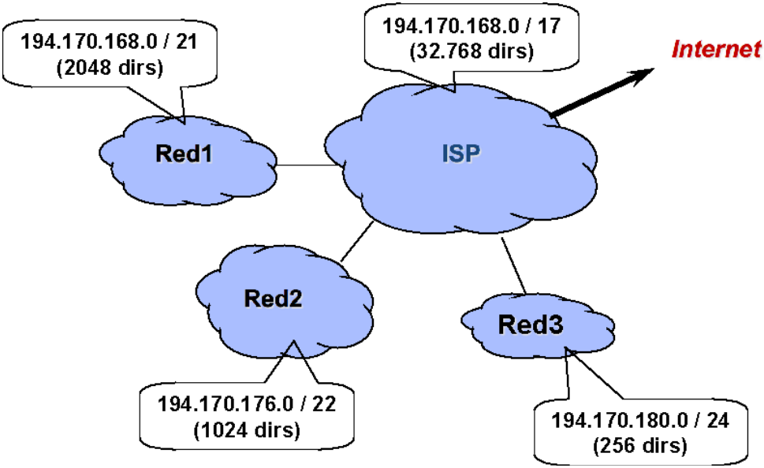

### Encaminamiento intradominio vs. interdominio <a name="Punto1.3"></a>

Al comienzo de este tema se veía cómo podemos aplicar algoritmos de encaminamiento para encontrar los caminos más cortos en una red. No obstante, si la red es muy grande, tanto el tamaño de los vectores de distancias como el número de mensajes de estado de enlace que necesitarían circular por la red sería muy elevado. Es por ello que, en el caso de Internet, en lugar de calcular las rutas a cada *posible* dirección IP destino, se hace para **cada** red destino, asumiendo que a través de los routers de esa red se pueden alcanzar a todos los hosts que haya.

Si bien esta solución mejora *un poco* el problema, Internet es una red demasiado grande. Para conseguir simplificar el problema del encaminamiento, se optó por definir una estructura jerárquica en la red:

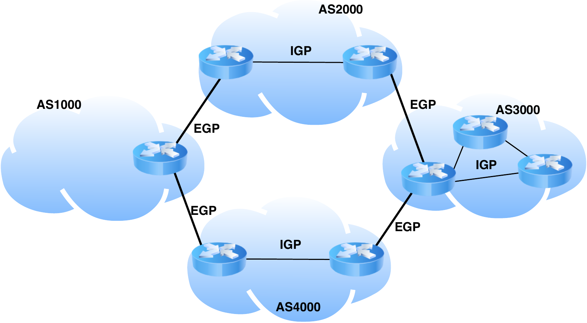

Así, todos los hosts se integran en redes tal cual vimos y, a su vez, conjuntos de redes se integran en los llamados **sistemas autónomos**. De esta forma, el encaminamiento se dividirá entre encaminamiento *interdominio* y encaminamiento *intradominio*:

- **Sistema Autónomo (AS)**: Es un conjutno de redes administradas por una entidad común que comparten una estrategia de encaminamiento común.

- **Encaminamiento interdominio**: Son esquemas de encaminamiento cuya finalidad es encontrar un camino entre sistemas autónomos distintos. A este tipo de protocolos se les suele llamar *External Gateway Protocol (EGP)*.

- **Encaminamiento intradominio**: Son esquemas de encaminamiento encargados de facilitar el encaminamiento entre redes pertenecientes a un mismo sistema autónomo. A este tipo de protoclos se les suele llamar *Internal Gateway Protocol (IGP)*.

Esta división jerárquica del encaminamiento en Internet aporta fundamentalmente tres ventajas:

- Mejora la **escalabilidad** al permitir que no haga falta que todos los routers intercambien mensajes entre sí.

- Facilita la **compatibilidad**, ya que el único requisto de un sistema autónomo para formar parte de Internet es usar el protocolo de routing externo correspondiente. Dentro de un AS se puede usar el protoclo de routing interno que se desee; de hecho, diferentes AS podrían usar diferentes protocolos de routing interno.

- Ofrece **extensibilidad**, porque la red puede evolucionar con nuevos protocolos de routing dentro de sistemas autónomos sin necesidad de actualizar toda la red de Internet.

Existen bastantes protocolos de encaminamiento, pero nos centraremos en **RIP** (*Routing Information Protocol*) y **OSPF** (*Open Shortest Path First*) como protocolos intradominio; y **BGP** (*Border Gateway Protocol*) como protocolo interdominio.

## Introducción al encaminamiento en redes <a name="Punto2"></a>

El encaminamiento tiene que ver con las funciones que se realizan en el nivel de red para conseguir que los mensajes o datagramas puedan llegar a sus destinatarios.

> Llamamos **encaminamiento** al proceso por el cual los elementos de una red son capaces de hacer que los datagramas o mensajes circulen por ella para alcanzar su destino.

En diferentes tecnologías de red, o incluso en un mismo tipo de red, se pueden emplear diferentes formas de realizar el encaminamiento. El objetivo del encaminamiento es buscar las rutas en una red que, para todo origen y destino, satisfagan una serie de condiciones.  Para la búsqueda de esas rutas se emplean algoritmos de encaminamiento:

> Denominamo **algoritmo de encaminamiento** al método por el cual se calculan las rutas en una red.

Existen diferentes tipos de algoritmos de encaminamiento que pueden claseificarse en función de cómo abordan dicha búsqueda de rutas.

Un aspecto importante que distingue las redes orientadas a conexión de las redes no orientadas a conexión tiene que ver con la forma en la que se toma la *decisión de encaminamiento*. En las primeras, como primero se establece un circuito virtual por el que luego circulan todos los mensajes, <mark>la decisión de qué camino utilizar se toma durante el establecimiento de dicho circuito virtual</mark>. Por contra, <mark>en las redes no orientadas a conexión, cada datagrama puede seguir un camino distinto</mark>; así, la decisión de encaminamientos e toma de forma independiente para cada datagrama.

Aunque podríamos pensar que el problema del encaminamiento en redes es muy simple, la realidad es que en redes de un tamaño más grande donde pueden, además, haber cambios en la topología debido a fallos en los dispositivos de red o los enlaces, el problema es bastante más complejo. Es necesario utilizar diferentes algotimos para poder automatizar la búsqueda de caminos.

## Algoritmos de encaminamiento <a name="Punto3"> </a>

Uno de los objetivos fundamentales del nivel de red es encaminar los mensajes o datagramas a su destino, por lo que es fundamental disponer de una forma de encontrar caminos para un determinado destino.

> Denominamos **algoritmo de encaminamiento** al mecanismo que nos permite averiguar una o varias rutas hacia un determinado destino de una red.

Es deseable que los protocolos de encaminamiento cumplan una serie de propiedades deseables para el correcto funcionamiento de la red:

- **Corrección**: Decimos que un algoritmo de encaminamiento es correcto si obtiene caminos que permitan alcanzar el destino.

- **Robustez**: Un algoritmo de encaminamiento es robusto si es capaz de converger a una solución tras posibles fallos hardware y software en la red.

- **Simplicidad**: La simplicidad se refiere a que el algoritmo sea fácilmente entendible, y eso contribuye a que se pueda implementar y depurar sin mucho esfuerzo incluso en dispositivos con capacidades de cómputo limitadas.

- **Optimalidad**: Un algoritmo de encaminamiento es óptimo cuando es capaz de obtener el mejor camino hacia el destino.

- **Estabilidad**: Un algoritmo es estable cuando es capaz de converger de forma rápida a una solución entre cambios de estado de la red.

- **Equidad**: Un protocolo es ecuánime cuando ofrece el mismo servicio a todos los usuarios.

La corrección es la más fundamental hasta el punto de ser un requisito exigible más que una propiedad deseable. Por detrás estarían la robustez y la simplicidad. Finalmente, la optimalidad, estabilidad y equidad pueden ser deseables, pero no imprescindibles para un correcto funcionamiento del encaminamiento. además, como se puede observar, algunas de estas propiedades deseables son contradictorias entre sí. Por ejemplo, un aprovechamiento óptimo de los recursos no siempre va unido al concepto de equidad.

Los algoritmos de encaminamiento pueden clasificarse atendiendo a varios criterios. En función de quién es el que decide el camino a seguir, distinguimos dos tipos:

- Encaminamiento fijado en origen
  Es el encaminador origen quien conoce toda la topología de la red, calcula el camino a seguir y lo indica en el mensaje o datagrama a enviar. Cada encaminador intermedio solo tiene que mirar quien es el siguiente salto en el camino que estableció el origen y reenviarle el mensaje o datagrama.

- Encaminamiento salto a salto
  Cada encaminador al que llega el mensaje calcula el camino hacia el destino y lo envía a su vecino correspondiente para seguir el camino. Es decir, el camino se va recalculando en cada salto.

Los algoritmos de encaminamiento pueden clasificarse en:

- Estáticos
  Se usa una información de la red previamente disponible, por lo que, una vez se calcula la ruta al destino, no cambia, ya que se asume una topología estática.

- Cuasi-estáticos
  También se usa información previa, pero, si la ruta actual falla, entonces se calcula o se usa una ruta alternativa.

- Adaptativos o dinámicos
  El algoritmo tiene en cuenta los posibles cambios que pueda haber en las condiciones de la red, y recalcula un camino nuevo cuando es necesario. Puede implementarse de tres formas:
  
  - Centralizada: se envían los datos del estado actual de la red a un nodo, que calculará las rutas.
  
  - Aislada: cada nodo usa solo información local para decidir usar un camino u otro.
  
  - Distibuida: los nodos colaboran entre sí intercambiando información para el establecimiento y adaptación de los caminos.
  
  Estos algoritmos son los más normales en las redes de datagramas y en Internet en particular.

### Encaminamiento por inundación <a name="Punto3.1"></a>

El encaminamiento por inundación consiste en enviar un mensaje a todos los nodos de la red para hacerlo llegar al destino. La implementación es simple, solo hay que hacer que, cuando un mensaje dirigido a un destino llega a un encaminador, el encaminador lo reenvía por todas sus interfaces excepto aquella por la que lo recibió. De esta manera, el mensaje acaba llegando a todos los nodos de la red y, por consiguiente, al destino.

Las <span style="color:green">ventajas</span> de este método son su **sencillez** y su **efectividad** en alcanzar el destino. De hecho, el mensaje no solo llega al destino, sino que, al recorrer todos los caminos, llegará por el camino **más corto**.

Los <span style="color:red">principales inconvenientes</span> de esta estrategia son su ineficiencia, la posibilidad de que haya ciclos (si no se usa alguna forma de identificación de los mensajes con números de secuencia para evitar que sea reenviado muchas veces) y el hecho de que algunos encaminadores podrían recibir el mensaje múltiples veces. Se puede demostrar que:

$$
|E|\le R \le 2 \times |E|

$$

Donde $|E|$ es el número de enlaces presentes en la red y $R$ es el número total de envíos del mensaje que se realizan en la red para inundar un mensaje o datagrama.

La inundación de mensajes en una red se puede hacer de una forma más eficiente intentando evitar el envío de mensajes por aquellos enlaces por los que no sea necesario, de forma que el coste total de los enlaces recorridos sea mínimo.

En muchos algoritmos de encaminamiento, la red de comunicaciones suele modelarse como un grafo $G=(V,E,w)$, donde el conjunto de vértices $V$ representa a cada uno de los encaminadores, el conjunto $E$ de enlaces representa a cada uno de los enlaces entre los routers y $w$ es el conjunto de los pesos o costes asociados a cada enlace.

Dada la siguiente red:

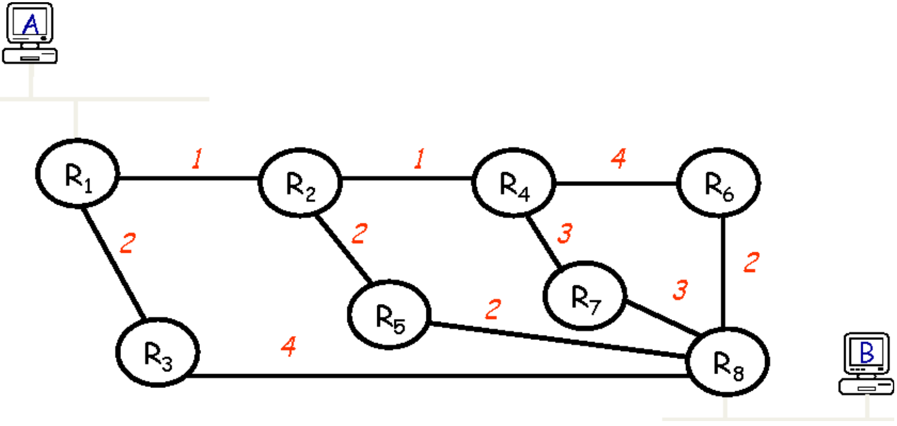

Si queremos enviar un mensaje desde el nodo $R_8$ de manera que no haya ciclos y se minimice el coste (suma de los pesos de los enlaces por los que se envía el mensaje), podríamos calcular el camino más corto desde cada nodo hasta $R_8$ y unirlos todos de forma que por cada enlace que forme parte de ese conjunto de caminos solo se envíe el mensaje una vez.

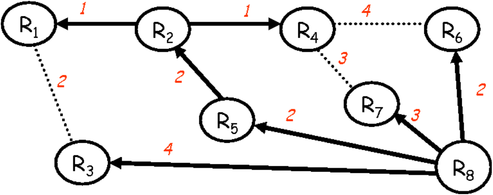

El conjunto de nodos y enlaces resultantes forma lo que se llama en teoría de grafos un ***spanning tree*** o **árbol de expansión**:

> Un ***spanning tree*** o **árbol de expansión** de un grafo $G$ es un subgrafo conexo acíclico que incluye a todos los nodos.

Un *spanning tree* tiene por definición una serie de propiedades muy interesantes para el encaminamiento, por lo que es un concepto muy usado en el diseño de protocolos de encaminamiento:

- El número de enlaces que lo componen es $|V|-1$, siendo $|V|$ el número de nodos. Por tanto, <mark>el coste del broadcast usando un árbol de expansión en cuanto al número de mensajes que circulan por la red es siempre de $|V|-1$</mark>.

- El hecho de que sea conexo e incluya todos los nodos significa que existe un camino entre cada para de nodos del grafo original en el árbol de expansión. Por lo tanto, usar el árbol de expansión <mark>no deja ningún nodo inalcanzable</mark> por el encaminamiento.

- El que sea acíclico significa que <mark>no tiene ciclos</mark>, por esa razón se trata de un árbol. Esta es una propiedad muy interesante en lo que se refiere al encaminamiento.

Dada una red existen múltiples posibles *spanning trees*. De todos ellos, existen algunos que llamaremos ***minimum spanning tree***:

> Se dice que un árbol de expansión es mínimo (***minimum spanning tree***)si no existe otro *spanning tree* con un coste total estrictamente menor al suyo.

Este tipo de árboles de expansión óptimos se pueden calcular con el algoritmo de Kruskal y el de Prim.

### Encaminamiento por el camino más corto <a name="Punto3.2"></a>

Los algoritmos de encaminamiento por el camino más corto son aquellos capaces de calcular el camino más corto entre dos nodos de un grafo. Esta técnica aplica tanto al encaminamiento estático como al dinámico.

Para poder hablar del camino más corto es necesario definir cuál es la forma en la que se calcula el coste o la distancia entre dos nodos. Dada una red modelada como un grafo $G=(V,E,w)$, cada enlace $e∈E$ tendrá un coste o distancia asociado a atravesar dicho enlace, que denominaremos $w_e$.

Un camino entre dos nodos $v_i, v_j \in V$ es un subgrafo conexo y acíclico $\pi ⊂ G$ cuyo coste o longitud se calcula como:

$$
C(\pi)=\sum_ew_e \forall e \in \pi
$$

Es importante definir la métrica para saber en qué unidades medimos la optimalidad del camino.

> Denominamos **métrica** a la magnitud asociada a los caminos de la red que queremos que el encaminamiento optimice.

Ejemplos de métricas que pueden emplearse son: el retardo, el coste económico o el número de saltos. En una misma red, el camino más corto podría ser distinto atendiendo a métricas distintas.

En general: $w_e \ge 0\ \forall e \in \pi$. El caso particular donde $w_e = 1\ \forall e \in \pi$ se conoce como **routing** por el mínimo número de saltos, ya que en este caso el camino más corto sería aquel que atraviesa menos enlaces. Además, si los costes $w_e$ varían con el tiempo, se puede conseguir una solución mejor conforme cambia la red, aunque pueden aparecer problemas de convergencia.

> El **principio de optimalidad** indica que, sea $G=(V,E,w)$ y sea $\pi_{ij}=[v_i,v_{i+1},...,v_{j-1},v_j]$ el camino más corto entre dos vértices $v_i,v_j \in V$, entonces el camino óptimo entre cualquier par de vértices de $\pi_{ij}$ está incluido en $\pi_{ij}$.

En otras palabras, esta propiedad está indicando que si el router B forma parte del camino óptimo entre A y C, entonces el camino óptimo de B a C está incluido en esta ruta.

Una consecuencia derivable de esto es que el grupo de caminos óptimos desde los nodos de la red hacia un destino dado <mark>forma un *spanning tree* cuya raíz es el destino</mark>. A este árbol se le suele llamar: ***shortest path tree*** (SPT) o **árbol de caminos más cortos**, porque incluye a todos los caminos más cortos desde cualquier nodo hasta el destino.

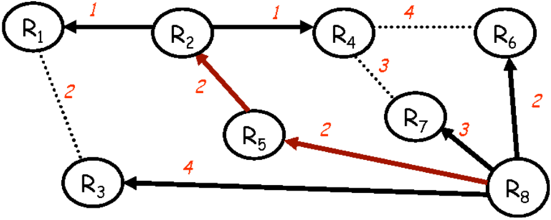

La <span style="color:green">ventaja</span> fundamental del encaminamiento por el camino más corto es que existen algoritmos simples capaces de calcular dichos caminos. Los ejemplos más conocidos son el algoritmo de Dijkstra y el de Bellman-Ford. El <span style="color:red">inconveniente</span> fundamental es que, desde el punto de vista del rendimiento de la red, no es una solución óptima, ya que el tráfico solo viajaría por el camino más corto entre ambos y, por tanto, puede ser que se obtenga menos rendimiento que si se enviase en paralelo por varios caminos.

Para encaminar maximizando el rendimiento haría falta emplear **optimal routing**, que consiste en separar tráfico entre múltiples caminos en puntos estratégicos de la red de acuerdo con la toría de *optimal multi-commodity flows*. El algoritmo de Ford-Fulkerson aplica esta técnica.

No obstante, dada la complejidad a la hora de implementar este tipo de algoritmos, sobretodo de forma distribuida, en general en Internet se usa encaminamiento **por el camino más corto** y, por tanto, los algoritmos estudiados serán de este tipo. Nos centraremos en algoritmos de encaminamiento distribuidos para calcular rutas por el camino más corto, que fueron los precursores de los actuales protocolos empleados en Internet.

Los motivos fundamentales por los que se prestó tanto interés a los protocolos distribuidos son:

- **Escalabilidad**: si el número de routers aumenta, el tiempo de cómputo de los caminos más cortos en un algoritmo centralizado aumenta de forma exponencial; por tanto, al utilizar protocolos distribuidos conseguimos repartir el esfuerzo de cómputo entre todos los nodos.

- **Tolerancia a fallos**: al no tener un nodo central que calcule los caminos de forma centralizada evitamos un punto único de fallo.

- **Sobrecarga de control**: enviar periódicamente el estado de la red a un nodo central consume bastantes recursos de red y podría ser muy ineficiente.

Ante estas ventajas, se optó por usar algoritmos distribuidos en los cuales los nodos intercambian información entre sí sobre la red y, así, cada nodo puede calcular a partir de dicha información su tabla de encaminamiento.

En concreto, se propusieron dos tipos de algoritmos: el[ algoritmo de vector de distancias](#Punto3.3) y el [algoritmo de estado de enlace](#Punto3.4).

### Algoritmo de vector de distancias <a name="Punto3.3"></a>

También conocido como **algoritmo de Bellman-Ford distribuido** por sus similitudes con el algoritmo centralizado de Bellman-Ford, el algoritmo de vector de distancias funciona de forma asíncrona y distribuida. Es decir, no requiere sincronización alguna para el intercambio de mensajes entre los nodos y, además, los nodos ejecutan de forma independiente el algoritmo.

La idea general consiste en que, periódicamente, cada nodo recibe de sus vecinos información sobre su coste para llegar a cada uno de los nodos de la red (*vector de distancias*). Con esta información, que ofrece una visión parcial del estado de la red, el nodo construye su propia tabla de rutas y vector de distancias que vuelve a intercambiar con sus vecinos.

En concreto, a continuación se detalla el algoritmo completo para un router $R_i$, el cual tiene como:

- datos el vector de costes: $X_n=(C_1,C_2,...,C_k)$, con $C_j=C(\pi_{ij})$

- entrada los vecinos del nodo $i$, $N,i$ y el coste de enlace con los vecinos: $w_l\ \forall l \in N_i$

- salida la tabla de rutas: $R=(V_1,V_2,...,V_k)$ donde $V_j$ es el vecino que da un mejor camino hacia el destino $j$.

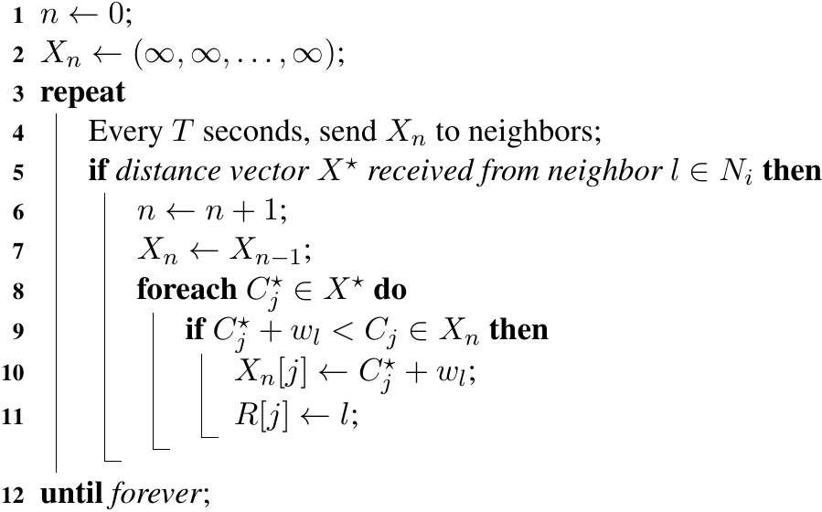

Lo que está haciendo $R_i$ es enviar periódicamente su vector de distancias actual $X_n$ a sus vecinos y, por supuesto, como los vecinos hacen lo mismo, también recibirá periódicamente vectores de distancias de sus vecinos. Cada vez que recibe un nuevo vector de distancias de un vecino $l$, comprueba para cada destino $R_j$ si el coste de ir a través de $l$, que sería $(C_j^*+w_l)$ es menor al coste actual para llegar al vecino $l$. Nótese que $C_j^*$ es el coste que $l$ indica que tiene para llegar a $R_j$, y $w_l$ es el coste para llegar al vecino $l$. Si el camino que anuncian es mejor, entonces el vector de distancias $X_n$ se actualiza con el nuevo coste y se anuncia la tabla de rutas indicando que $l$ es ahora el nuevo mejor vecino para alcanzar el destino $R_j$.

-------------------------

A continuación se presenta un ejemplo de aplicación del algoritmo de vector de distancias:

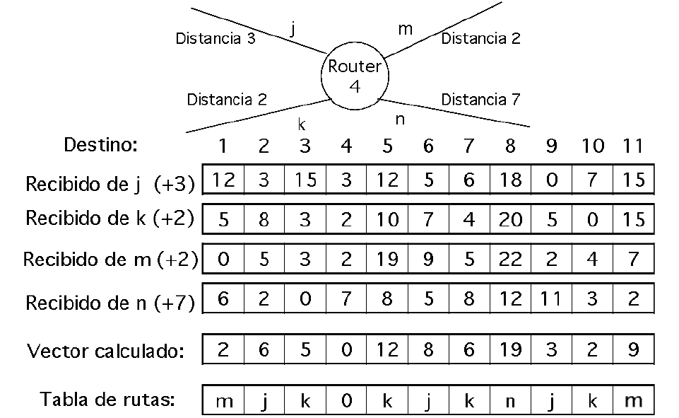

Consideramos que el router $R_4$ tiene $4$ vecinos alcanzables a través de los enlaces $j$, $k$, $m$ y $n$, cuyos costes para llegar a ellos respectivamente es de $3$, $2$, $2$ y $7$ unidades. Supongamos que los primeros cuatro vectores son los vectores de distancias que van llegando de cada uno de los enlaces, y que $R_4$ acaba de inicializarse, por lo que todo su vector de distancias vale  ∞. En este caso, para cada vector, el valor que aparece en la n-ésima posición representa el coste que anuncia el vecino de $R_4$ a este para llegar a $R_n$.

Aplicando el algoritmo, cuando llega el vector de distancias del vecino que tiene $R_4$ a través del enlace $j$, entraría en la sexta línea del algoritmo y, por tanto, para cada posición del vector, comprobaría si el valor + el coste del enlace $j$ es menor que el coste actual de $R_4$, que inicialmente es  ∞ en todas las posiciones excepto en la cuarta ($R_4$ llega a sí mismo con coste 0).

Por lo tanto, tanto el vector $X_1$ tras procesar este primer vector de distancia, como la tabla de rutas, quedarían:

$$
X_1 = [15, 6, 18, 0, 15, 8, 9, 21, 3, 10, 18] \newline
R = [j, j, j, 0, j, j, j, j, j, j, j]
$$

Cuando llega el segundo vector de distancia del vecino $k$ al que $R_4$ puede llegar con coste 2, de nuevo se va comparando elemento a elemento el valor + 2 con el valor actual de $X_1$:

$$
X_2 = [7, 6, 5, 0, 12, 8, 6, 21, 3, 2, 17] \newline
R = [k, j, k, 0, k, j, k, j, j, k, k]

$$

Tras recibir este segundo vector de distancia de otro vecino, $R_4$ aprende que para algunos destinos es mejor ir a través de otro vecino, por lo que actualiza algunas entradas de su tabla de rutas. Si procesamos los otros dos vectores de distancias, el resultado final sería:

$$
X_4 = [2, 6, 5, 0, 12, 8, 6, 19, 3, 2, 9] \newline
R = [m, j, k, 0, k, j, k, n, j, k, m]
$$

En el siguiente ciclo, $R_4$ enviaría a sus vecinos $X_4$, estos calcularían su vector de distancia y, una vez más, $R_4$ calcularía el suyo con la información recibida. Este proceso se sigue repitiendo de forma indefinida.

------------------

Así, con un intercambio de información solo con sus vecinos, el algoritmo de vector de distancias consigue calcular una tabla de rutas que le dice por qué enlace se alcanza mejor cada unos de sus destinos. Más adelante podremos ver cómo realmente ningún router conoce la topología real completa, pero con información de los costes a los destinos desde cada destino, y en base al principio de optimalidad, acaba conociendo poco a poco conforme el algoritmo converge el camino más corto a cada destino.

Algunos aspectos interesantes de este algoritmo son: su tiempo de ejecución, la convergencia del mismo y, evidentemente, su comportamiento cuando hay fallos en los routers o cambian los costes de los caminos.

#### El problema de la cuenta a infinito

El problema de la cuenta a infinito se puede ver con el siguiente ejemplo:

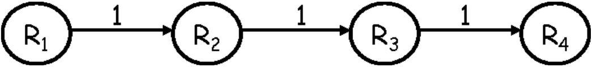

Tenemos cuatro routers, y el coste de cada uno de los enlaces es de una unidad. Tras aplicar el algoritmo de vector de distancia, y una vez que este converge, $R_1$ habrá aprendido que puede llegar a $R_4$ con coste 3 a través de $R_2$. Por otro lado, $R_2$ habrá aprendido que puede llegar a $R_4$ con coste 2 a través de $R_3$ y $R_3$ habrá aprendido que puede llegar a $R_4$ con coste 1 directamente. Denotaremos esta situación en el instante inicial $t_0$ por:

$$
t_0=<(3,R_2), (2,R_3),(1,R_4)>
$$

Indicando la primera tupla el coste y el vecino de llegar a $R_4$ desde $R_1$, la segunda tupla el coste desde $R_2$ y la tercera desde $R_3$.

Si aplicamos el algoritmo de vector de distancia directamente, podría pasar que, una vez que un router conoce su mejor coste para un destino dado, este ya no cambie nunca porque nunca llegan vectores de distancias que anuncien un mejor coste. No obstante, esto no es bueno porque, en caso de producirse un fallo, es necesario que se recalculen las rutas afectadas.

Para que el algoritmo de vector de distancias pueda adaptarse a esos cambios en la topología: en cada ronda de intercambio de vectores de distancia se elige el mejor coste (y vecino) de los recibidos para cada uno de los posibles destinos; si un enlace falla, el router eligirá un nuevo mejor camino a cada destino de entre los vectores de distancias que reciba del resto de enlaces. 

El problema de la cuenta a infinito surge cuando, tomando el ejemplo anterior, un enlace (en este caso el que une $R_3$ y $R_4$) falla. $R_3$ verá que no puede llegar a $R_4$, por lo que en la siguiente ronda de intercambio de vectores solo recibirá información del coste para llegar a $R_4$ de $R_2$. $R_2$ le anunciará que puede llegar en 2 unidades, por lo que $R_3$ aprende que puede llegar a $R_4$ con coste $2+1=3$ a través de $R_2$:

$$
t_1 =< (3, R_2 ), (2, R_3 ), (3, R_2 ) >
$$

En el siguiente instante, tanto $R_1$ como $R_3$ anuncian a $R_2$ un coste de 3 para llegar a $R_4$. Por lo que $R_2$ actualiza su vector de distancias y tabla de rutas con coste $4$:

$$
t_2 =< (3, R_2 ), (4, R_3 ), (3, R_2 ) >
$$

Cuando los routers intercambian sus vectores de distancia, $R_1$ y $R_3$ solo reciben información sobre como llegar a $R_4$ a través de $R_2$, que anunciará un coste de $4$. Por lo tanto, estos aprenden que pueden llegar con coste $5$:

$$
t_3 =< (5, R_2 ), (4, R_3 ), (5, R_2 ) >
$$

El proceso se repite cíclicamente y los routers cada vez aprenderían un coste más alto para llegar a $R_4$. Cuando lleguen al *infinito*, los routers se darían cuenta de que realmente es un destino inalcanzable.

Uno de los aspectos a tener en cuenta en este tipo de algoritmos es que pueden tener convergencia lenta. En estos algoritmos *las noticias buenas viajan muy rápido y las malas muy lento*. Cuando se avergiua una nueva ruta de menor coste se aprende en seguida, pero, cuando falla algún enlace, hasta que no se ha propagado la información por los routers tras varios ciclos, el algoritmo podría no converger a la solución. Este problema de la cuenta a infinito es un caso especial de esa convergencia lenta.

Posibles <span style="color:green">soluciones</span>:

- **Solución trivial**. Podríamos configurar un valor de infinito en el algoritmo a un entero pequeño (p.ej. 16), de forma que como mucho hagan falta esos ciclos hasta darse cuenta de que algún nodo es inalcanzable. No obstante, esto no es sino un intento de reducir el impacto del problema.

- **Split Horizon**. No permite a un router anunciar un coste hacia un determinado nodo destino por el interfaz que actualmente representa su mejor camino hacia dicho destino. En el ejemplo: como el mejor camino para llegar a $R_2$ es a través de $R_3$, $R_2$ no anuncia a $R_3$ un coste para llegar a $R_4$.

- **Split Horizon con Poisson Reverse**. En este caso, un router anuncia coste infinito hacia un determinado destino por aquella interfaz que actualmente representa su mejor camino hacia dicho destino. En el ejemplo, $R_2$ habría anunciado coste infinito a $R_3$ y esto también habría impedido la aparición del problema.

Este tipo de algotimo tine como principal ventaja su simplicidad, y como punto débil la convergencia. Un ejemplo de protocolo de Internet que estudiaremos más adelante y que usa este algoritmo es RIP.

### Algoritmo de estado de enlace <a name="Punto3.4"></a>

Su nombre se debe a que el funcionamiento general consiste en que cada router inunda en toda la red el estado de sus enlaces: información sobre qué enlaces tiene disponible y con qué coste. Cuando un router recibe del resto esa información del estado de los enlaces y agrega toda la información es capaz de construir un grafo con la topología de la red. Por tanto, una vez hecho esto, puede aplicar cualquier algoritmo centralizado, como puede ser el de Dijkstra, para calcular su camino más corto a cada posible destino.

Usaremos el siguiente ejemplo para explicarlo:

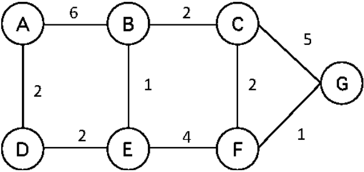

Al principio, cada router contacta con sus vecinos para ver cuáles siguien activos, midiendo también la distancia o coste hacia ellos. Una vez conocidos los vecinos y sus costes, construye un *Link State Packet* (LSP) que resume el estado de sus enlaces. Un LSP incluye, por un lado, el identificador del router que construye el LSP, un número de secuencia y una lista de vecinos y distancias a ellos. Como cada vez que hay un cambio en la topoogía se vuelve a calcular un LSP, el número de secuencia (que se va incrementando secuencialmente) permite distinguir para un mismo router el LSP más reciente con respecto a los anteriores. En el ejemplo, los LSPs construidos serían:

$$
< Id : A, Seqno : 21, N eigh : (B, 6)(D, 2) > \newline
< Id : B, Seqno : 21, N eigh : (A, 6)(C, 2)(E, 1) > \newline
< Id : C, Seqno : 21, N eigh : (B, 2)(F, 2)(G, 5) > \newline
< Id : D, Seqno : 20, N eigh : (A, 2)(E, 2) > \newline
< Id : E, Seqno : 21, N eigh : (B, 1)(D, 2)(F, 4) > \newline
< Id : F, Seqno : 21, N eigh : (C, 2)(E, 4)(G, 1) > \newline
< Id : G, Seqno : 21, N eigh : (C, 5)(F, 1) >


$$

Una vez construido su LSP, cada router lo inunda por toda la red para que el resto de routers puedan conocer esa parte de la topología de red. Cada router envía el LSP a sus vecinos y, a su vez, los vecinos lo reenvían por todas las interfaces menos aquella por la que le llegó. El resto de routers no tienen que calcular nada antes de retransmitir un LSP y, por tanto, esto hace que se pueda mejorar la convergencia ya que en todo momento lo que se transmite por toda la red es el estado actual de ciertos enlaces sin necesidad de esperar poco a poco a que converja al estado actual.

El número de secuencia también es útil para evitar reenviar varias veces el mismo LSP. En el ejemplo, E recibe el LSP que creó A tanto de B como de D, pero E es capaz de detectar el duplicado viendo que ambos tienen el mismo número de secuencia, reenviando solo el primero. Cada vez que llega un LSP de un origen con un número de secuencio superior al más alto de los vistos hasta el momento, se reenvía; si el número de secuencia es anterior o igual al más alto de los vistos hasta el momento, dicho LSP se descarta.

Lo que va a hacer cada router de la red conforme le llegan LSPs es construir una tabla con toda la información recibida. Para cada LSP se almacena:

- El origen del LSP

- El número de secuencia

- El tiempo de vida que le queda a esa información antes de expirar

- Información sobre el enlace por el que se ha recibido el LSP y por dónde debería reenviarse

- Información del estado de los enlaces de dicho LSP

En el ejemplo, el router C tendría la siguiente tabla de LSPs recibidos:

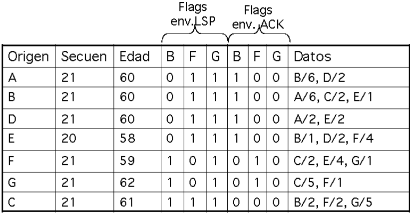

En el campo *edad* se indica el tiempo de vida del LSP; una vez transcurrido este tiempo, si no se ha recibido un nuevo LSP, la entrada se elimina de la tabla y se asume que se ha perdido la alcanzabilidad al router A.

En los *flags* hay una columna por cada vecino. Si en los *flags* de envío de LSP de un vecino aparece un 1 para un determinado origen, entonces cuando se reciba un LSP de ese origen se reenviará a ese vecino. Respecto a los *flags* de envío de ACK, en lugar de reenviar el LSP, enviará un mensaje de confirmación.

Una vez recibidos los LSPs del resto de routers de la red, y con la tabla de LSPs ya construida, el router ya puede construir su tabla de rutas calculando el camino más corto a cada uno de los routers de la red. Esto lo puede hacer de forma simple empleando un algoritmo centralizado como el de Dijkstra, ya que, con la información de la tabla, el nodo realmente conoce todos los enlaces y costes de cada uno de los routers de la red, por lo que realmente dispone de todo el grado o topología de la red.

En el ejemplo, el router C podría aplicar un esquema simple como el siguiente para calcular los caminos más cortos:

1. Inicialmente el nodo C se pone a sí mismo de raíz del *spanning tree* que representará sus caminos más cortos al resto de nodos. En esta fase de la construcción del *spanning tree* solo dispone de sí mismo como raíz.

2. Para cada uno de sus vecinos agrega un enlace desde el nodo raíz con el coste correspondiente. C conoce esta información porque es la que propaga en sus LSPs al resto de la red.

3. Usando la información contenida en los LSPs, agrega ahora a los vecinos de sus vecinos, así como los enlaces correspondientes con sus costes. Si aparece más de un camino hacia un nodo, se coge el más corto y se descartan los demás.

4. Se repite el paso anterior con cada uno de los nuevos nodos agregados en la fase anterior hasta que no se agregan nodos nuevos.

Una vez hemos terminado el árbol de expansión, el router puede construir de forma sencilla su tabla de rutas mirando, para cada nodo de la red, cuál de sus vecinos es el que froma parte del camino más corto entre él y dicho nodo en el *spanning tree*.

En este tipo de algoritmo, todos los nodos de la red conocen la topología completa detallada. Es por esto que se piensa que los protoclos de estado de enlace son más fiables y eficientes que los de vector de distancia. Este tipo de algoritmo se utiliza como base de varios protocolos de encaminamientod de Internet bien conocidos como OSPF o IS-IS.

### Comparativa de vector de distancias vs. estado de enlace <a name="Punto3.5"></a>

- Atendiendo al ***tamaño de los mensajes*** que cada uno de los dos algoritmos requiere, podemos afirmar que en los algoritmos de estado de los enlaces, en general, los mensajes son pequeños en tamaño porque el número de vecinos que tiene cada router es más o menos limitado en comparación con el número total de routers que puede haber en la red. En el algoritmo de vector de distancias, si hay muchos nodos en la red, los vectores de distancias podrían llegar a ser realmente grandes.

- Si nos fijamos en el ***número de mensajes*** que hay que enviar en la red, entonces el algoritmo de vector de distancias requiere menos envíos de mensajes porque el vector de distancias de cada router solo se envía a sus vecinos directos, mientras que en el algoritmo de estado de los enlaces, cada LSP de un determinado router debe inundarse por toda la red.

- En cuanto a las ***necesidades de memoria***, el algoritmo de vector de distancias es muy eficiente porque solo requiere almacenar un array con un valor de coste para cada posible destino, mientras que en estado de enlace es necesario almacenar todos los LSPs de todos los nodods para poder conocer la topología completa.

- En lo referente a la ***fiabilidad***, el algoritmo básico de estado de los enlaces podría inundar LSPs incorrectos o corruptos si no hay control de errores. Sin embargo, se puede añadir robustez de forma natural en caso de haya caminos alternativos cuyos LSPs no lleguen corruptos. En el caso del vector de distancias, una corrupción de un mensaje en la red podría llevar a anunciar caminos incorrectos a todos los destinos y que esta información incorrecta se pudiese propagar por la red.

Estos algoritmos representan una base sólida para poder calcular caminos más cortos en una red de forma distribuida y, por tanto, sobre ellos se han propuesto los protocolos de encaminamiento que se empelan hoy en día en Internet.

## El protocolo RIP <a name="Punto4"></a>

El *Routing Information Protocol* (**RIP**) se definió en 1983 en el RFC 1058 y es uno de los primeros protocolos de encaminamiento que se propusieron. En concreto, es un protocolo que se basa en el algoritmo de vector de distancias y que usa como métrica de encaminamiento el número de saltos. Es equivalente a considerar un coste de cada enlace de 1 unidad aunque, como es una métrica no óptima, el administrador podría poner más coste a algunos enlaces para intentar que usen los enlaces de mayor capacidad.

Cada uno de los routers mantiene una tabla con entradas para cada posible destino de la red llamada *routing database* que almacena la dirección de la red destino, el siguiente salto hacia esa red, la interfaz por la que llegar a ese siguiente salto, el coste de llegar a esa red destino y el tiempo transcurrido desde que se actualizó por última vez cada entrada de la tabla.

El protocolo RIP define dos mensajes **RIP Request** y **RIP Response**, que envían y reciben por el puerto 520 usando el protocolo UDP. El mensaje **RIP Request** lo envían aquellos nodos que acaban de incorporarse a la red o han estado un tiempo desconectados para solicitar a sus vecinos que le pasen sus vectores de distancia actuales y así actualizarse. Los mensajes **RIP Response** se envían tanto como respuesta a un **RIP Request** como cuando es necesario informar de cambios en la base de datos de rutas a los vecinos.

RIP distingue entre participantes activos y pasivos. Los pasivos solo escuchan los vectores de distancias y actualizan la tabla de rutas, pero nunca envían mensajes **RIP Response**. Los activos sí que reciben y envían vectores de distancias para colaborar en el cálculo de las tablas de rutas de toda la red. Los nodos activos envían mensajes **RIP Response** cada 30 segundos, incluyendo su vector de distancias (parcialmente en caso de que no quepa en un único mensaje) formado por pares $<IP_{dst},coste>$ para cada red destino. Si durante 180 segundos no se ha vuelto a saber nada de una determinada red destino, esta se elimina de la *routing database*. Existe también una red destino especial (0.0.0.0) que se usa para anunciar una ruta por defecto.

El procedimiento de actualización de la *routing database* conforme se reciben mensajes **RIP Response** es similar al algoritmo de vector de distancia estudiado. Para cada entrada del vector de distancias incluido en el mensaje, se comprueba si el coste que nos anuncian más nuestro coste para el vecino que nos lo anuncia es menor que el que teníamos. Como puede haber cambios muy frecuentes en la ruta a seguir para una determinada red, se usa histéresis. Es decir, solo se actualiza de la ruta anterior a una nueva si el coste de la nueva es estrictamente menor que la actual.

Algunas características que incorpora RIP:

- **Triggered Updates**: envía un mensaje **RIP Response** cuando ha cambiado la métrica de alguna de las entradas de la *routing database* sin necesidad de esperar al siguiente envío periódico que se hace cada 30 segundos.

- **Split Horizon**: si está activada, no se anunciará una red destino a un vecino que actualmente sea el mejor siguiente salto para alcanzar dicha red.

- **Poisson Reverse**: si se activa,  las redes inalcanzables se anunciarán con coste $\infin$, que en el caso de RIP es 16. Usado en combinación con las *triggered updates*, permitiría que esta información se propague de forma inmediata.

- **Hold down timer**: en caso de activarse, esta opción mejorará la convergencia en redes grandes, ya que durante 60 segundos un router ignorará todo vector de distancias referente a una red inalcanzable.

Uno de los problemas que tenía la versión 1 de RIP era que se creó antes de que existiese el concepto de subred. En el año 1993 fue necesaria la propuesta de una versión 2 del protocolo, descrita en el RFC 1388 que ya sí que permitía, a la hora de indicar redes destino, poder asociar también la máscara de red correspondiente para poder saber si esa entrada del vector de distancias se refería a una red o a una subred. En la versión 2 también se incluyó un mecanismo muy simple de autenticación de los mensajes RIP.

A la izquierda RIP v1, a la derecha RIP v2:

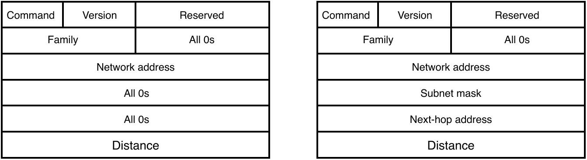

Las principales <span style="color:green">ventajas</span> de RIP son su sencillez y su amplia disponibilidad en casi cualquier equipamiento de red. Como <span style ="color:red">desventajas</span> tenemos las mismas que tenía el algoritmo de vector de distancias: convergencia lenta, métrica poco dinámica y la posibilidad de crear bucles que cargarían bastante la red de mensajes RIP hasta ser detectados y converger, especialmente en redes bastane grandes.

Este protocolo se usa fundamentalmente en encaminamiento intradominio y, fundamentalmente, en redes de un tamaño no muy grande.

## El protocolo OSPF <a name="Punto5"></a>

El protocolo OSPF en su versión 2 se define en el RFC 2328. Se trata de un protocolo basado en estado de enlace mucho más completo que RIP y, por tanto, también es más complejo. Algunas características fundamentales son:

- Es un protocolo adaptativo que reacciona de forma rápida a cambios topológicos, al menos mucho más rápido que RIP.

- Permite soportar tanto subnetting como CIDR.

- Es capaz de encaminar en base a múltiples métricas y, en caso de existir caminos de igual longitud a un destino, es capaz de balancear carga entre los diferentes caminos existentes.

- Para mejorar la escalabilidad, es capaz de organizar un sistema autónomo en áreas de menor tamaño de tal forma que se pueda aliviar la sobrecarga de distribución de información de encaminamiento por todo el sistema autónomo.

- Soporta integración con redes externas, así como la mejora de su eficiencia en redes locales mediante la elección de routers designados.

### Visión general <a name="Punto5.1"></a>

El funcionamiento general de OSPF es similar al algoritmo de estado de enlace. Cada router OSPF mantiene una base de datos con la topología del sistema autónomo. La información allí contenida proviene de los mensajes de estado de enlace que inundarán diferentes routers de la red en mensajes *Link-State Advertisements* (LSA). Aplicando el algoritmo de Dijkstra, cada router calculará el árbol de caminos más cortos a cada destino y así podrá calcular su tabla de rutas. Las redes destino que se hayan podido aprender de otrs ASs ( como pueden ser las rutas externas), se añaden a la base de datos como nodos hoja del router que aprendió esas rutas y las anunció en su LSA.

Uno de los aspectos más importantes de OSPF es el concepto de área. Las áreas en OSPF están formadas por un conjunto de routers y permiten añadir un nivel adicional de jerarquía en el enrutamiento. El objtivo del área es minimizar el tráfico de control OSPF necesario en la red. Dado que inundar cada LSA de cada router por todo el sistema autónomo no sería escalable, lo que propone OSPF es dividir el AS en áreas de menor tamaño, de forma que los routers solo tienen que inundar sus LSA dentro de su área. Para aplicar Dijkstra, un router solo tendrá que conocer la topología de su área. Es más, la topología de un área es invisible fuera de ella. Para que esta mejora sea posible, se establecen una serie de condiciones que han de cumplirse:

- Siempre tiene que haber como mínimo un área con identificador 0, también llamada *backbone*.

- Todas las otras áreas han de tener conectividad con el área 0 mediante al menos un router que tenga al menos una interfaz de red en cada una de dichas áreas (router frontera).

- Un router puede pertencer simultáneamente a dos o más áreas, en cuyo caso debe mantener la base de datos de rutas y hacer los cálculos de los caminos más cortos para cada una de ellas.

- Dos áreas solo pueden hablar entre sí a través del área 0 o *backbone*. El router frontera entre un área y el área 0 se encargará de resumir la información de su área para que se inunde en el área 0, así como de inundar dentro de su propia área los resúmenes de rutas que reciba del área 0.

En base a esta división en áreas, y a la función que realizan dentro de la jerarquía, se clasifican los routers OSPF en:

- **Routers internos**: solamente están conectados a redes del mismo área. Solo deben mantener en su base de datos la topología del área, sus LSAs también se inundan solo dentro de su área.

- **Routers frontera de área (ABR)**: tienen interfaces que les conectan a diferentes áreras. Deben mantener una base de datos de la topología de red independiente para cada área. Entre sus funciones está la de generar resúmenes de su área (*summary LSAs*) y propagarlos al área *backbone* para que puedan inundar el resto de áreas. Estos resúmenes contienen un listado de las redes —con los costes de alcanzarlas— dentro del área. Así, no se propaga la topología interna del área fuera de la misma.

- **Routers *backbone***: están conectados con alguna red del área 0. Su función fundamental es ayudar en la difusión de los LSAs dentro del área *backbone*.

- **Routers frontera de AS (ASBR)**: tienen conectividad mediante alguna de sus interfaces con redes externas al AS. Su función será difundir en el AS las rutas para que dichas redes sean conocidas dentro del AS.

En función de las áreas que atraviesan, las rutas también podrán ser de diferentes tipos:

- **Rutas intra-área**: origen y destino de la ruta están en un mismo área.

- **Rutas inter-área**: origen y destino de la ruta están en áreas distintas de un mismo AS.

- **Rutas inter-AS**: origen y destino están en ASs distintos.

Podemos ver un ejemplo de red OSPF a continuación:

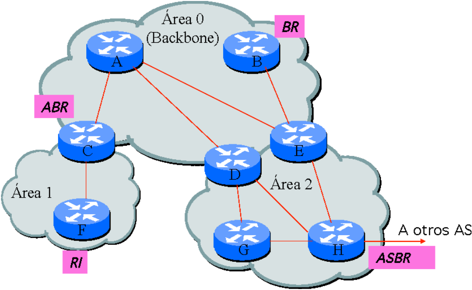

Donde podemos ver tres áreas: *backbone*, área 1 y área 2. El router F sería un router interno, el router C es un router frontera de área, el router B es un router de *backbone* y el router H es un router frontera de AS. La ruta D-G-H es una ruta inter-área, la ruta F-C,C-A-D,D-G-H es una ruta inter-área y, finalmente, las rutas del tipo A-D,D-G-H,H-... son rutas inter-AS.

Un ASBR no tiene porqué ser un router del área 0, sino que puede estar en cualquiera de las áreas.

### Formato de los mensajes OSPF <a name="Punto5.2"></a>

La cabecera OSPF viaja directamente sobre datagramas IP con tipo de protocolo número 89.

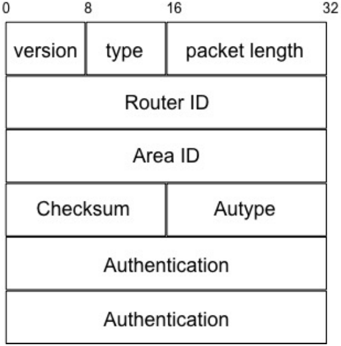

- **Version**: indica la versión de protocolo que se está usando. La `0x02` sería la versión 2 y la `0x03` indicaría la versión 3.

- **Type**: es el tipo de mensajes. Existen 5 tipos de mensajes OSPF (no confundir con los tipos de LSA):
  
  - `0x01` - Hello
    Se usa para conocer la topología local.
  
  - `0x02` - Database description
    Se usa para establecer adyacencias, es decir, mantener sincronizada la información entre vecinos.
  
  - `0x03` - Link State Request
    También se usa para establecer adyacencias.
  
  - `0x04` - Link State Update
    Inunda la red con mensajes LSA. Puede contener uno o más LSA.
  
  - `0x05` - Link State Ack
    Asentimiento que confirma la recepción correcta de un *Link State Update*.

- **Packet Length**: indica la longitud de todo el paquete OSPF en bytes.

- **Router ID**: identificador único del router que envía el mensaje. Si no lo configura el administrador, se usa automáticamente la mayor de las direcciones IP que tenga asignado el router en alguna de sus interfaces.

- **Area ID**: identificador del área a la que pertenece el mensaje que envía el router.

- **Checksum**: suma de comprobación de 16 bits que cubre todo el paquete excepto el campo `authentication`.

- **Autype**: tipo de autenticación empleada.
  
  - `0` - Sin autenticación
  
  - `1` - Texto plano
  
  - `2` - MD5

- **Authentication**: información de autenticación que varía en función del mecanismo de autenticación empleado (nada, clave compartida o resumen MD5 según el caso).

### Intercambio de mensajes Hello <a name="Punto5.3"></a>

La primera parte del funcionamiento de OSPF consiste en conocer a los vecinos para poder conocer el estado de los enlaces. Cada router envía por cada una de las interfaces donde tenga habilitado el protocolo OSPF mensajes *Hello* de forma periódica. Por defecto, cada 10 segundos se envía un mensaje *Hello* y un vecino se considera inalcanzable si no se reciben mensajes *Hello* de él en 40 segundos, aunque estos valores puede cambiarlos el administrador de la red.

Estos mensajes incluyen el router ID del emisor, el área ID así como una lista de vecinos conocidos. Así, se puede comprobar si existe bidireccionalidad entre ambos vecinos. Si en el mensaje *Hello* de mi vecino aparezco listado como vecino, entonces es seguro que disponemos de un enlace bidireccional. Estos mensajes se envían a una dirección multicast denominada *AllOSPFRouters* (224.0.0.5) con TTL=1 para que solo sean recibidos por aquellos equipos conectados a la red que sean routers OSPF.

Una de las funciones adicionales de los mensajes *Hello* es el establecimiento y mantenimiento de las relaciones de adyacencia. Solo se podrá intercambiar información de LSAs entre aquellos routers que tengan establecida una relación de adyacencia. No todos los vecinos se consideran routers adyacentes. En redes donde pueda haber varios routers, para reducir la sobrecarga de control, solo se establecen relaciones de adyacencia con aquellos routers vecinos que realmente sea necesario. Los routers adyacentes mantendrán sincronizadas sus bases de datos de rutas y, además, un router siempre comunicará cualquier cambio a todos sus vecinos con los que tenga establecida una relación de adyacencia.

Un caso muy común que sirve de ejemplo en el que no se establecen adyacencias con todos los vecinos se da en las redes de acceso múltiple cuando hay varios routers OSPF conectados al mismo segmento de red. Viendo la siguiente figura:

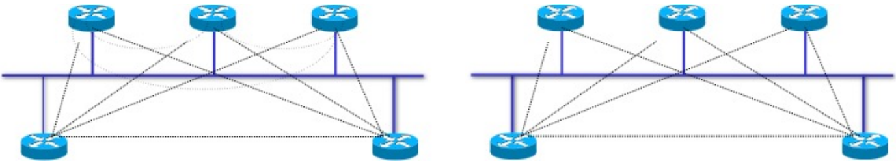

Si OSPF estableciese adyacencias con todos los vecinos, cada router debería enviar el estado de sus enlaces a los otros $n-1$ routers de dicho segmento de red, necesitando por tanto, para intercambiar toda la información entre todos, un total de $\frac{n\times (n-1)}{2}$ mensajes cada vez intercambien información. En estos casos es mucho más efectivo elegir un único router con el que todos establecen adyacencia y este mantenga a todos sincronizados. En el caso de OSPF, por la tolerancia a fallos, se eligen dos routers: el **router designado** (DR) y el **backup router** (BDR). Cada uno de los routers de la red establecerá una adyacencia con cada uno de estos dos que, a su vez, también establecerán entre ellos. En la topología de la derecha podemos ver cómo el número de adyacencias es menor.

El proceso de **elección del router designado** consiste en:

1. Si existe un router designado, se mantiene.

2. Si no, en base a la información de los mensajes *Hello* se elige aquel que tiene un valor más alto en el campo *Prioridad*. Este valor lo establece el administrador en la configuración de cada uno de los routers.

3. Si hay un empate de prioridades, se elige el router que tenga un *Router ID* mayor.

El BDR será justo el siguiente siguiendo los mismos criterios.

Una vez se han elegido el DR y el BDR, se encargarán de mantener adyacencias con el resto de routers de la red de medio compartido. Para ello, sincronizarán las bases de datos de estado de enlace mediante la recepción y el envío de LSAs con destino el grupo multicast *AllDRouters* (224.0.0.6). El resto de routers solo establecerán adyacencias con el DR y el BDR, pero no entre sí.

El DR es el responsable de resumir la topología de la red de medio compartido e inundar dicha información por todo el área a la que pertenece la red. A este resumen de la topología se le llama *Network* o LSA de tipo 2. Por su parte, en caso de que el DR falle, sería el BDR el responsable de hacer este resumen e inundarlo por el área.

### Intercambio de bases de datos <a name="Punto5.4"></a>

Cuando dos routers OSPF se ven por primera vez, han de proceder a intercambiarse y sincronizar la información de sus bases de datos.

Cada router almacena dos bases de datos denominadas *Router Link States* y *Network Link States*. La primera almacena información sobre el último LSA recibido de cada uno de los routers de la red. La segunda, para aquellas partes de la red que se resumen como redes en lugar de conocer la topología detallada, contiene el último LSA recibido anunciando cada una de esas redes.

Para hacer esta sincronización inicial, los routers se envían mensajes *Database Description* por unicast que contienen la lista de mensajes LSA que hay en sus bases de datos (no su contenido). Si el vecino que se acaba de conocer tiene LSAs distintos a los del router actual, o incluso dispone de versiones más actualizadas que las almacenadas localmente, entonces este solicitará mediante un mensaje *Link State Request* también unicast, aquellos que necesita. El router vecino responderá con un *Link State Update* (multicast) incluyendo los LSA completos solicitados. una vez recibidos, el nodo confirma la recepción correcta enviando un *Link State ACK* (multicast) de vuelta.

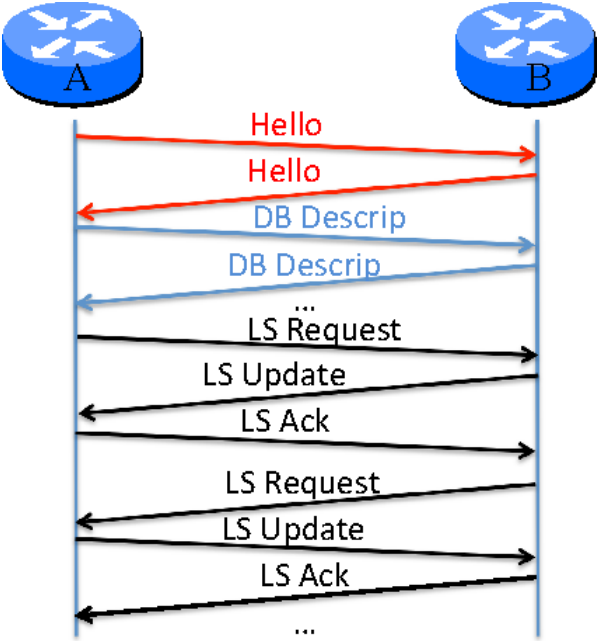

En este ejemplo, podemos ver como el router A, que lleva un tiempo arrancado, envía un mensaje *Hello* al router B en cuanto este último arranca, B le responde con otro mensaje *Hello*. Una vez descubren que son vecinos, intercambian mediante los mensajes unicast *Database Description* los contenidos de sus vases de datos. Después, cada uno le pide al otro los LSAs que necesita y, finlmente, se envían los mensajes *Link State Update* y *Link State ACK* para finalizar la sincronización de la información.

Mientras no haya cambios topológicos, los routers OSPF vecinos solo intercambian mensajes *Hello*. Sin embargo, ante algún cambio en la topología o las condiciones de los enlaces, el router que lo detecta envía de nuevo los LSAs correspondientes en un mensaje *Link State Update*. De nuevo, los routers que reciben los nuevos LSAs asienten con un *Link State ACK*.

### Tipos de LSAs <a name="Punto5.5"></a>

OSPF usa 5 tipos de mensajes distintos para cumplir su cometido. Además, a la hora de propagar información de routing por la red, OSPF también utiliza diferentes tipos de LSAs, de manera que muchas veces pueden confundirse los LSAs con mensajes OSPF. En realidad, los LSAs solo viajan sobre mensajes *Link State Update* que se envían a la dirección multicast $224.0.0.5$ con TTL=1 y por aquellas interfaces donde hay un vecino adyacente. Un mismo mensaje *Link State Update* puede transportar varios LSAs en su interior que incluso pueden ser LSAs de tipos distintos.

Los LSAs son los que contienen información sobre el estado de los enlaces, por lo que para poder entender bien el funcionamiento de OSPF se hace imprescindible conocerlos. En OSPFv2 se distinguen 7 tipos básicos de LSAs en función de la información que transportan:

1. **Router LSA**: contienen el router-ID de cada router y sus correspondientes enlaces, incluyendo cada uno su máscara de red, dirección de red IP y coste. Cada router OSPF construye un LSA de tipo 1 con su información y lo inunda dentro del área a la que pertenece. Un router envía un LSA tipo 1 por cada área a la que está conectado. Si un router tiene conectividad externa a otras redes (es un ASBR), lo marca activando un bit dentro del mensaje router LSA. Este mensaje se inunda por todo el área y nunca sale de ella.

2. **Network LSA**: solo envían los DR de una LAN de medio compartido, indicando las direcciones IP del DR y del resto de routers OSPF, el prefijo de red y la máscara de red de esa subred. Se inunda también por todo el área y sirve para ayudar también a conocer la topología al igual que los anteriores. Este mensaje se inunda por todo el área y nunca sale de esta. Por un área podría o no circular LSAs de tipo 2, en función de si hay o no segmentos de red de medio compartido donde haya varios routers OSPF.

3. **Network summary LSA**: los LSA de tipo 1 y tipo 2 no fluyen nunca fuera de un área porque los ABR no los inundan por las interfaces que conectan con otras áreas. En su lugar, un ABR genera un LSA de tipo 3 para cada una de las redes que existen dentro de un área y las envía a sus vecinos de otras áreas para que en la otra área sepan que dichas redes existen y están alcanzables a través del ABR. Sin embargo, no se revelan los detalles de la topología interna del área fuera de ella.

4. **ASBR summary LSA**: este tipo de LSA es similar al anterior en cuanto a que lo genera el ABR de un área donde hay algún ASBR y lo propaga al área 0 para que sea inundado en el resto de áreas. Un ABR sabe que tiene que generar un LSA de tipo 4 al ver el bit activo en el LSA de tipo 1 que reciba dicho router que es un ASBR, o el LSA de tipo 2 que reciba donde se aparezca dicho router. Este LSA en lugar de incluir el coste de llegar a las redes del área, lo que incluye son costes de llegar hacia los ASBR que pueda haber dentro del área. Es decir, para cada ASBR del área incluye su IP y el coste de llegar a él desde el ABR.

5. **External LSA**: incluye información sobre redes que están fuera del sistema autónomo y el coste de llegar a las mismas. Este tipo de LSAs los generan los ASBR para cada ruta externa que conozcan y se propagan completamente por todo el sistema autónomo. Si así lo configurase el administrador, un ASBR también podría anunciar una red (0.0.0.0) en un LSA tipo 5 para anunciar una ruta por defecto para llegar a cualquier destino cuya IP esté fuera del AS.

6. **Multicast LSA**: actualmente no está soportado y no se usa.

7. **External LSA**: también se conoce como *Not-so-stubby Area* (NSSA) LSA, ya que solo se usa en ese tipo de áreas especiales llamadas NSSA. En dichas áreas, no se permiten LSAs de tipo 5, por lo que, cuando algún router de ese tipo de área tiene conectividad externa, se anuncian las rutas externas aprendidas en este LSA de tipo 7 en lugar de en un LSA de tipo 5.

Por lo tanto, no todos los LSAs se propagan por toda la red (excepto los LSA de tipo 5) intentando justamente reducir el tráfico de control. La información que es necesario que viaje por la red en el caso de tener sistemas autónomos de un tamaño grande. El motivo fundamental que nos permite usar esta estructura jerárquica es que a la hora de hacer el encaminamiento, un router lo que hace es que cuando le llega eld atagrama elige el siguiente salto al destino. Por tanto, para una red destino dentro de un área, un router de fuera solo necesita saber su siguiente salto hacia el ABR que ofrece un menor coste, y ya será el ABR y el resto de los routers de dentro del área los que se encargarán de seguir enrutando el datagrama por el camino más corto. Al fin y al cabo, el principio de optimalidad nos garantiza que si cada router envía el mensaje a su vecino que forma parte del camino más corto hacia el destino, al final el mensaje acaba viajando por el camino más corto al destino.

Analizaremos la siguiente imagen:

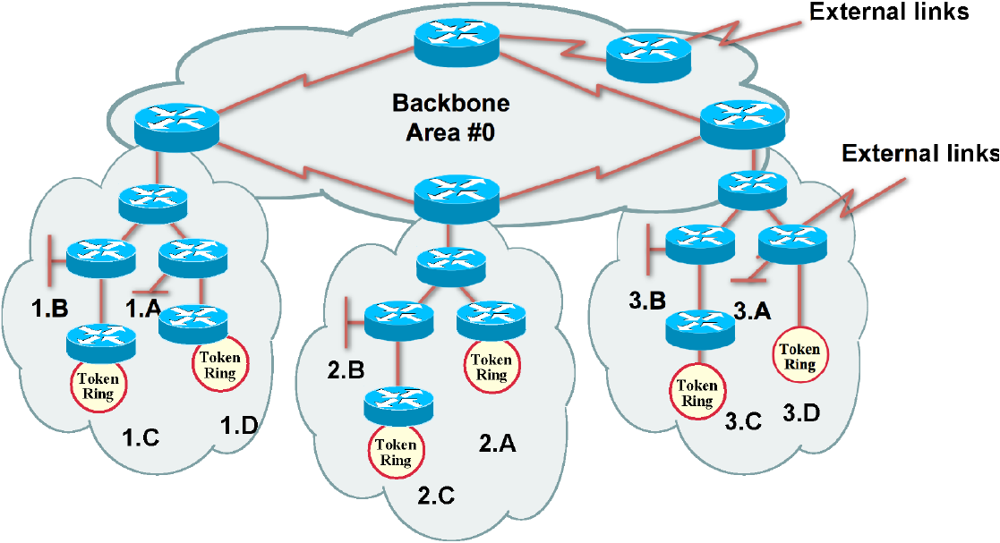

Podemos ver cómo está formada por 4 áreas. El área 1 contiene las redes 1.A hasta 1.D, el área 2 las 2.A hasta 2.C y el área 3.A hasta 3.D.

Centrándonos en el área 1, cada uno de los routers, a traves del procedimiento mencionado de sincronización de bases de datos de rutas, generará su LSA de tipo 1 indicando el estado de sus enlaces y lo enviará a sus vecinos, que a su vez lo inundará por dentro de todo el área. En las redes de medio compartido (hay más de un router OSPF) se elegirá un router designado que también inundará por todo el área sus LSAs de tipo 2 informando de las redes de ese segmento de red. Con toda la información inundada por todo el área, los routers (incluído el ABR) conocen la topología completa, por lo que son capaces de añadir a su tabla de rutas, para cada una de las redes, quién es su mejor vecino aplicando el algoritmo de Dijkstra. El mismo procedimiento sucede en las áreas 2 y 3 con sus respectivas redes.

En este estado, cada router solo sabría encaminar a destinos dentro de su propio área. Para que un router de un área pueda saber cómo llegar a redes de otras áreas, los ABR se encargarán de enviar por el interfaz de red que les une al área backbone un mensaje *LS Update* que incluye LSAs de tipo 3 que contienen todas las redes que hay dentro de su área y el coste de llegar a ellas. En concreto, si la métrica fuese el número de saltos, las máscaras de red de 24 bits y el *Router-ID* del ABR del área 1 fuese $130.206.1.19$, la información de un LSA tipo 3 que enviaría el ABR del área 1 sería:

```bash
Link State ID: 1.A
Advertising Router: 130.206.1.19
Netmask: 255.255.255.0
Metric: 3

Link State ID: 1.B
Advertising Router: 130.206.1.19
Netmask: 255.255.255.0
Metric: 3

Link State ID: 1.C
Advertising Router: 130.206.1.19
Netmask: 255.255.255.0
Metric: 4

Link State ID: 1.D
Advertising Router: 130.206.1.19
Netmask: 255.255.255.0
Metric: 4
```

La información de los LSA tipo 3 de los ABR de las otras áreas sería similar, pero anunciando las redes 2.A al 2.C y 3.A a 3.D respectivamente.

Estos LSAs de tipo 3 se inundarán por el área backbone, por lo que también serán recibidos por los ABR de las otras áreas. En este instante, los ABRs sabrían llegar tanto a redes de dentro de su área, porque ya lo aprendieron antes con los LSAs de tipo 1 y 2, como a redes de otras áreas porque acaban de recibir los LSAs de tipo 3 de los otros ABRs.

Para que los routers internos de cualquiera de las tres áreas pueda disponer en su tabla de rutas de entradas para saber llegar a redes de otras áreas, los ABR inundan dentro de su área los LSAs de tipo 3 que han recibido de los otros LSAs. De esta forma, los routers internos del área 1 aprenderán a llegar a las redes 2.A  a 2.C y 3.A a 3.D, los del área 2 aprenderán a llegar también a las redes 1.A a 1.D y 3.A a 3.D y, finalmente, los del área 3 también sabrán llegar a las redes 1.A a 1.D y 2.A a 2.C. La ventaja de este esquema radica en que los mensajes LSA de tipo 3 contienen la información suficiente para que desde un área se aprenda a llegar a redes de otras áreas, pero no se necesita enviar toda la topología completa del área, que sería mucho más costoso en cuanto a mensajes y volumen de tráfico de control a enviar.

En cuanto a los LSA de tipo 4, los generan los ABR y se usan para anunciar rutas hacia los ASBR. En el ejemplo, el ABR del área 3, al recibir el LSA de tipo 1 del ASBR con el bit de ASBR activo, enviaría hacia el área backbone un LSA de tipo 4 anunciando la IP del ASBR y el coste de llegar a él. Este mensaje llegaría a los otros ABR que lo propagarían para que los routers de dentro de un área sepan llegar al ASBR que hay en el área 3. De forma similar, como el otro ASBR está ya en el área 0, y los ABRs forman parte de su área y también del backbone, los ABR ya conocen la topología interna del área 0 y están informados de que hay un ASBR en dicha área. Por tanto, ellos mismo generan un LSA de tipo 4 informando de la IP del ASBR del área 0 y su coste.

Para anunciar redes externas, son los ASBR directamente los que generan LSAs de tipo 5 indicando para cada red externa que han aprendido su dirección de red y su coste. Estos LSAs de tipo 5 se inundan por toda la red, por lo que todo router del sistema autónomo puede añadir a su tabla de rutas una entrada apuntando a esas redes y poner como siguiente salto su vecino que esté en el camino más corto hasta el ASBR que anunció dicha ruta, una vez aplicado Dijkstra sobre su visión de la topología de red.

Un aspecto a considerar en el caso de las rutas externas es que, en muchos casos, puede suceder que el coste empleado por el protocolo externo a nuestro AS use unidades distintas a las que usa OSPF dento de nuestro AS. A la hora de hacer la redistribución de esas rutas, hay que ver con qué coste las anuncia el ASBR. OSPF permite al administrador elegir entre dos tipos de métricas:

- **Tipo 1**: el coste que anuncia el ASBR se va actualizando conforme se propaga esa ruta, por lo que para un router que esté a un coste de *$x$* unidades del ASBR, el coste de llegar a esa ruta externa será el que anuncia el ASBR *$+\ x$* unidades.

- **Tipo 2**: el coste que anuncia el ASBR se mantiene constante dentro de todo el AS. Por tanto, para cualquier router de la red OSPF, el coste de llegar a ese destino externo será el mismo que anunció el ASBR.

El primer tipo de métrica puede ser interesante para cuado se desea hacer distribución de la carga entre los diferentes ASBR, porque si cada ASBR anuncia el mismo coste, cada router del AS irá hacia esa red externa por su camino hacia el ASBR más cercano.

El segundo caso puede ser interesante cuando se prefiere que el tráfico vaya por un ASBR hacia esa red externa y, solo si este falla, pueda ir por el otro. En tal caso, el administrador puede configurar los ASBRs para que anuncien costes distintos de forma que, como el coste no varía dentro del AS, todos los routers irían por el ASBR que anuncia un menor coste (salvo que este no esté disponible).

Una vez completado el proceso, todos los routers conocerían las rutas a cada una de las redes de cada una de las áreas así como a las redes externas a las que haya conectividad a través de los ASBR.

### Tipos de áreas <a name="Punto5.6"></a>

En algunos escenarios de red particulares donde las áreas cumplen ciertas propiedades, el administrador de red podría optimizar aún más el tráfico de control del protocolo OSPF, evitando tener que distribuir cierta información de rutas que igual no es necesaria para el correcto funcionamiento del encaminamiento.

#### Resumen de rutas

Cuando hay redes de dentro de un área que tienen rangos de direccionamiento contiguos y pueden agregarse, un ABR realmente no necesitaría enviar un LSA de tipo 3 para cada una de las redes internas del AS. Podría bastar con enviar un LSA de tipo 3 para cada conjunto de redes que puedan ser agregables usando una máscara de red que agrupe a todas. Esto se conoce como *route summarization*.

En ele ejemplo anterior, si suponemos que las redes 1.A a 1.D tienen las siguientes direcciones:

```bash
130.206.0.0/24
130.206.1.0/24
130.206.2.0/24
130.206.3.0/24
```

El ABR del área 1 podría simplemente anunciar un único LSA de tipo 3 incluyendo como red la `130.206.0.0/22`, de forma que el resto de routers del sistema autónomo aprendería a llegar a las 4 redes destino y solo necesitarían una entrada en su tabla de rutas.

Un ASBR también podría resumir diferentes rutas externas en un menor número de LSAs de tipo 5.

#### Áreas especiales

Hasta este punto, se ha asumido siempre un comportamiento normal de lo que se llama un *área estándar*. Sin embargo, para algunos escenarios de red particulares, un administrador puede plantearse el uso de los siguientes tipos de áreas para mejorar la eficiencia de OSPF.

- **Stub area**: se pueden usar cuando dentro de un área no hay ningún ASBR y, para llegar a redes externas al AS, cualquier router de dentro del área va a tener que pasar en cualquier caso por alguno de los ABR. En estos casos, el administrador puede ahorrarse la inundación de mensajes LSA de tipo 4 y 5 de otras áreas que harían los ABR hacia dentro del área. Esto es así porque, en cualquier caso, la ruta hacia esos destinos externos al AS para los routers internos siempre va a ir por su camino más corto hasta el ABR correspondiente.
  Si se configura como *stub*, el ABR se encarga de filtrar todos los LSA de tipo 4 y 5 y, en su lugar, genera un LSA de tipo 3 anunciando una ruta por defecto (red 0.0.0.0). Los routers internos tendrán en su tabla de rutas entradas para llegar a redes de su propia área, entradas para llegar a redes de las otras áreas y una ruta por defecto para llegar al resto de redes externas.

- **Totally Stub area**: se pueden usar cuando, incluso para llegar a otras áreas, la única alternativa pasa por un único ABR. Es decir, los routers internos del área, para llegar a cualquier red que no sea de su propia área, irían por su siguiente salto en su camino más corto hacia el ABR, independientemente de la información que llegue de fuera.
  Si se configura como *totally stub*, el ABR no dejaría pasar hacia dentro del área los LSAs de tipo 4, tipo 5 ni de tipo 3. En su lugar, el ABR genera un LSA de tipo 3 anunciando una ruta por defecto. Así, en la tabla de rutas de los routers internos solo habría entradas para poder llegar a las redes de dentro del propio área y una ruta por defecto para cualquier otra red tanto de otras áreas como externas.

- **Not-so-stubby area (NSSA)**: es una variación del área *stub* en la que sí se permite que haya routers ASBR dentro del área, pero no interesa que lleguen rutas externas de otras áreas en forma de LSAs de tipo 5. Al configurar un área como NSSA, el ABR no difunde los LSAs de tipo 5 de otras áreas dentro del área NSSA. En este caso, los ASBR en un área NSSA, en lugar de generar LSAs de tipo 5, generan LSAs de tipo 7. Funcionalmente son iguales, pero se envían de tipo 7 para diferenciarlos de los de tipo 5.

- **Totally NSSA**: es una variante de la NSSA en la que tampoco queremos que el ABR deje entrar LSAs de tipo 3 a otras áreas. Los routers internos del área tendrán solo entradas en sus tablas de rutas para redes internas al área, redes externas aprendidas con los LSAs de tipo 7 de los ASBR y, finalmente, una ruta por defecto que anunciaría el ABR para poder llegar a redes del resto de áreas y redes externas alcanzables desde otras áreas que no sean alcanzables desde los ASBR internos al área.
  Si una red externa es alcanzable tanto por un ASBR interno al área como por un ASBR de otra área, los routers internos siempre preferirían ir por el ASBR interno, ya que las rutas tendrían preferencia en la tabla de rutas frente a una ruta por defecto.

Estos mecanismos pueden dar un cierto grado de flexibilidad al administrador para poder controlar por dónde fluye el tráfico a determinados destinos y, así, intentar conseguir un mejor aprovechamiento de los enlaces en base a sus intereses.

### Encaminamiento multi-métrica <a name="Punto5.7"></a>

En lugar de calcular un camino más corto para cada destino, realmente OSPF calcula cinco caminos más cortos, uno para cada métrica. Las cinco métricas que se definieron para los datagramas IP eran los 5 valores posibles que podría tomar el campo *Type of service (ToS)* de la cabecera IP, y que eran métricas asociadas a los enlaces de la red:

- `0x00`: número de saltos, equivalente a asignar coste 1 a cada enlace.

- `0x02`: coste monetario fijado por el administrador al configurar cada enlace.

- `0x04`: fiabilidad en términos del histórico reciente de tasa de pérdida de paquetes.

- `0x08`: velocidad de transmisión del enlace (duración de un bit en unidades de 10 ns).

- `0x10`: tiempo de transmisión + tiempo de encolado.

Cada router calculaba cinco *spanning trees* distintos aplicando Dijkstra con las 5 métricas diferentes asociadas al coste de los enlaces y, en función de la IP destino y del ToS de cada datagrama, se elegía el siguiente salto del camino según el *spanning tree* que correspondiese.

Hoy en día, en que el uso del campo ToS ya no está permitido por los estándares, los routers OSPF usan como métrica de los enlaces el ancho de banda predeterminado ($ 10^8$) dividido por el ancho de banda de la interfaz:

$$
C(i)=\frac{10^8}{BW_i}
$$

Ejemplos de coste para diferentes tipos de enlaces:

| Tipo de interfaz             | BW de referencia | BW predeterminado | Coste |
|:----------------------------:|:----------------:| -----------------:| -----:|
| 10 Gigabit Ethernet (10Gb/s) | 100.000.000      | 10.000.000.000    | 1     |
| 1 Gigabit Ethernet (1Gb/s)   | 100.000.000      | 1.000.000.000     | 1     |
| Fast Ethernet (100 Mb/s)     | 100.000.000      | 100.000.000       | 1     |
| Ethernet (10 Mb/s)           | 100.000.000      | 10.000.000        | 10    |
| Serial (1,544 Mb/s)          | 100.000.000      | 1.554.000         | 64    |
| Serial (128 Kb/s)            | 100.000.000      | 128.000           | 781   |

## El protocolo BGP <a name="Punto6"></a>

### Introducción y conceptos iniciales <a name="Punto6.1"></a>

El objetivo fundamental de la división en sistemas autónomos es mejorar la escalabilidad del encaminamiento permitiendo que a nivel del encaminamiento global en Internet, cada sistema autónomo pueda verse como un dominio de routing autónomo con su propio plan de encaminamiento y direccionamiento interno que informa a otros sistemas autónomos de qué redes son alcanzables a través de él. A cada uno de estos sistemas autónomos se le asigna un identificador único llamado *Autonomous System Number (ASN)*, que es un valor de 16 bits que lo identifica de forma unívoca. Por ejemplo Harvard tiene ASN 11 y RedIRIS tiene ASN 766.

En el routing inter-dominio intervienen también aspectos de política de rutas. Hay que tener en cuenta que en muchas ocasiones cada AS establece sus propias políticas y, al poder ser competidores potenciales, no se puede esperar ayuda ni suponer un correcto comportamiento en cuanto a las rutas que anuncian y los costes que anuncian.

El objetivo fundamental del encaminamiento inter-dominio por tanto se centra en encontrar un camino entre origen y destino que cumpla las políticas establecidas por cada AS intermedio y no tenga ciclos. Este camino <mark>podría no ser óptimo</mark> desde el punto de vista de alguna métrica. En general, el problema del encaminamiento inter-dominio consiste más bien en encontrar una lista de sistemas autónomos por los que ir transitando el tráfico de origen a destino más que un conjunto concreto de enlaces de origen a destino. El camino concreto que se seguirá dentro de cada uno de esos ASs cuando circula el tráfico vendrá determinado por los caminos que calcule el protocolo interno de encaminamiento que use ese AS.

> Denominamos **tráfico local** a aquel que se original o termina en equipos de un determinado AS.

> Denominamos **tráfico de tránsito** a aquel que pasa a través de un AS, pero ni la fuente ni el destino están en dicho AS.

Podemos clasificar tres tipos de AS:

- **Stub AS**: es un AS que tiene solo una única conexión con otro AS, por lo que realmente solo encaminará tráfico local y nunca tráfico de tránsito entre dos AS.

- **Multihommed AS**: es un AS que tiene conexiones a dos o más ASs vecinos, pero se niega a cursar tráfico de tránsito.

- **Transit AS**: es un AS que tiene conexiones a dos o más ASs vecinos y se ha diseñado para transportar tanto tráfico local como tráfico de tránsito entre otros AS.

En algunos casos, la topología y las políticas de encaminamiento son tan complejas que no es sencillo clasificar a un AS en una categoría concreta. A continuación puede verse un ejemplo con sistemas autónomos de los diferentes tipos mencionados:


Otro aspecto importante son las relaciones que pueden existir entre los diferentes AS. Las políticas de cada AS pueden ser extremadamente complejas, pero si que hay algunos tipos de relaciones muy comunes:

- **Proveedor-Cliente**: los proveedores basan su negocio en conectar a sus clientes al resto de Internet. Un cliente podría ser una empresa grande o también podría ser un ISP pequeño que, a su vez, tenga clientes a los que les da acceso a Internet. La política común en este tipo de relación consiste en que el proveedor anuncia las redes de sus clientes al resto de Internet para que sus redes sean alcanzables por cualquier nodo de Internet, y también anuncia todas las rutas que conoce para llegar a redes de Internet al router de sus clientes para que sepan cómo llegar a destinos fuera de sus AS.

- **Cliente-Proveedor**: el cliente quiere conseguir que el tráfico que pueda generarse en Internet dirigido a su red sea enrutado hacia él por el proveedor, y también quiere ser capaz de enviar tráfico al resto de Internet. Por tanto, su política más común es anunciar todas las rutas y las de sus clientes al proveedor para que pueda distribuirlas por Internet. Su política también será no anunciar las rutas que haya aprendido de uno de sus proveedores al otro para asegurarse que su red no sea utilizada para transportar tráfico de tránsito entre dichos proveedores.

- **Peering**: los acuerdos de *peering* entre dos ASs se establecen de igual a igual entre proveedores para poder cursar tráfico entre los clientes de cada uno de ellos sin necesidad de tener que pagar a un tercer proveedor que haga de tránsito entre ambos. En algunos casos, estos acuerdos entre operadores son tan frecuentes que se establecen puntos neutros de interconexión (NIX) cercanos a diferentes operadores para que puedan intercambiar tráfico y así ahorrar costes. La política tipica en este caso es anunciar las rutas aprendidas de los clientes al *peer* y anunciar las rutas aprendidas del *peer* a los clientes, pero anunciar las rutas del *peer* a ninguno de los proveedores ni viceversa para evitar ser usado como tránsito.

### Funcionamiento del protocolo BGP <a name="Punto6.2"></a>

Inicialmente en Internet se utilizaba como protocolo de routing externo el denominado EGP (*Exterior Gateway Protocol*), sin embargo, con el crecimiento de Internet hubo que buscar una solución más escalable y en 1989 el [IETF](https://www.ietf.org) desarrolló un nuevo protocolo de routing externo llamado **BGP** (*Border Gateway Protocol*). Existen varias versiones de BGP, en 1998 se añadieron extensiones para soportar IPv6, multicast y soporte multicast a la denominada BGP4+, descrita en el RFC 2283.

El protocolo BGP se usa entre routers frontera de sistemas autónomos vecinos para intercambiar información de alcanzabilidad a redes.  Se puede considerar como un protocolo de “vector de caminos” (*AS Path*) porque, aunque es un protocolo que guarda ciertas similitudes con lo que sería un protocolo de vector de distancia donde los nodos del grafo serían los sistemas autónomos y las políticas definirían los enlaces entre los diferentes AS, en lugar de comunicar a los vecinos vectores de distancias a redes, comunica caminos completos de ASs que habría que recorrer para llegar a un <u>prefijo de red</u> determinado. La topología interna de los ASs no se conoce, por lo que intentar calcular un camino globalmente óptimo no tiene sentido, ya que no conocemos a priori el coste de atravesar un AS, de hecho, puede haber ASs atravesables con muy pocos saltos y otros con muchos, por lo que <mark>atravesar menos ASs no siempre es el camino más corto</mark>. Por tanto, lo que realmente anuncia un router BGP a sus vecinos es alcanzabilidad a redes, y no rutas concretas ni óptimas.

El hecho de que se incluya la lista completa de ASs en lugar del coste permite detectar de forma sencilla los ciclos.

Un router frontera de un AS anuncia a sus vecinos aquellas rutas que él considera mejor para su AS aplicando la política local que haya configurado el administrador, por lo que aún conociendo varios *AS-Path* para llegar a una misma red destino, solo anunciaría el que él eligiera independientemente de que esa alternativa pueda no ser el mejor *AS-Path* para el AS vecino. Del mismo modo, si algún enlace falla y algunas
de esas redes dejan de estar alcanzables por el *AS-Path* que se había elegido localmente, el router enviará a sus vecinos de otros ASs, a los que anunció ese *AS-Path*, una invalidación de dichas rutas (*withdrawn*).

El funcionamiento del protocolo consiste, en primr lugar, en establecer la sesión con los vecinos de otras ASs e intercambiar las rutas. A continuación se muestra el diagrama de estados correspondiente:

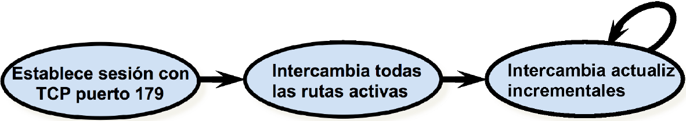

Para llevar a cabo esta operación, el protocolo usa 4 mensajes:

- **Open**: establece la sesión de *peering* entre dos routers BGP.

- **Keep Alive**: una vez se han intercambiado las rutas, el router permanece en el último estado y solo enviar actualizar cuando hay modifcaciones que notificar. De esta manera, si pasa un cierto tiempo, el router vecino no tiene forma de saber si el vecino no tiene nada que notificar o ha perdido la conectividad. Es por ello que, en caso de no haber nada nuevo que notificar, cada cierto tiempo los nodos enviarían un mensaje *Keep Alive* para informar al vecino de que se mantienen activos.

- **Notification**: cierra una sesión de *peering* y notifica al otro router de que va a dejar de anunciar rutas.

- **Update**: contiene los anuncios de las nuevas rutas, o indica aquellas que deben ser anuladas (*withdrawn*).

Los anuncios de rutas que envía un router BGP a uno de sus vecinos constan de una serie de prefijos de red (direcciones IP y máscaras asociadas de las redes alcanzables) junto con una serie de valores asociados a cada una de esas rutas llamados atributos. Existen varios tipos de atributos que se identifican por un valor y un código. Se listan a continuación:

| Valor | Código                    | Referencia |
| ----- | ------------------------- | ---------- |
| 1     | `ORIGIN`                  | [RFC1771]  |
| 2     | `AS_PATH`                 | [RFC1771]  |
| 3     | `NEXT_HOP`                | [RFC1771]  |
| 4     | `MULTI_EXIT_DISC`         | [RFC1771]  |
| 5     | `LOCAL_PREF`              | [RFC1771]  |
| 6     | `ATOMIC_AGGREGATE`        | [RFC1771]  |
| 7     | `AGGREGATOR`              | [RFC1771]  |
| 8     | `COMMUNITY`               | [RFC1997]  |
| 9     | `ORIGINATOR_ID`           | [RFC2796]  |
| 10    | `CLUSTER_LIST`            | [RFC2796]  |
| 11    | `DPA`                     | [Chen]     |
| 12    | `ADVERTISER`              | [RFC1863]  |
| 13    | `RCID_PATH / CLUSTER_ID`  | [RFC1863]  |
| 14    | `MP_REACH_NLRI`           | [RFC2283]  |
| 15    | `MP_UNREACH_NLRI`         | [RFC2283]  |
| 16    | `EXTENDED COMMUNITIES`    | [Rosen]    |
| ...   |                           |            |
| 255   | Reservado para desarrollo |            |

Los atributos incluyen fundamentalmente información asociada a las rutas, que luego puede ser usada por los routers para, en caso de recibir diferentes anuncios para una misma ruta, poder elegir la más adecuada según la política.

#### El atributo `AS_PATH`

Cuando un router BGP anuncia a un vecino alcanzabilidad a un determinado prefijo de red e incluye como atributo el `AS_PATH`, lo que se añade es el vector de caminos. El atributo `AS_PATH` define la lista de ASs que habría que recorrer para llegar a la red que se está anunciando.

En el siguiente ejemplo podemos ver cómo se va actualizando el atributo `AS_PATH` en función del router que envía el anuncio:

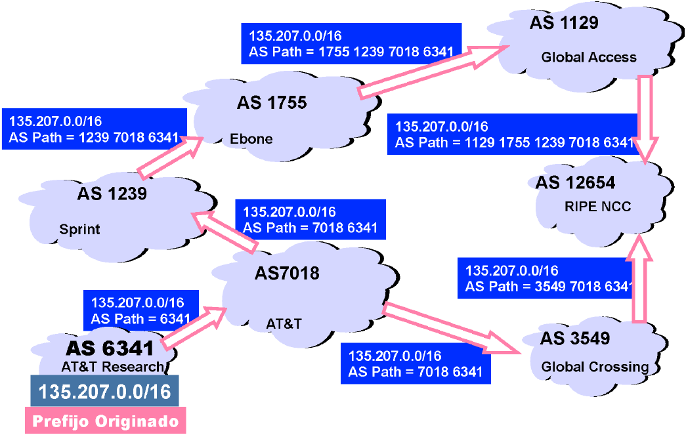

 Como el prefijo de red $135.207.0.0/16$ pertenece al AS 6341, cuando el router frontera de dicho AS anuncia alcanzabilidad a dicho prefijo de red, inicialmente el `AS_PATH`=6341. Una vez el router frontera BGP del AS 7018 recibe información de que se puede llegar a esa red a través del AS 6341, ahora anuncia a sus vecinos que él sabe llegar a la red $135.207.0.0/16$ con AS_PATH = 6341 7018. Este proceso continúa hasta que, según las políticas de cada AS, dicha información de alcanzabilidad se distribuye
por todos los ASs que corresponda en Internet.

En el ejemplo podemos ver cómo con el AS 12654 llega un anuncio BGP de alcanzabilidad a la red $135.207.0.0/16$ para cada uno de sus ASs vecinos. Por tanto, en base a este atributo, se elegirá aquel que tenga un `AS_PATH` con menos saltos. Es decir, el tráfico desde RIPE NCC hasta los hosts de la red $135.207.0.0/16$ circulará por los ASs 3549, 7018 y 6341.

El atributo `AS_PATH` solo garantiza que se atraviesan menos ASs para llegar al destino, pero no que el camino sea globalmente el más corto porque BGP no tiene conocimiento del coste de atravesar cada AS en particular. Este atributo permite evitar ciclos porque, si un router de un AS ve que su número de AS aparece ya en el `AS_PATH` de un anuncio que acaba de llegarle, sabe que solo implicaría un ciclo por lo que puede desecharlo directamente.

#### El atributo `NEXT_HOP`

Cuando un router de un AS X anuncia un prefijo de red a otro vecino BGP de otro AS Y, el atributo `NEXT_HOP` siempre indica la dirección IP del router BGP frontera del AS X que envió el anuncio. Se usa para que el router frontera del AS Y sepa qué dirección IP ha de poner en su tabla de rutas como siguiente salto para esa red destino. Se usa también para la integración de las rutas externas e internas de un sistema autónomo.

### Integración de routing interdominio y routing intradominio <a name="Punto6.3"></a>

El caso más simple es aquel en el que tenemos un *stub AS* que solo dispone de conectividad externa a través de un único AS vecino. El router BGP de dicho AS inyectará una ruta por defecto ($0.0.0.0$) que se podría anunciar con el protocolo interno que se esté usando al resto de routers del AS.

Cuando hay varios routers frontera en el AS, cada uno aprenderá rutas específicas hablando BGP con otros ASs. De hecho, el volumen de rutas que se aprenden en BGP, sobre todo en áreas del backbone de Internet, es tan grande (más de 300.000) que si se redistribuyesen tal cual al protocolo de routing interno para anunciarlas a todos los routers del AS, claramente se desbordaría y la sobrecarga de control sería excesiva.
Pare este caso, se va a emplear una solución alternativa que describimos a continuación.

Uno de los primeros aspectos a considerar es qué podría suceder para que un router frontera pensase que es mejor ir por un AS y otro tuviese la visión contraria. Para que haya una visión coordinada en la red, nuestros routers frontera no deben anunciar cosas distintas a vecinos BGP de ASs distintos sobre la alcanzabilidad a determinadas redes. Lo primero que se hace es establecer sesiones BGP entre todos los routers frontera del AS (todos con todos) para que s eintercambien entre ellos las diferentes redes que cada uno ha aprendido por su cuenta, y puedan llegar a tener una visión homogénea de las redes que se pueden alcanzar desde el AS. Esto permitirá, por ejemplo, que una red alcanzable a través de nuestros routers frontera pueda ser anunciado por otro router frontera a otro AS, ya que usando esta sesión BGP todos aprenderían esa información. Al ser sesiones BGP entre routers internos, suelen llamarse ***iBGP*** (*internal* BGP), mientras que a las sesiones normales entre routers frontera de distintos AS se les llama ***eBGP*** (*external* BGP); a nivel de funcionamiento, en ambos casos se anuncian las rutas de la misma forma usando BGP.

Ahora cada router frontera BGP, tras haber hablado iBGP con los otros routers frontera, habrá aprendido para cada una de esas redes externas alcanzables desde el AS cuál es el mejor siguiente salto a nivel BGP. Dentro del AS se está ejecutando algún protocolo de routing interno que permite saber el mejor siguiente salto desde cualquier router hasta el mejor router iBGP para cada uno de los prefijos aprendidos. Combinando esta información, y rredistribuyendo ya las rutas consensuadas entre los *peers* iBGP, cada nodo podría calcular su *forwarding table*.

Supongamos el siguiente ejemplo:

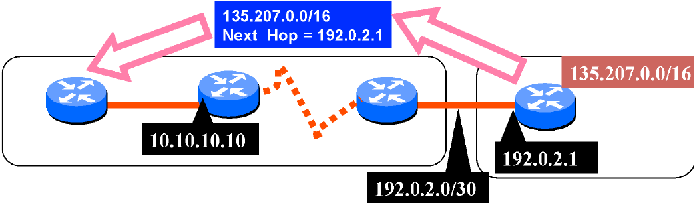

Cuando el router frontera del AS 2 anuncia al AS 1 el prefijo $135.207.0.0/16$, el atributo `NEXT_HOP` será su dirección IP ($192.0.2.1$). Cuando el router frontera del AS1 notifica por iBGP al otro router frontera, vemos cómo, efectivamente, no cambia esos valores de atributos. Por tanto, este segundo router ha aprendido por un lado por iBGP, en su tabla de rutas BGP lo siguiente:

| Red destino    | Next Hop  |
| -------------- | --------- |
| 135.207.0.0/16 | 192.0.2.1 |

Al mismo tiempo, como los routers frontera redistribuyen en el protocolo de routing interno las redes alas que están conectados, también el propio protocolo de routing interno que haya en AS 1 habrá aprendido en la tabla de rutas dicho protocolo:

| Red destino  | Next Hop    |
| ------------ | ----------- |
| 192.0.2.0/30 | 10.10.10.10 |

Por tanto, en su tabla final de *forwarding* a nivel de router, lo que habrá es una entrada que combina esas dos entradas de tablas distinas de rutas en una sola que, como puede verse, apunta correctamente a su siguiente salto:

| Red destino    | Next Hop    |
| -------------- | ----------- |
| 135.207.0.0/16 | 10.10.10.10 |

## Bibliografía <a name="Bibliografía"></a>

- Douglas E. Comer. Internetworking with TCP/IP Volume I. Principles, Protocols and Architecture, 5th Ed. Prentice Hall, Pearson, 2006. Cap. 4, 8, 10, 14, 15 y 16.

- Larry L. Peterson and Bruce S. Davie. Computer Networks: A systems approach, 5th Ed. Elsevier, 2011 sec 3.2, 3.3 y 4.1.

- Richard W. Stevens. TCP/IP Illustrated Volume I: The Protocols, 1st Ed. Addison-Wesley, 1994. Cap. 2 y 4.

- Andrew S. Tanenbaum. Redes de Computadoras 3a Ed. Prentice Hall, Pearson, 1998. Secciones. 5.2 y 5.4.

- J. B. Kruskal. On the shortest spanning subtree and the traveling salesman problem. Proceedings of the American Mathematical Society, 7:48–50, 1956. Lectura complementaria.

- R. C. Prim. Shortest connection networks and some generalisations. Bell System Technical Journal, 36:1389–1401, 1957. Lectura complementaria.
