# Tema 1: Interfaz de un Sistema Operativo

## Índice

- [Introducción](#Punto1)

- [Estándares](#Punto2)

- [Llamadas al sistema y funciones de biblioteca](#Punto3)

- [Servicios POSIX y glibc](#Punto4)
  
  - [Creación y terminación de procesos](#CreacionProcesos)
  
  - [Acceso a sistemas de ficheros](#Ficheros)
  
  - [Gestión de memoria virtual](#VM)
  
  - [Gestión de memoria dinámica](#DM)
  
  - [Comunicación/sincronización de procesos (IPC)](#IPC)

## Introducción <a name="#Punto1"></a>

> El **Sistema Operativo** es un *software* que gestiona los recursos (procesos, memoria y E/S) del computador.

El *kernel* es el núcleo del sistema y el encargado de:

- [La creación y terminación de los procesos](#CreacionProcesos)

- Gestionar las credenciales de procesos (Identificadores y permisos)

- La planificación de procesos ([*Preemptive multitasking*](https://es.wikipedia.org/wiki/Multitarea_apropiativa#:~:text=La%20multitarea%20apropiativa%20(del%20inglés,múltiples%20procesos%20al%20mismo%20tiempo.&text=Por%20cada%20núcleo%20de%20la,un%20proceso%20en%20cada%20momento.)))

- Gestión de memoria ([*Dynamic memory*](#DM)/[*Virtual memory*](#VM))

- Administración de usuario y grupos (*Virtual private computer*)

- [Acceso al sistema de ficheros (*Virtual File System* o VFS)](#Ficheros)

- [Comunicación y sincronización de procesos (IPC)](#IPC)

- Acceso a dispositivos de E/S

- *Networking*

- *System Call Application Programming Interface* (API)

Junto al kernel hay un conjunto de herramientas que lo acompañan, es el caso del *shell*, la interfaz gráfica, los editores y otras utilidades.

### El intérprete de comandos o *shell*

> El *shell* es un programa informático que procesa las líneas de órdenes tecleadas por el usuario, ejecutando cada comando mediante la *System Call API* del Sistema Operativo.

Dentro del *shell* encontramos comandos internos (`help comando`) y externos (`man comando`). Existen diferentes intérpretes de comandos, siendo los más comunes:

- *Bourne shell* (**sh**)

- *C shell* (**csh**)

- *Korn shell* (**ksh**)

- <u>***Bourne again shell*** (**bash**)</u>

El *shell* está estandarizado (POSIX.2 o 1003.2-1992), tanto **ksh** como **bash** se ajustan a POSIX.2, pero también incluyen algunas extensiones no portables. 

El *shell* por defecto depende del sistema operativo, podemos averiguar el que estamos usando haciendo: `$ echo $SHELL`

## Estándares <a name="Punto2"></a>

### Lenguaje C

En el año 1989, [ANSI](https://www.ansi.org/about/introduction#:~:text=The%20American%20National,system.) aprobó el primer estándar de C (C89); en 1990, [ISO/IEC](https://www.iso.org/standard/17782.html) lo aprobó también (C90). Posteriormente, el estándar de C sufrió tres revisiones (C95, C99 y C11), también hubo una revisión C17/C18 que corrigió algunos errores de la C11.

El estándar de C incluye no solo la sintaxis y la semántica de C, sino también su biblioteca estándar ([*The Standard C Library*](https://es.wikipedia.org/wiki/Biblioteca_estándar_de_C#:~:text=La,cadenas.)).

### UNIX y Linux

De 1969 a 1974 se desarrollaron las cinco primeras versiones de UNIX en [AT&T](https://es.wikipedia.org/wiki/AT%26T#:~:text=En%201925,logros.), y en 1975 AT&T liberó el código fuente de la sexta. Durante los 80, la Universidad de Berkeley liberó varias versiones de BDS (*Berkeley Software Dirstribution*) basadas en el UNIX de AT&T (FreeBSD, NetBSD y OpenBSD). En paralelo, AT&T había comenzado la comercialización de UNIX como System V (de SVr1 a SVr4).

El 1989 arranca el proyecto [GNU](https://www.gnu.org/home.es.html#:~:text=GNU%20es%20un%20sistema%20operativo%20de%20tipo%20Unix%2C%20lo%20cual,se%20conoce%20como%20Proyecto%20GNU.&text=El%20nombre%20«GNU»%20es%20un,«GNU%20No%20es%20Unix».) de la mano de Richard Stallman, su objetivo era el de crear una implementación libre de UNIX con aplicaciones y utilidades con licencia GPL como `gcc`, `gdb` o `make`. Ante la ausencia de un kernel libre maduro, GNU adopta el núcleo Linux.

En la actualidad siguen comercializándose versiones de UNIX como Solaris (previamente SunOS), basado en SVr4 y Mac OS X, basado en Mach/FreeBSD.

En 1994 se libera la versión 1.0 de Linux con licencia GPL.

Hoy en día, el término genérico *Linux* se refiere a la combinación del kernel con bibliotecas, herramientas e instalación (distribucione).

### Relación entre los estándares C y UNIX

[POSIX](https://es.wikipedia.org/wiki/POSIX#:~:text=POSIX%20(acrónimo,).) es una familia de estándares para sistemas operativos de [IEEE](https://www.ieee.org/about/vision-mission.html#:~:text=IEEE%20is,statements.) que regula las interfaces, pero no las implementaciones.


## Llamadas al sistema y funciones de biblioteca <a name="Punto3"></a>

### Llamadas al sistema

> Las llamadas al sistema o *syscalls* permiten a un proceso de usuario solicitar servicios de diferente naturaleza al Sistema Operativo.

La mayoría de las llamadas al sistema están encapsuladas en funciones de biblioteca que suelen tener el mismo nombre que la *syscall* correspondiente.

Cada llamada al sistema implica un cambio de modo usuario a modo kernel, se identifica mediante un número único y puede requerir un conjunto de argumentos.

Las llamadas son extremadamente importantes por ser un recurso imprescindible, gracias a ellas podemos entender qué hace un programa, cómo lo hace y cuán útil es. Además, determinan la portabilidad de un programa (todos los ejemplos que incluyen la [*feature test macro*](http://man7.org/linux/man-pages/man7/feature_test_macros.7.html#:~:text=Feature%20test%20macros%20allow,copiled.) `_POSIX_C_SOURCE 200809L` son portables). Por lo tanto, <mark>son parte esencial de la seguridad del sistema</mark>.

**Nota**: Con `strace -c programa` podremos ver las estadísticas de las llamadas al sistema que realiza *programa*.

### Modo usuario y modo kernel

En modo kernel, el código tiene acceso ilimitado tanto al hardware (instrucciones y registros *privilegiados*) como a la memoria. En modo usuario, el código solo tiene acceso restringido a su espacio de direcciones virtuales.

En x86, el registro EFLAGS proporciona cuatro anillos de protección, aunque normalmente solo se usan el 0 (kernel) y el 3 (usuario).

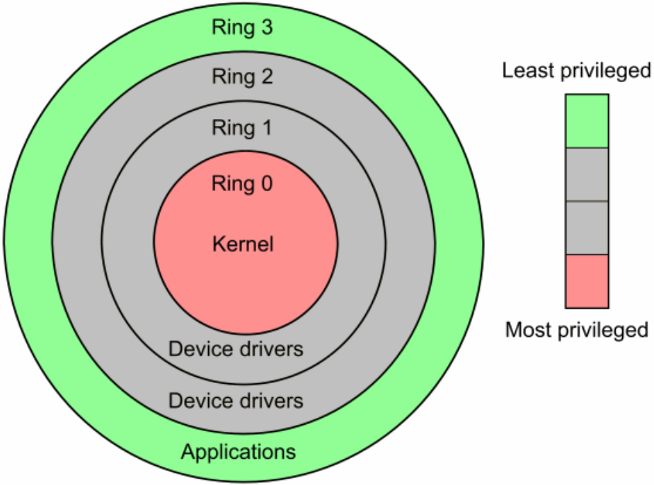

### Cambio de contexto y cambio de modo

El *Process Control Block* (PCB) de un proceso contiene:

- Información sobre el estado del procesador

- Información de identificación

- Información de control

Un <u>cambio de contexto</u> implica:

1. Guardar en el PCB el estado del procesador

2. Actualizar el PCB del proceso interrumpido

3. Mover el PCB del proceso interrumpido a la cola adecuada

4. Seleccionar el nuevo proceso a ejecutar (*scheduling*)

5. Actualizar el PCB del nuevo proceso

6. Actualizar las estructuras de datos de gestión de memoria

7. Restaurar el estado del procesador desde el PCB del nuevo proceso

Por el contrario, un <u>cambio de modo</u> solo requiere:

1. Guardar el estado del procesador.

No obstante, en Linux, [si usamos *Kernel Page-Table Isolation* (KPTI)](https://en.wikipedia.org/wiki/Kernel_page-table_isolation), cada llamada al sistema requiere un cambio de contexto.

### Anatomía de una llamada al sistema o *system call*

Cuando el proceso llama a la función que encapsula la llamada:

1. Se copian los argumentos de la pila en registros del procesador

2. Se copia el número de llamada al sistema en un registro (**`eax`**)

3. Se ejecuta `int 0x80`, que cambia de modo usuario a modo kernel
   NOTA: Los procesadores de AMD e Intel proporcionan mecanismos alternativos más rápidos como `sysenter/sysexit` (32 bits) y `syscall/sysret` (64 bits).

4. Se establece el valor de [**`errno`**]("#ManejoErrores")

En respuesta, el kernel ejecuta la función `system_call()`, la cual:

1. Guarda el estado del procesador en la pila del kernel

2. Comprueba la validez del número de llamada

3. Verifica la validez de los argumentos

4. Invoca la rutina de servicio correspondiente (tabla[#syscall]), que realiza el servicio solicitado y devuelve un valor de retorno

5. Restaura el estado del procesador desde la pila del kernel

6. Copia el valor de retorno en la pila del usuario

7. Regresa a la función de biblioteca volviendo a modo usuario

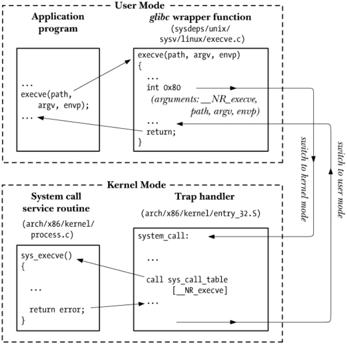

### Manejo de errores <a name="ManejoErrores"><a>

Cada llamada al sistema devuelve un valor de retorno de tipo entero, que significar:

- **Éxito**: si el valor de retorno es $\ge0$

- **Fallo**: si el valor de retorno es $\lt0$
  
  - Si el valor de retorno es igual a **-EVAL**, la función de biblioteca establece el valor de la variabla `errno` a **EVAL** y devuelve $-1$.

El [fichero de cabecera](http://man7.org/linux/man-pages/man3/errno.3.html) `errno.h` contiene todos los posibles valores de retorno y la definición de la variable `errno`.

La sección **ERRORS** de la página del manual de cada llamada al sistema contiene los posibles valores de la variable `errno`.

La función `perror()` imprime `msg` seguido del mensaje correspondiente al valor actual de `errno` en `stderr`:

```c
# include < stdio .h > /* POSIX */
void perror ( const char * msg ) ;
```

La función `stderror()` devuelve el mensaje correspondiente al valor de `errnum`:

```c
# include < string .h > /* POSIX */
char * strerror ( int errnum ) ;
```

### *C Standard Library*

La especificación de C incluye una biblioteca estándar con macros, variables, tipos y funciones declarados en ficheros de cabecera.

- En `stdio.h` se declaran `EOF`, `stdin`, `FILE` y `fopen`

Existen diversas implementaciones, como: *GNU C Library* (`glibc`), *BSD libc*, *Microsoft C Run-time Library*, etcétera. Otros lenguajes incluyen funcionalidad equivalente, por ejemplo, en C++, el `namespace std` incluye la funcionalidad de la biblioteca estándar de C con ficheros de cabecera similares como `cstdio`.

### *POSIX Standard Library*

La biblioteca estándar de POSIX extiende la de C:

- Procesos como `fork()` y `pipe()` se definen en `unistd.h`

- Se implementan los *threads* mediante la API de Pthreads definida en `pthread.h`

- Las funciones de E/S como `read()`, `write()` y `close()` se definen en `unistd.h`

- Se implementan los *sockets* mediante la API de (Berkeley) *sockets* definida en `sys/socket.h`

Entre otros.

### *GNU C Library* (`glibc`)

Es una implementación de las bibliotecas estándar de C y de POSIX. Implementa funciones y llamadas al sistema no portables.

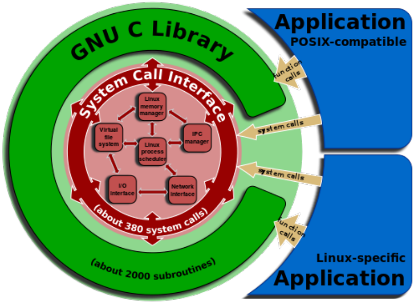

El *shell* y todos los comandos externos usan `glibc`:

```bash
$ ldd / bin / bash | grep libc
libc . so .6 = > / lib / x86_64 - linux - gnu / libc . so .6 ( address )
$ ldd / bin / ls | grep libc
libc . so .6 = > / lib / x86_64 - linux - gnu / libc . so .6 ( address )
```

Para determinar la versión de `glibc` del sistema podemos hacer:

```bash
$ / lib / x86_64 - linux - gnu / libc . so .6
GNU C Library ( Ubuntu GLIBC 2.27 -3 ubuntu1 ) stable release version 2.27
```

```c
# include < gnu / libc - version .h >
const char * gnu_get_libc_version ( void ) ;
const char * gnu_get_libc_release ( void ) ;
```

Algunas funciones de biblioteca se comportan como llamadas al sistema, por ejemplo `remove()` 

- `perror()` y `strerror()` se pueden usar con normalidad

Algunas funciones de biblioteca devuelven un valor distinto de -1 en caso de error, por ejemplo `fopen()`, pero usan `errno`

- `perror()` y `strerror()` se pueden usar con normalidad

Otras funciones de biblioteca no usan `errno`, por ejemplo `memcpy()`

- `perror()` y `strerror()` <span style="color:red">**NO** se deben usar</span>

### En resumen...

> Una llamada al sistema es una solicitud al Sistema Operativo por parte de un usuario/programador para que realice un servicio.

La mayoría de las llamadas al sistema están encapsuladas en funciones de biblioteca que suelen tener el mismo nombre. Cada llamada al sistema implica pasar a modo kernel y, por tanto, es mucho más lenta que una simple llamada a una función.

POSIX estandariza las llamadas al sistema UNIX para hacer posible escribir código que sea portable aunque incluya llamadas al sistema. `glibc` implementa las bibliotecas estándar de POSIX y de C.

```bash
man 2 <<llamada_al_sistema>>
man 3 <<llamada_a_funcion>>
man -a <<llamada>>
```

## Servicios POSIX y `glibc` <a name="Punto4"></a>

### Creación y terminación de procesos <a name="CreacionProcesos"></a>

> Un proceso es una instancia de un programa en ejecución.

> Un programa ejecutable es un fichero con información para construir un proceso.

Un programa ejecutable debe contener:

- Formato, por ejemplo: *Executable and Linkable Format* ([ELF]([https://en.wikipedia.org/wiki/Executable_and_Linkable_Format#:~:text=In%20computing%2C%20the%20Executable%20and,shared%20libraries%2C%20and%20core%20dumps.&text=By%20design%2C%20the%20ELF%20format,extensible%2C%20and%20cross-platform.))

```bash
file <<program>>
```

- Código, dirección de comienzo y datos inicializados

```bash
size <<program>>
```

- Tabla de símbolos (funciones y variables)

```bash
readelf -s <<program>>
```

- Bibliotecas dinámicas requeridas

```bash
ldd <<program>>
```

#### Servicios POSIX para la obtención de IDs

Cada proceso tiene un identificador único o PID. Para obtener el PID de un proceso haremos:

```bash
cat /proc/$$/status | grep ^Pid:
```

```c
# include < unistd .h > /* POSIX */
pid_t getpid ( void ) ;
```

En el código de ejemplo, `pid_t` equivale a un entero $\le$ `/proc/sys/kernel/pid_max`.

Para obtener el PID del padre que creó un proceso o PPID haremos:

```bash
cat /proc/$$/status | grep ^PPid:
```

```c
# include < unistd .h > /* POSIX */
pid_t getppid ( void ) ;
```

Todo el sistema forma un árbol de procesos cuya raíz es el proceso *init* o *systemd* con PID 1, por lo que todos los procesos tendrán un PPID. Podemos ver el árbol de procesos haciendo:

```bash
pstree -s -p $$
```

#### Mapa de memoria de un proceso

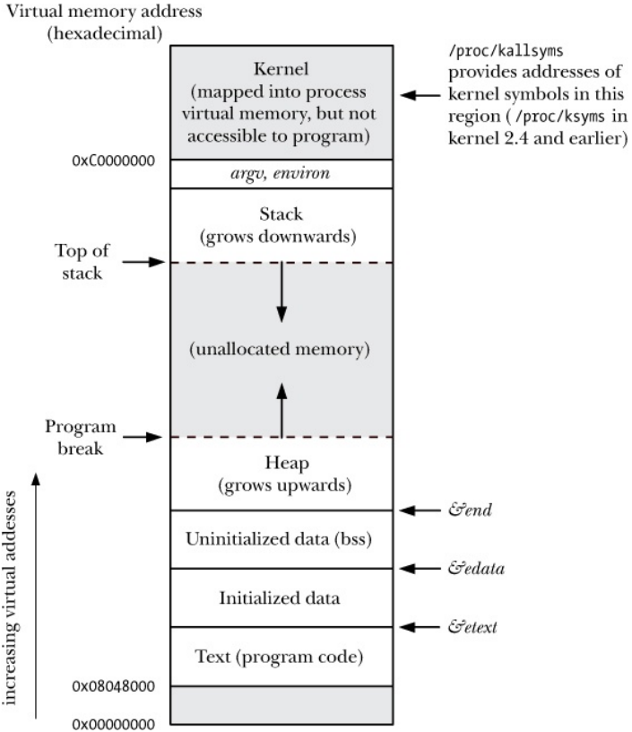

A la hora de realizar un programa, es importante conocer dónde se almacena cada variable y cuándo se crean y se destruyen.

En C, todas las variables locales de un proceso se encuentran en la pila, esto incluye también a las variables de `main()`. Los punteros también están en la pila y apuntan al **HEAP**.

Cuando se declara una variable local con el identificador `static`, esta variable pasa a guardarse en la memoria; además, si la variable se inicializa en su declaración, entonces se encontrará en la zona de la memoria <u>inicializada</u>.

Las variables globales están en la memoria (memoria inicializada si las variables están inicializadas, no inicializada si no lo están).

#### Parámetros de línea de comandos de un proceso

```c
int main ( int argc , char * argv []) {
    int i ;
    for ( i = 0; i < argc ; i ++)
        printf (" argv[ %d] = %s\n", i , argv [ i ]) ;
    return EXIT_SUCCESS ;
}
```

Los parámetros se almacenan en la memoria del proceso (*argv*), podemos verlos haciendo: `cat /proc/$$/cmdline`. Podemos procesar los parámetros con las funciones de la biblioteca `getopt` (POSIX). La variable *argc* contiene el número de parámetros del programa, es decir, el tamaño de *argv*. Es importante recordar que en `argv[0]` siempre estará el nombre del programa.

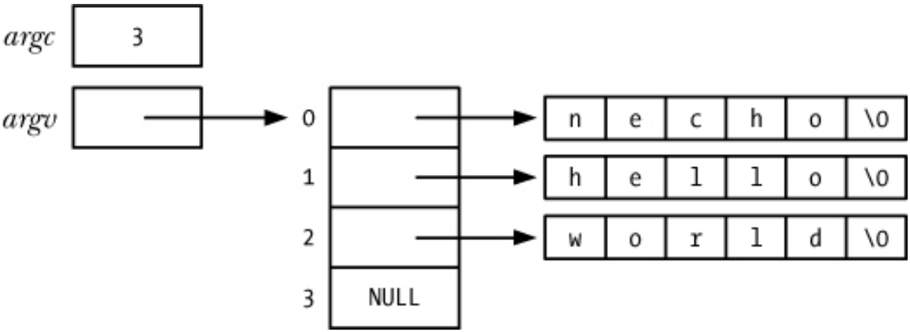

#### Variables de entorno de un proceso

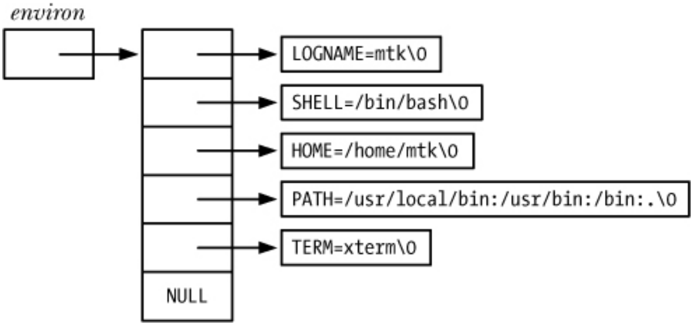

Cuando se crea un proceso, el proceso hijo hereda una copia del entorno del proceso padre. El entorno se almacena en la memoria del proceso (*environ*).

Podemos modificar el entorno desde el shell haciendo: `export`, `env`, `unset` o `printenv`. También podemos modificar el entorno de un programa desde el shell haciendo:

`env [OPTION] ... [-][NAME=VALUE] ... ./program`

`NAME=VALUE ./program`

O podemos modificar el entorno desde un proceso: `getenv`, `putenv`, `setenv`, `unsetenv`.

#### Servicios POSIX para la creación de procesos

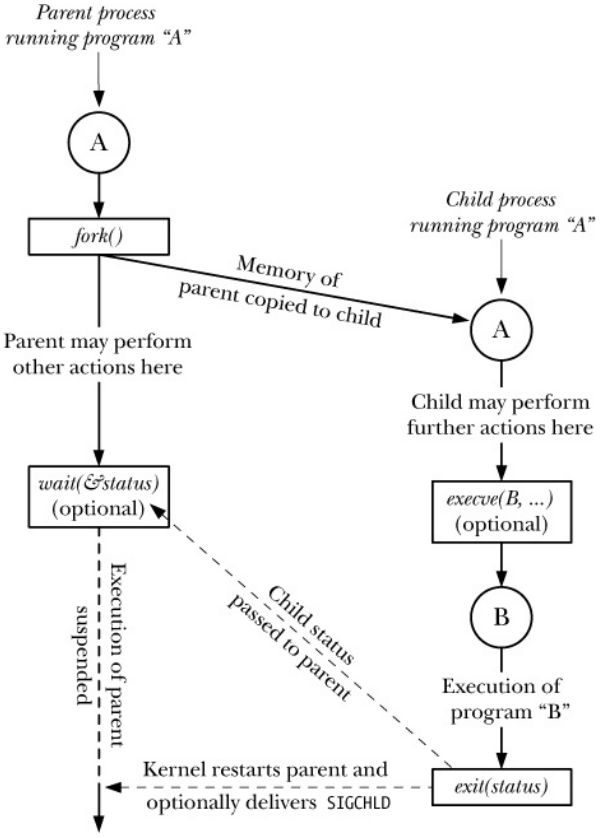

**NOTA**: Técnicamente el S.O. no copia la memoria del padre, copia las tablas de páginas, de manera que ambos procesos apuntan a la misma zona de la memoria. Cuando uno de los procesos intenta modificar algún valor, entonces se copia ese trozo de memoria y el puntero de ese proceso pasa a apuntarlo.

##### La llamada `fork()`

La llamada al sistema `fork()` crea un nuevo proceso *hijo* que es una copia casi exacta del proceso *padre* (el que llama a `fork()`).

```c
# include < unistd .h > /* POSIX */
pid_t pid = fork ( void ) ;
```

Donde `pid` guarda el valor del PID del hijo en el proceso padre y 0 en el hijo.

Después de hacer el `fork()`, ambos procesos (padre e hijo) comparten la misma copia del código del programa en modo solo lectura. Además, el proceso hijo obtiene una copia exacta de los datos, el *heap*, y la pila del proceso padre. El proceso hijo recibe también un **duplicado** de todos los [descriptores de fichero](#Ficheros) del proceso padre.

Tanto el proceso padre como el hijo podrían ocupar la CPU. Desde el kernel 2.6.32, el proceso padre se ejecuta primero (podemos ver quién se ejecuta primero haciendo: `cat /proc/sys/kernel/sched_child_runs_first`).

--------------

Ejemplo de `fork()`:

```c
int main ( void ) {
    pid_t pid ; /* Used in parent to record PID of child */

    switch ( pid = fork () ) {
        case -1: /* fork () failed */
            /* Handle error */
            break ;
        case 0: /* Child comes here after successful fork () */
            /* Perform actions specific to child */
            printf (" Child with PID %d created by parent with PID %d\n",
                    getpid () , getppid () ) ;
            break ;
        default : /* Parent comes here after successful fork () */
            /* Perform actions specific to parent */
            printf (" Parent with PID %d forked child with PID %d\n",
            getpid () , pid ) ;
            break ;
    }

    return EXIT_SUCCESS ;
}
```

------------

###### Caso práctico

¿Cuántos procesos resultarían de la ejecución del siguiente fragmento de código (asumiendo que `fork()` nunca falla)?

```c
fork () ;
if ( fork () ) fork () ;
fork () ;
```

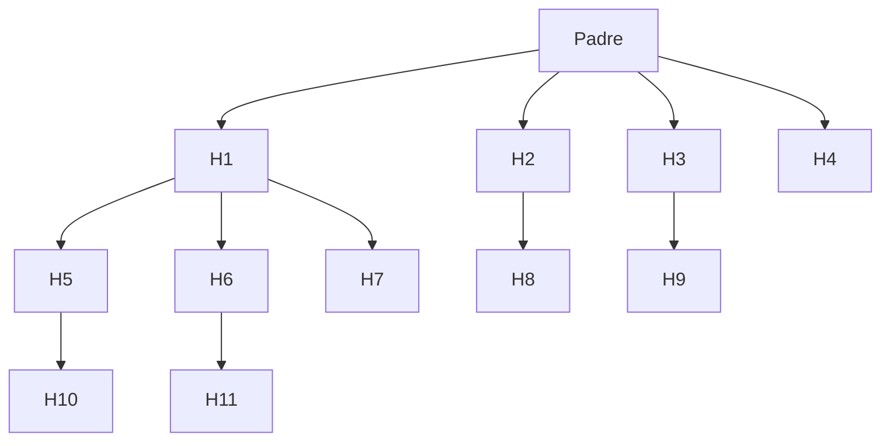

En total resultan 12 procesos.

###### `fork()` y la Memoria Virtual

El siguiente código ejemplifica la separación que existe cuando uno de los procesos modifica su memoria:

```c
int main ( void ) {
    char contents [] = { ’A’, ’S’, ’O’, ’\0 ’ };
    pid_t pid ; /* Used in parent to record PID of child */

    switch ( pid = fork () ) {
        case -1: /* fork () failed */
            /* Handle error */
            break ;
        case 0: /* Child comes here after successful fork () */
            /* Perform actions specific to child */
            contents [0] = ’I’;
            printf (" Contents in child : %s\n", contents ) ;
            break ;
        default : /* Parent comes here after successful fork () */
            /* Perform actions specific to parent */
            wait ( NULL ) ; /* Wait for child to finish */
            printf (" Contents in parent : %s\n", contents ) ;
            break ;
    }

    return EXIT_SUCCESS ;
}
```

#### Servicios POSIX para esperar a un proceso hijo

La llamada al sistema `wait()` espera a que uno de los procesos *hijo* del proceso que la invoca termine:

```c
# include < sys / wait .h > /* POSIX */
pid_t wait (int * status ) ;
```

Cuando un proceso llama a `wait()` se bloquea hasta que un proceso hijo haya terminado (si alguno ya lo ha hecho, no se bloquea). La función `wait()` retorna el PID del proceso hijo que ha finalizado, si es -1, no hay más procesos hijo y se establece `errno` a **ECHILD**. `status` devuelve el código de retorno de dicho proceso hijo.

La llamada al sistema `wait()` tiene algunas limitaciones:

- Si un proceso padre crea varios procesos hijos, no es posible esperar a que uno de ellos en concreto termine.

- Si ningún proceso hijo ha finalizado, tras una llamada a `wait()` el proceso padre se bloquea.

- Con `wait()` solo es posible averiguar cuándo un proceso hijo ha terminado, no se puede saber cuándo para o reanuda su ejecución.

La llamada al sistema `waitpid()` subsana las limitaciones de `wait()`:

```c
# include < sys / wait .h > /* POSIX */
pid_t waitpid ( pid_t pid , int * status , int options ) ;
```

Si el parámetro `pid` es positivo, espera a que termine el proceso hijo con dicho PID. Si es $-1$, espera a que termine cualquier hijo, es decir, `waitpid(-1, &status, 0)` equivale a `wait(&status)`. El parámetro `options` es una máscara de bits, que puede valer:

- **WUNTRACED**: Informa acerca de hijos cuando se detiene su ejecución.

- **WCONTINUED**: Informa acerca de hijos cuando se reanuda su ejecución.

- **WNOHANG**: Llamada no bloqueante de manera que si no hay ningún proceso hijo que cumpla las condiciones especificadas, `waitpid()` devuelve 0 y se establece `errno` a ECHILD.

El valor `status` devuelto por `wait()` y `waitpid()` permite distinguir los siguientes sucesos:

- El proceso hijo terminó llamando a `_exit()` o `exit()`

- El proceso hijo terminó por la entrega de una señal no tratada

- El proceso hijo detuvo su ejecución por entrega de señal (**WUNTRACED**)

- El proceso hijo siguió su ejecución por entrega de señal (**WCONTINUED**)

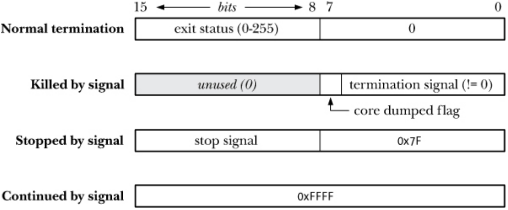

- El parámetro `status` se debe procesar siempre con las macros WIFEXITED (WEXITSTATUS), WIFSIGNALED (WTERMSIG), WIFSTOPPED y WIFCONTINUED porque la codificación depende de la implementación.

------------------

Ejemplo de aplicación de `wait()`:

```c
int main ( void ) {
    pid_t pid ; /* Used in parent to record PID of child */
    int status ; /* Used in parent to record status of child */
    switch ( pid = fork () ) {
        case -1: /* fork () failed */
            /* Handle error */
            break ;
        case 0: /* Child comes here after successful fork () */
            /* Perform actions specific to child */
            printf (" Child with PID %d created by parent with PID %d\n",
            getpid () , getppid () ) ;
            exit ( EXIT_SUCCESS ) ;
            break ;
        default : /* Parent comes here after successful fork () */
            /* Perform actions specific to parent */
            printf (" Parent with PID %d forked child with PID %d\n",
            getpid () , pid ) ;
            while ( waitpid ( pid , & status , WNOHANG ) == 0)
                sleep (1) ;
            if ( WIFEXITED ( status ) )
                printf (" Child exited , status= %d\n", WEXITSTATUS ( status ) ) ;
            break ;
    }

    return EXIT_SUCCESS ;
}
```

-------------------

##### Procesos huérfanos y *zombies*

El tiempo de vida de un proceso padre no tiene por qué coincidir con el de sus procesos hijos:

- ¿Qué sucede si un proceso padre termina sin llamar a `wait()`?
  El proceso huérfano es adoptado por el proceso `init` o `systemd` cuyo PID es 1. Cuando el proceso huérfano acaba, `init/systemd` llama a `wait()`.

- ¿Qué pasa si un hijo termina antes de que su padre llame a `wait()`?
  El proceso hijo se convierte en un proceso *zombie* y el kernel libera sus recursos, pero mantiene una entrada en la tabla de procesos hasta que el proceso padre llame a `wait()`.

Cada vez que un proceso hijo termina, se envía una señal `SIGCHILD` al proceso padre que se podría usar para llamar a `wait()`.

###### Caso práctico

- ¿Qué crearía el siguiente fragmento de código?

```c
if (! fork()) sleep(60); exit(0);
```

    Crearía un proceso huérfano, no obstante, si quitamos el `!`, sería un *zombi*.

- ¿Qué sucedería si un proceso tratase de crear procesos hijo de manera ininterrumpida, pero no llamase nunca a `wait()`?
  Si el sistema no está bien configurado, se quedaría colgado todo el sistema para todos los usuarios. Con el comando `ulimit` puedes limitar la memoria, CPU, etc, que un programa puede usar.

#### Servicios POSIX para ejecución de programas

La llamada al sistema `execve()` carga un nuevo programa en la memoria del proceso y sustituye los datos, el *heap* y la pila.

```c
# include < unistd .h > /* POSIX */
int execve ( const char * pathname , char * const argv [] , char * const envp []) ;
```

Donde `pathname` es la ruta absoluta o relativa del nuevo programa, `argv` contiene los argumentos para el nuevo programa y `envp` contiene el entorno para el nuevo programa. Nunca regresa en caso de éxito y siempre devuelve $-1$ (fallo). El PID del proceso que llama a `execve()` no cambia.

---------------

Ejemplo de programa con `execve()`:

```c
int main ( int argc , char * argv []) {
    const char epath [] = "/ bin /ls";
    char * eargv [] = {"/bin/ls", "-l", NULL };
    int ret = execve ( epath , eargv , NULL ) ;
    assert ( ret == -1) ;
    printf (" execve failed \n") ;
}
```

--------------

Tras una llamada a `execve()`, el nuevo programa hereda todos los descriptores de fichero abiertos. Las funciones `execle()`, `execlp()`, `execvp()`, `execv()` y `execl()` proporcionan una interfaz distinta, pero todas se basan en `execve()`.

| **Función** | **Fichero**        | **Argumentos** | **Entorno**      |
|:----------- |:------------------ | -------------- | ---------------- |
| `execve`    | Ruta absoluta      | Array          | envp             |
| `execle`    | Ruta absoluta      | Lista          | envp             |
| `execlp`    | Fichero + **PATH** | Lista          | Entorno heredado |
| `execvp`    | Fichero + **PATH** | Array          | Entorno heredado |
| `execv`     | Ruta absoluta      | Array          | Entorno heredado |
| `execl`     | Ruta absoluta      | Lista          | Entorno heredado |

-----------------------

Ejemplo de programa con `execlp()`:

```c
int main ( int argc , char * argv []) {
    const char ebin [] = "ls";
    int ret = execlp ( ebin , "ls", "-l", NULL ) ;
    assert ( ret == -1) ;
    printf (" execlp failed \n") ;
}
```

---------------------

#### Intérpretes

La mayor parte de los kernels UNIX permiten ejecutar *scripts* como si fueran binarios si el fichero es ejecutable y comienza por `#!`. Al encontrar la secuencia `#!` al comienzo del fichero, `execve()` ejecuta el intérprete con la siguiente línea de comandos:

- Código de `interpreter.c`

```c
int main (int argc , char * argv []) {
    const char epath [] = " script .sh";
    char * eargv [] = {" script .sh", NULL };
    int ret = execve ( epath , eargv , NULL ) ;
    assert ( ret == -1) ;
    printf (" execve failed \n") ;
    return EXIT_SUCCESS ;
}
```

- Script `script.sh`

```bash
#! /bin/sh
echo ASO
```

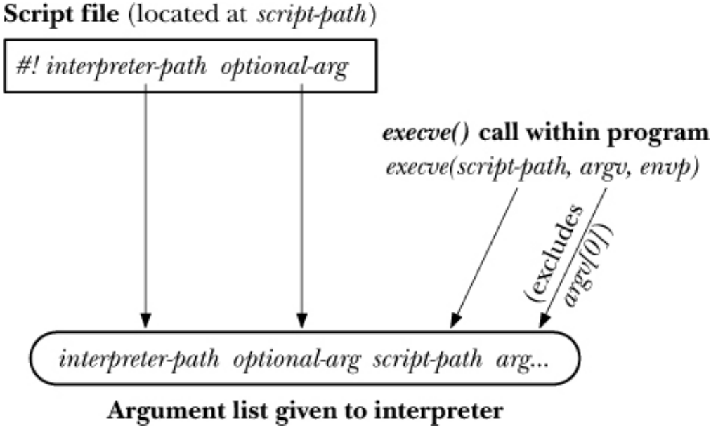

#### Servicios POSIX para terminación de procesos

Un proceso puede terminar con `return status;` en `main()` o con `exit(status);` en cualquier parte del programa.

```c
# include < stdlib .h > /* C99 y POSIX */
void exit (int status ) ;
```

Hacer `return(status)` es equivalente a hacer `exit(status)`. No hay reglas sobre los valores de `status`, pero por convenio se han establecido: `EXIT_SUCCESS` con valor 0 y `EXIT_FAILURE` con valor 1.

Cuando realizamos una llamada a `exit()`:

1. Se ejecutan los *exit handlers* registrados con `atexit()` o con `on_exit()` en orden inverso de registro.

2. Se ejecuta `fflush(NULL)`.

3. Se ejecuta la llamada al sistema `_exit()`.

```c
# include < unistd .h > /* C99 y POSIX */
void _exit (int status ) ; /* 0 <= status <= 255 */
```

La terminación de un proceso implica el cierre de sus [descriptores de fichero](#Ficheros) y del directorio.

#### En resumen...

- La llamada al sistema `fork()` crea un proceso hijo que es una copia casi exacta del proceso *padre*.

- La llamada al sistema `wait()` espera a que uno de los procesos *hijo* del proceso que la invoca termine.

- La llamada al sistema `waitpid()` subsana limitaciones de `wait()`.

- El tiempo de vida de un proceso padre no tiene por qué coincidir con el de sus procesos hijo, lo cual da lugar a procesos huérfanos y *zombis*.

- La llamada al sistema `execve()` carga un nuevo programa en la memoria del proceso y sustituye los datos, el *heap* y la pila.

### Acceso a sistemas de ficheros <a name="Ficheros"></a>

#### El modelo de E/S universal

Un descriptor de fichero es un entero positivo utilizado por las llamadas al sistema para acceder a todo tipo de ficheros abiertos, incluyendo ficheros regulares, *pipes*, FIFOs, terminales y dispositivos. Por convención, hay tres descriptores de fichero abiertos por el *shell* para cada programa antes de ejecutarlo: `STDIN_FILENO` (0), `STDOUT_FILENO` (1), `STDERR_FILENO` (2).

La biblioteca estándar de C usa *streams* en lugar de descriptores. Los *streams* `stdin`, `stdout` y `stderr` son equivalentes a `STDIN_FILENO`, `STDOUT_FILENO` y `STDERR_FILENO`. Por ejemplo, la llamada al sistema: `write(STDOUT_FILENO, ...)` es similar a `fprintf(stdout, ...)`.

| File descriptor | Purpose         | POSIX name      | *stdio* stream |
|:---------------:| --------------- |:--------------- | -------------- |
| 0               | standard input  | `STDIN_FILENO`  | *stdin*        |
| 1               | standard output | `STDOUT_FILENO` | *stdout*       |
| 2               | standard error  | `STDERR_FILENO` | *stderr*       |

Las llamadas `open()`, `read()`, `write()` y `close()` se pueden usar para realizar operaciones de E/S sobre cualquier tipo de fichero.

```c
# include < sys / types .h > /* POSIX */
# include < sys / stat .h >
# include < fcntl .h >
int open ( const char * pathname , int flags , mode_t mode ) ;

# include < unistd .h > /* POSIX */
ssize_t read (int fd , void * buf , size_t count ) ;
ssize_t write (int fd , const void * buf , size_t count ) ;
int close (int fd ) ;
```

La llamada a `open()` siempre devuelve el descriptor de fichero no usado más bajo. En las llamadas `read()`/`write()`, `count` es el número de bytes a leer/escribir.

| `syscall` | `rc == count`   | `rc < count`      | `rc == 0`    | `rc == -1` |
| --------- | --------------- | ----------------- | ------------ | ---------- |
| `read()`  | Lectura total   | Lectura parcial   | EOF          | ¡Error!    |
| `write()` | Escritura total | Escritura parcial | No escritura | ¡Error!    |

Cuando un proceso termina, todos sus descriptores se cierran.

Existen numerosas *flags*: de modo de acceso (solo lectura), de creación (no se pueden consultar ni modificar), y de estado (lectura y escritura).

| Flag          | Propósito                                                                      | SUS? |
| ------------- | ------------------------------------------------------------------------------ | ---- |
| `O_RDONLY`    | Abrir para solo lectura                                                        | v3   |
| `O_WRONLY`    | Abrir para solo escritura                                                      | v3   |
| `O_RDWR`      | Abrir para leer y escribir                                                     | v3   |
| `O_CLOEXEC`   | Establece el *flag* de cerrar-en-ejecucion (desde Linux 2.6.23)                | v4   |
| `O_CREAT`     | Crea el archivo si no existe                                                   | v3   |
| `O_DIRECT`    | El archivo I/O se salta el buffer caché                                        |      |
| `O_DIRECTORY` | El *pathname* debe ser un directorio                                           | v4   |
| `O_EXECL`     | Junto a `O_CREAT`, crea un archivo de forma exclusiva                          | v3   |
| `O_LARGEFILE` | Usado en los sistemas 32 bits para abrir archivos grandes                      |      |
| `O_NOATIME`   | No actualiza el momento de último acceso al hacer `read()` (desde Linux 2.6.8) |      |
| `O_NOCTTY`    | No deja que el *pathname* se convierta en el terminal de control               | v3   |
| `O_NOFOLLOW`  | No desreferencia los enlaces simbólicos                                        | v4   |
| `O_TRUNC`     | Trunca el archivo existente a 0 de longitud (borra el contenido)               | v3   |
| `O_APPEND`    | Escribe siempre a continuación del final del archivo                           | v3   |
| `O_ASYNC`     | Genera una señal cuando se pueda hacer I/O                                     |      |
| `O_DSYNC`     | Provee de integridad de datos I/O sincronizada                                 | v3   |
| `O_NONBLOCK`  | Abre en modo *nonblocking*                                                     | v3   |
| `O_SYNC`      | Hace que la escritura en el archivo sea síncrona                               | v3   |

----------------------

Ejemplo:

```c
    fd = open ( argv [1] , O_RDONLY ) ;
    if ( fd == -1) {
        perror (" open ") ;
        exit ( EXIT_FAILURE ) ;
    }

    while (( num_read = read ( fd , buf , BUF_SIZE ) ) > 0) {
        num_written = write ( STDOUT_FILENO , buf , num_read ) ;
        if ( num_written == -1) {
            perror (" write ") ;
            exit ( EXIT_FAILURE ) ;
        }
    /* Escrituras parciales no tratadas */
        assert ( num_written == num_read ) ;
    }

    if ( num_read == -1) {
        perror (" read ") ;
        exit ( EXIT_FAILURE ) ;
    }

    if ( close ( fd ) == -1) {
        perror (" close ") ;
        exit ( EXIT_FAILURE ) ;
    }
    exit ( EXIT_SUCCESS ) ;
}
```

--------------------------

#### Servicios POSIX para E/S con ficheros

Relaciones entre descriptores, ficheros abiertos y nodos-i:

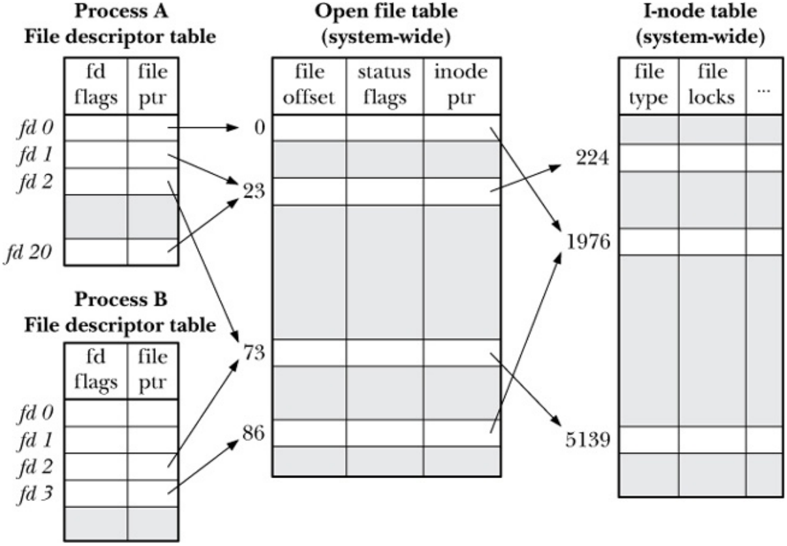

Si el *offset* del fichero no estuviese en la tabla de ficheros abiertos, ¿qué pasaría al ejecutar la línea de órdenes `(ls;df)>f1`?

Podemos duplicar un descriptor de fichero con `dup()`:

```c
# include < unistd .h > /* POSIX */
int dup ( int oldfd ) ; int dup2 ( int oldfd , int newfd ) ;
```

La función `dup()` devuelve una copia de `oldfd` usando el descriptor disponible más bajo, mientras que `dup2()` crea una copia de `oldf` en `newfd` cerrando `newfd` si fuese necesario.

----------------------

###### Caso práctico

```c
int main ( void ) {
    pid_t pid ; /* Used in parent to record PID of child */
    int fd_s1 , fd_s2 , fd_us ;
    fd_s1 = open (" shared ", O_WRONLY | O_CREAT | O_TRUNC , S_IRWXU ) ;
    write ( fd_s1 , "ESO ", 3) ;
    switch ( pid = fork () ) {
        case -1: /* fork () failed */
            /* Handle error */
            break ;
        case 0: /* Child comes here after successful fork () */
            /* Perform actions specific to child */
            fd_s2 = dup ( fd_s1 ) ;
            fd_us = open (" shared ", O_WRONLY | O_CREAT | O_TRUNC , S_IRWXU ) ;
            write ( fd_s2 , "ISO ", 3) ;
            write ( fd_us , "ASO ", 3) ;
            close ( fd_s1 ) ;
            close ( fd_s2 ) ;
            close ( fd_us ) ;
            break ;
        default : /* Parent comes here after successful fork () */
            /* Perform actions specific to parent */
            wait ( NULL ) ;
            close ( fd_s1 ) ;
            break ;
    }
    return EXIT_SUCCESS ;
}
```

Después del `write()` de `"ISO"`, el el fichero está `"ISO"` a partir de la tercera posición, pero lo que hay antes es desconocido (VOID), porque `fd_us` ha hecho un `O_TRUNC` al abrir el fichero, borrando así lo que había escrito` fd_s1`. Al final de la ejecución, en el fichero quedará:

| A   | S   | O   | I   | S   | O   |
|:---:|:---:|:---:|:---:|:---:|:---:|

La variable `fd_us` apuntará a la posición 3, mientras que `fd_s1` y `fd_s2` (son el mismo) apuntan a la posición 6. Después de todos los `close()`, se eliminan las entradas de las tablas y del nodo-i.

------------------

Cada fichero abierto tiene asociado un *offset* en el que comenzará la próxima operación `read()` o `write()`. El *offset* apunta al principio del fichero cuando se abre, y aumenta después de cada operación `read()` o `write()` en función de `count`.

La llamada `lseek()` permite modificar el *offset* de un fichero abierto:

```c
# include < unistd .h > /* POSIX */
off_t lseek (int fd , off_t offset , int whence ) ;
```


Si hacemos `lseek(fd, 0, SEEK_CUR)`, recuperamos el *offset* actual sin modificarlo. Si se lee más allá de EOF, `read()` devuelve cero, pero si se escribe más allá de EOF, se crea un *agujero* que no ocupa espacio en disco. Ejemplo:

```c
int main () {
    int fd ;
    char c = ’a’;
    if ( -1 == ( fd = open (" test ", O_RDWR | O_CREAT | O_TRUNC , S_IRUSR | S_IWUSR ) ) ) {
        perror (" open ()") ;
        exit ( EXIT_FAILURE ) ;
    }

    /* Seek at 1 ,000 ,000 bytes from the beginning */
    if ( -1 == lseek ( fd , 1000000 , SEEK_SET ) ) {
        perror (" lseek ()") ;
        exit ( EXIT_FAILURE ) ;
    }

    /* Write one byte */
    if ( -1 == write ( fd , &c , 1) ) {
        perror (" write ()") ;
        exit ( EXIT_FAILURE ) ;
    }
    if ( -1 == close ( fd ) ) {
        perror (" close ()") ;
        exit ( EXIT_FAILURE ) ;
    }

    exit ( EXIT_SUCCESS ) ;
}
```

#### Servicios POSIX para manipulación de atributos

- Consulta de los atributos de un fichero o directorio:

```c
# include < sys / stat .h > /* POSIX */
int stat ( const char * pathname , struct stat * statbuf ) ;
int lstat ( const char * pathname , struct stat * statbuf ) ;
int fstat (int fd , struct stat * statbuf ) ;

struct stat {
    dev_t st_dev ; /* IDs of device on which file resides */
    ino_t st_ino ; /* I- node number of file */
    mode_t st_mode ; /* File type and permissions */
    nlink_t st_nlink ; /* Number of ( hard ) links to file */
    uid_t st_uid ; /* User ID of file owner */
    gid_t st_gid ; /* Group ID of file owner */
    dev_t st_rdev ; /* IDs for device special files */
    off_t st_size ; /* Total file size ( bytes ) */
    blksize_t st_blksize ; /* Optimal block size for I/O ( bytes ) */
    blkcnt_t st_blocks ; /* Number of (512 B) blocks allocated */
    time_t st_atime ; /* Time of last file access */
    time_t st_mtime ; /* Time of last file modification */
    time_t st_ctime ; /* Time of last status change */
};
```

Las llamadas `stat()`, `lstat()` y `fstat()` proporcionan información sobre un fichero obtenida en su mayor parte del nodo-i correspondiente.

#### Servicios POSIX para E/S con directorios

- Creación y eliminación de directorios:
  
  ```c
  # include < sys / stat .h > /* POSIX */
  int mkdir ( const char * pathname , mode_t mode ) ;
  # include < unistd .h >
  int rmdir ( const char * pathname ) ;
  ```
  
  - Dada una ruta absoluta o relativa, `mkdir()` y `rmdir()` crean y eliminan un directorio, respectivamente

- Proceso de directorios:
  
  ```c
  # include < dirent .h > /* POSIX */
  DIR * opendir ( const char * dirpath ) ;
  struct dirent * readdir ( DIR * dirp ) ;
  struct dirent {
      ino_t d_ino ; /* File i- node number */
      char d_name []; /* Null - terminated name of file */
  };
  void rewinddir ( DIR * dirp ) ;
  int closedir ( DIR * dirp ) ;
  ```
  
  - `opendir()` *abre* un directorio, `readdir()` devuelve una entrada del directorio, `rewinddir()` *rebobina* el directorio y `closedir()` lo *cierra*

--------------------

Ejemplo:

```c
void list_files ( const char * dirpath ) {
    DIR * dirp ;
    struct dirent * dp ;

    dirp = opendir ( dirpath ) ;
    if ( dirp == NULL ) {
        fprintf ( stderr , " opendir failed on ’ %s’", dirpath ) ;
        return ;
    }
    for (;;) {
        errno = 0; /* To distinguish error from end -of - directory */
        dp = readdir ( dirp ) ;
        if ( dp == NULL )
            break ;
        if ( strcmp ( dp - > d_name , ".") == 0 || strcmp ( dp - > d_name , "..") == 0)
            continue ; /* Skip . and .. */

        printf (" %s\n", dp - > d_name ) ;
    }
    if ( errno != 0) {
        perror (" readdir ") ;
        exit ( EXIT_FAILURE ) ;
    }
    if ( closedir ( dirp ) == -1) {
        perror (" closedir ") ;
        exit ( EXIT_FAILURE ) ;
    }
}
```

----------

#### Servicios POSIX para E/S con ficheros y directorios

Podemos renombrar ficheros o directorios haciendo:

```c
# include < stdio .h > /* POSIX */
int rename ( const char * oldpath , const char * newpath ) ;
```

La llamada `rename()` renombra un fichero o un directorio, o bien lo mueve a otro directorio dentro de un mismo sistema de ficheros. `rename()` no mueve ni copia bloques de datos del fichero, no actualiza su contador de enlaces y no afecta a los procesos que tengan descriptores de fichero abiertos para ese fichero.

Para eliminar ficheros o directorios haremos:

```c
# include < stdio .h > /* POSIX */
int remove ( const char * pathname ) ;
```

`remove()` llama a `unlink()` si `pathname` es un fichero, y a `rmdir()` si es un directorio.

Para obtener el directorio de trabajo de un proceso haremos:

```c
# include < unistd .h > /* POSIX */
char * getcwd ( char * cwdbuf , size_t size ) ;
```

La función `getcwd()` devuelve el directorio de trabajo actual de un proceso que determina el punto inicial para la resolución de rutas alternativas.

Para cambiar el directorio de trabajo de un proceso hacemos:

```c
# include < unistd .h > /* POSIX */
int chdir ( const char * pathname ) ;
```

#### Buffers de E/S: *Standard IO Library* (`stdio`) y Kernel *buffer cache*

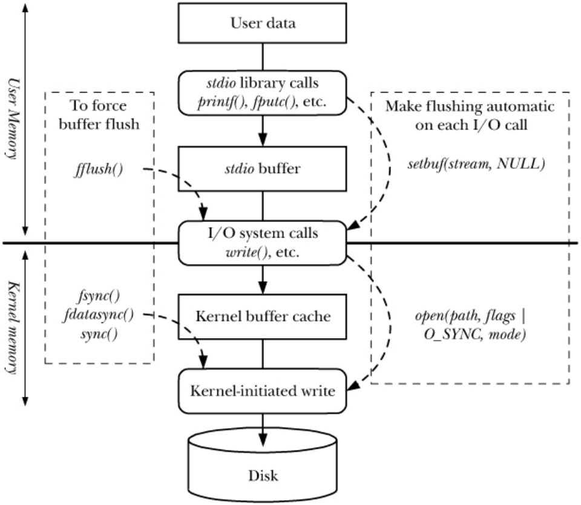

Algunas funciones de `stdio` agrupan los datos leídos/escritos en *buffers* de memoria para reducir el número de llamadas al sistema. Es el caso de las funciones `fopen()`, `fread()`, `fwrite()`, `fscanf()`, `fprintf()`, `fclose()`.

```c
# include < stdio .h > /* C99 y POSIX */
int fflush ( FILE * stream ) ;
```

Por defecto, la estrategia para cada *stream* es diferente: en el caso de `stdin` y `stdout` se usa *line buffering*, `stderr` lo usa sin *buffering*, otros *streams* de salida (ficheros) utilizan *block buffering*. Estas estrategias pueden cambiarse con las funciones de la biblioteca estándar de C `setbuf()` y `setvbuf()`.

La función `fflush()` obliga a escribir el *buffer* de *stream* con `write()`. `fflush(NULL)` escribe el buffer de todos los *streams* de `stdio`. Si se cierra un *stream*, automáticamente se ejecuta `fflush(stream)`.

```c
int main ( int argc , char * argv []){
    printf (" Depurando ... ") ;
    raise ( SIGSEGV ) ;
    return EXIT_SUCCESS ;
}
```

-----------

Ejemplo de `fcat`:

```c
f = fopen ( argv [1] , "r") ;

if ( f == NULL ) {
    perror (" open ") ;
    exit ( EXIT_FAILURE ) ;
}

while (( num_read = fread ( buf , sizeof ( char ) , BUF_SIZE , f ) ) > 0) {
    num_written = fwrite ( buf , sizeof ( char ) , num_read , stdout ) ;
    if ( ferror ( stdout ) ) {
        fprintf ( stderr , " fwrite error ") ;
        exit ( EXIT_FAILURE ) ;
    }
    /* Escrituras parciales no tratadas */
    assert ( num_written == num_read ) ;
}

if ( ferror ( f ) ) {
    fprintf ( stderr , " fread error ") ;
    exit ( EXIT_FAILURE ) ;
}

if ( fflush ( stdout ) == EOF ) {
    perror (" fflush ") ;
    exit ( EXIT_FAILURE ) ;
}

if ( fclose ( f ) == EOF ) {
    fprintf ( stderr , " fclose error ") ;
    exit ( EXIT_FAILURE ) ;
}
```

----------------

Respecto al <u>kernel *buffer cache*</u>, las llamadas `read()` y `write()` no operan directamente sobre el disco, sino que solo copian datos desde o hacia el kernel *buffer cache*.

- `write()` no necesita esperar a que la operación termine

- `read()` lee de *buffer cache* hasta que se produce un fallo. En caso de que el acceso sea secuencia, el kernel podría realizar operaciones de prefetching

- Se reduce la latencia de `read()` y `write()` y los accesos a disco

- Desde el kernel 2.4, *buffer cache* = *page cache*

Las llamadas `fsync()`, `fdatasync()` y `sync()` permiten sincronizar el contenido de *buffer cache* con el disco:

```c
# include < unistd .h > /* POSIX */
int fdatasync (int fd ) ; /* Synchronized IO data integrity completion */
int fsync (int fd ) ; /* Synchronized IO file integrity completion */
void sync ( void ) ; /* System - wide fsync () */
```

El kernel sincroniza el contenido de *buffer cache* con el disco a intervalos regulares en ausencia de sincronizaciones explícitas. El *flag* `O_SYNC` de `open()` hace que todas las operaciones de lectura y escritura sean síncronas (`open()`+`fsync()`).

-----------------

Ejemplo de `cat`:

```c
fd = open ( argv [1] , O_RDONLY ) ;
if ( fd == -1) {
    perror (" open ") ;
    exit ( EXIT_FAILURE ) ;
}

while (( num_read = read ( fd , buf , BUF_SIZE ) ) > 0) {
    num_written = write ( STDOUT_FILENO , buf , num_read ) ;
    if ( num_written == -1) {
        perror (" write ") ;
        exit ( EXIT_FAILURE ) ;
    }
    /* Escrituras parciales no tratadas */
    assert ( num_written == num_read ) ;
}

if ( num_read == -1) {
    perror (" read ") ;
    exit ( EXIT_FAILURE ) ;
}

if ( fsync ( fd ) == -1) {
    perror (" fsync ") ;
    exit ( EXIT_FAILURE ) ;
}

if ( close ( fd ) == -1) {
    perror (" close ") ;
    exit ( EXIT_FAILURE ) ;
}
```

---------------

Resumiendo:

- Las llamadas `open()`, `read()`, `write()` y `close()` se pueden usar para realizar operaciones de E/S sobre cualquier tipo de fichero.

- Dado un nodo-i, puede haber varias entradas en la tabla de ficheros abiertos que apunten a él y, a su vez, también pueden existir varios descriptores de fichero para la misma entrada en dicha tabla.

- Algunas funciones de `stdio`, agrupan los datos leídos/escritos en *buffers* de memoria para reducir el número de llamadas al sistema.

- Las llamadas `read()` y `write()` **NO** operan directamente sobre el disco sino que sólo copian datos desde o hacia kernel *buffer cache*.

### Gestión de memoria virtual <a name="VM"></a>

#### Servicios POSIX para la gestión de memoria virtual

Protección y bloqueo de páginas de memoria virtual:

```c
# include < sys / mman .h > /* POSIX */
int mprotect ( void * addr , size_t length , int prot ) ;
int mlock ( const void * addr , size_t len ) ;
int munlock ( const void * addr , size_t len ) ;
int mlockall ( int flags ) ;
int munlockall ( void ) ;
```

La función `mprotect()` permite proteger páginas contra lectura, escritura y/o ejecución (`PROT_NONE` o `PROT_READ`, `PROT_WRITE` y/o `PROT_EXEC`). Si un proceso intenta acceder a una página violando su tipo de protección, recibe una señal `SIGSEGV` del kernel.

La función `mlock()` bloquea una o más páginas del proceso en memoria (no pueden ser expulsadas a la zona de intercambio de disco). `mlockall()` bloquea todas las páginas del proceso.

Los bloqueos de memoria no son heredados por los procesos hijo creados con `fork()` ni se preservan tras una llamada a `execve()`.

--------------------------

Ejemplo:

```c
int main ( int argc , char * argv []) {
    int pagesize = sysconf ( _SC_PAGE_SIZE ) ;
    if ( pagesize == -1) {
        perror (" pagesize ") ;
        exit ( EXIT_FAILURE ) ;
    }

    /* Allocate a buffer aligned on a page boundary ;
        10 initial protection is PROT_READ | PROT_WRITE */
    void * buffer ;
    if ( posix_memalign (& buffer , pagesize , pagesize ) == -1) {
        perror (" posix_memalign ") ;
        exit ( EXIT_FAILURE ) ;
    }  
    memset ( buffer , 0 , pagesize ) ;
    printf (" Before mprotect call ...\ n") ;

    if ( mprotect ( buffer , pagesize , PROT_NONE ) == -1) {
        perror (" mprotect ") ;
        exit ( EXIT_FAILURE ) ;
    }

    printf (" After mprotect call ...\ n") ;
    memset ( buffer , 0 , pagesize ) ;

    exit ( EXIT_SUCCESS ) ;
}
```

--------------------

#### Servicios POSIX para la gestión de mapeos de memoria

La función `mmap()` permite mapear un fichero en el espacio de direcciones virtuales de un proceso (podemos verlo haciendo `cat /proc/$$/maps`).

```c
# include < sys / mman .h > /* POSIX */
void * mmap ( void * addr , size_t length , int prot , int flags , int fd , off_t offset ) ;
int munmap ( void * addr , size_t length ) ;
```

Donde `prot` es una máscara de bits idéntica al `prot` de `mprotect()` y `flags` es una máscara de bits con `MAP_PRIVATE` o `MAP_SHARED`:

- `MAP_PRIVATE`: Las modificaciones no son visibles para otros procesos ni se escriben a disco.

- `MAP_SHARED`: Las modificaciones son visibles para otros procesos y se escriben a disco.

Los mapeos de memoria son heredados por los procesos hijo creados con `forck()`, pero no se preservan tras una llamada a `execve()`.

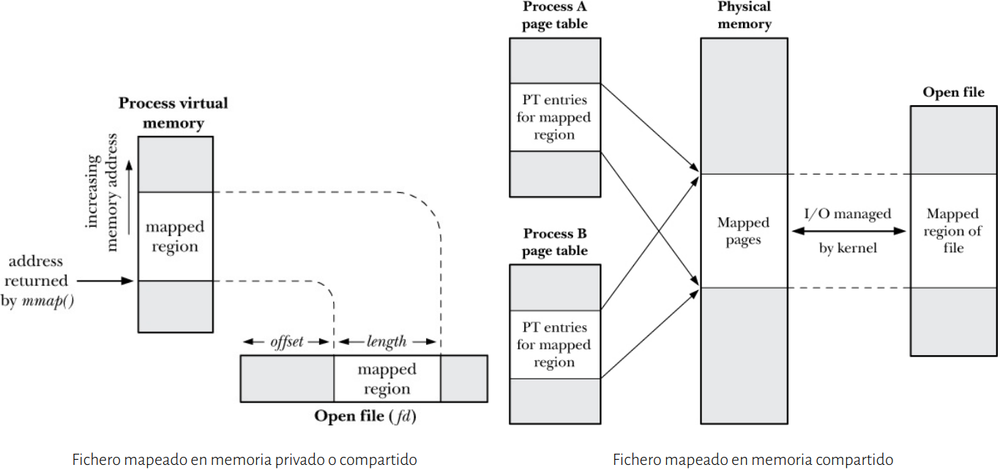

Los ficheros mapeados en memoria <u>privados</u> permiten que múltiples procesos compartan el mismo segmento de código y el mismo segmento de datos de un programa o de una biblioteca compartida (*dynamic linker*). Se usan para inicializar páginas de memoria virtual con un fichero.

```c
$ ldd / bin / ls | grep libc
libc . so .6 = > / lib / x86_64 - linux - gnu / libc . so .6 (0 x00007fa1a487a000 )
$ ldd / bin / ps | grep libc
libc . so .6 = > / lib / x86_64 - linux - gnu / libc . so .6 (0 x00007fac9cd34000 )
```

Los ficheros mapeados en memoria <u>compartidos</u> tienen la E/S mapeada en memoria (*memory-mapped IO*), lo cual simplifica la lógica de la aplicación eliminando `read()` y `write()`, y mejora el rendimiento en algunos casos al no requerir el uso de los buffers  en el espacio de memoria del kernel ni las llamadas al sistema. Además, permite una comunicación rápida entre procesos (*fast IPC*).

#### Bibliotecas compartidas

Las bibliotecas agrupan funciones usadas por múltiples programas. Cada programa incluye una lista de sus dependencias dinámicas (bibliotecas compartidas) en el fichero binario, podemos verlas haciendo: `ldd ./programa`.

Cuando un programa se ejecuta, el *dynamic linker* satisface las dependencias dinámicas buscando las bibliotecas compartidas en un conjunto de directorios predeterminados (p.ej., `/lib` y `/usar/lib`). En el caso de Ubuntu 18.04, el *dynamic linker* corresponde a la biblioteca `ld-linux-x86-64.so.2` (ubicada en `(/lib/x86_64-linux-gnu/ld-2.27.so`).

Cada biblioteca compatida se mapea en el espacio de direcciones virtuales del proceso cargándola en memoria física si no lo está ya. El código se tiene que compilar como *Position Independent Code* (PIC) porque la ubicación del código de una biblioteca en el espacio de direcciones virtuales de un proceso se desconoce de antemano. Si un símbolo (p.ej., una función) está definido en varias bibliotecas compartidas, por defecto, el proceso usará el que encuentra primero.

--------------------

Ejemplo `mmap.c`:

```c
fd = open ( argv [1] , O_RDWR ) ;
    if ( fd == -1) {
    perror (" open ") ;
    exit ( EXIT_FAILURE ) ;
}
addr = mmap ( NULL , ARRAY_SIZE_IN_FILE * sizeof ( char ) ,
            PROT_READ | PROT_WRITE , MAP_SHARED , fd , 0) ;
if ( addr == MAP_FAILED ) {
    perror (" mmap ") ;
    exit ( EXIT_FAILURE ) ;
}
if ( close ( fd ) == -1) {
    perror (" close ") ;
    exit ( EXIT_FAILURE ) ;
}
letter = ( char *) addr ;
for (int i = 0; i < ARRAY_SIZE_IN_FILE ; i ++) {
    printf (" Current letter= %c\n", (* letter ) ++) ; letter ++;
}
if ( munmap ( addr , sizeof ( long ) ) == -1) {
    perror (" munmap ") ;
    exit ( EXIT_FAILURE ) ;
```

----------------------

Resumiendo:

- La función `mprotect()` protege páginas contra lectura, escritura y/o ejecución.

- La llamada al sistema `mmap()` crea un mapeo de memoria en el espacio de direcciones virtuales del proceso privado o compartido.

- Los ficheros mapeados en memoria privados permiten a varios procesos compartir una biblioteca.

- Los ficheros mapeados en memoria compartidos permiten a varios procesos mapear un fichero —o parte de él— en sus espacios de direcciones.

### Gestión de memoria dinámica <a name="DM"></a>

#### Servicios POSIX para la gestión de memoria dinámica

La gestión de la memoria una vez el programa se ha cargado se realiza de forma dinámica. Se reserva la memoria en el *heap* (según el mapa de memoria, el *heap* comienza a continuación del programa cargado), donde el límite actual del *heap* se denomina ***program break***. Inicialmente, el *program break* es igual a la dirección `&end`, pero se puede modificar su valor mediante las llamadas al sistema `brk()`y `sbrk()`:

```c
# include < unistd .h > /* POSIX legacy */
int brk ( void * end_data_segment ) ;
void * sbrk ( intptr_t increment ) ;
```

Donde `brk()`modifica el valor absoluto del *program break* y `sbrk()` devuelve el valor del *program break* incrementándolo o disminuyéndolo (`sbrk(0)` simplemente devuelve el valor actual, sin cambiarlo). Ambas llamadas existen en Linux, pero <mark>han sido eliminadas de POSIX</mark>.

Para reservar/liberar memoria en el *heap* usaremos las funciones `malloc()` y `free()` respectivamente.

```c
# include < stdlib .h >
void * malloc ( size_t size ) ; /* C99 y POSIX */
void * calloc ( size_t numitems , size_t size ) ; /* C99 y POSIX */
int posix_memalign ( void ** memptr ,
size_t alignment , size_t size ) ; /* POSIX */
void * aligned_alloc ( size_t alignment , size_t size ) ; /* C11 */
void * realloc ( void * ptr , size_t size ) ; /* C99 y POSIX */
void free ( void * ptr ) ; /* C99 y POSIX */
```

La función `malloc()` devuelve `void *`, que se puede asignar a cualquier puntero. `calloc()` es similar a `malloc()`, pero inicia el bloque a 0.

La función `posix_memalign()` es similar a `malloc()`, pero el bloque está alineado a un múltiplo de `alignment` que debe ser potencia de 2. En `posix_memalign`/`aligned_alloc`, `size` es múltiplo de `alignment`.

La función `realloc()` redimensiona el tamaño del bloque a `size`.

Por último, `free()` libera un bloque previamente reservado con `malloc()`, `calloc()`, `posix_memalign()`, `alignes_alloc()` o `realloc()`.

##### ¿Cuándo hacer `free()`?

Cuando un proceso termina, toda su memoria se devuelve al sistema. Si un proceso reserva memoria y la utiliza hasta que termina, resulta habitual dejar que la misma se devuelve al sistema automáticamente.

Aunque esta estrategia puede ser aceptable en algunos casos, existen buenas razones para liberar explícitamente la memoria:

- El código fuente se vuelve mucho más legible y fácil de mantener o extender

- El código se puede usar como parte de otro programa (no solo como un programa separado que depende del S.O. para limpiar su memoria)

- Las herramientas de depuración identificarán las regiones de memoria reservadas no liberadas como fugas de memoria (*memory leaks*)

##### Implementación de `malloc()` y `free()`

Internamente, las funciones `malloc()` y `free()` mantienen una lista de bloques libres. Todos los bloques restantes que están en el *heap*, y que no están en la lista de bloques libres, están ocupados o no han sido liberados.


El funcionamiento de `malloc()` consiste en explorar la lista buscando un bloque de tamaño ≥ `size`:

- Si el bloque es más grande que `size`, `malloc()` lo fragmenta.

- Si no hay ningún bloque de este tamaño, `malloc()`  llama a `sbrk()`.

Además de la memoria solicitada, `malloc()` reserva una memoria adicional en cada bloque para almacenar su tamaño.

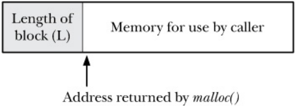

Por otro lado, `free()` utiliza el tamaño para insertar el bloque de nuevo en la lista. Además, `free()` usa el propio bloque para almacenar *Prev* y *Next*.

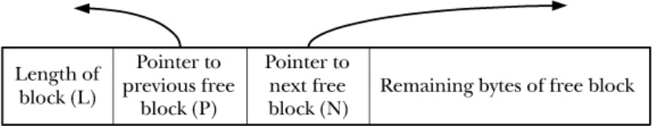

Las reglas básicas para usar `malloc()` y `free()` correctamente son:

- No modificar ningún byte fuera del rango reservado con `malloc()`

- No modificar el puntero entre las llamadas a `malloc()` y `free()`

- No llamar a `free()` con un bloque no reservado con `malloc()`

- No liberar el mismo bloque más de una vez con `free()`

- Garantizar que cualquier bloque no usado es liberado con `free()`
  
  - Si un proceso reserva repetidamente bloques y no los libera, antes o después el *heap* alcanzará su tamaño máximo (*memory exhaustion*)

-------------------------------

Ejemplo (`sbrk.c`):

```c
/*
2 + - - - - - - - - - - - -+ - - - - - - - - - - - -+ - - - - - - - - - - - - - -+ - - - - - - - - - - - - - - - -+
| block 0 | block 1 | ... | block 999 |
4 + - - - - - - - - - - - -+ - - - - - - - - - - - -+ - - - - - - - - - - - - - -+ - - - - - - - - - - - - - - - -+
<--- brk
6 After free :
+ - - - - - - - - - - - -+ - - - - - - - - - - - -+ - - - - - - - - - - - - - -+ - - - - - - - - - - - - - - - -+
8 | ( free ) | ( free ) | ... | block 999 |
+ - - - - - - - - - - - -+ - - - - - - - - - - - -+ - - - - - - - - - - - - - -+ - - - - - - - - - - - - - - - -+
10 <--- brk
*/

int main () {
char * blocks [ NBLOCKS ];

printf (" Initial program break : %10p\n", sbrk (0) ) ;

printf (" Allocating %d blocks of 20 ,000 bytes \n", NBLOCKS ) ;
for (int i = 0; i < NBLOCKS ; ++ i )
    blocks [ i ] = malloc (20000) ;
printf (" After malloc () , program break is: %10p\n", sbrk (0) ) ;
printf (" Freeing blocks ( all but last )\n") ;
for (int i = 0; i < NBLOCKS - 1; ++ i )
    free ( blocks [ i ]) ;
printf (" After free () , program break is: %10p\n", sbrk (0) ) ;

exit ( EXIT_SUCCESS ) ;
}
```

-----------------------

###### Caso práctico: ¿Qué sucedería si ejecutásemos el siguiente código? ¿Por qué?

```c
char * path = ( char *) malloc ( PATH_MAX * sizeof ( char ) ) ;
if ( ! getcwd ( path , PATH_MAX ) ) {
    perror (" get_cmd : getcwd ") ;
    free ( path ) ;
    exit ( EXIT_FAILURE ) ;
}

path = basename ( path ) ;
. . .
free ( path ) ;
```

El programa fallaría porque el puntero se pierde. 

###### ¿Por qué `free()` no especifica el tamaño del bloque liberado?

No es necesario indicar el tamaño del bloque porque se almacena antes del mismo, `free()` resta un cierto número de bytes (depende de la implementación) a la dirección del puntero y lee el tamaño antes de liberar. Podemos averiguar el tamaño ejecutando:

```c
printf("%lx\n", *((unsigned long*)(blocks[0]-sizeof(unsigned long))));
```

El tamaño reservado por `malloc()` puede ser superior al especificado para lograr alineamiento.

---------------------

###### Caso práctico: `valgrind`. ¿Qué errores hay en este programa?

```c
# define _POSIX_C_SOURCE 200809 L
# include < stdlib .h >
# define BUFSIZE 10
void f ( void ) {
    int * x = malloc ( BUFSIZE * sizeof (int ) ) ;
    x [ BUFSIZE ] = 0;
}
int main ( void ) {
    f () ;
    return 0;
}
```

No se libera con `free()` la memoria asignada.

##### Implementación de `realloc()`

La función `realloc()` se usa para aumentar el tamaño del bloque. 

Si el bloque está en la mitad del *heap*, `realloc()` intenta fusionar el bloque actual con los siguientes bloques libres, si los hay, hasta alcanzar el tamaño mínimo requerido por el parámetro `size`. Si no fuese posible, `realloc()` reserva un nuevo bloque y **copia** todos los datos desde el bloque antiguo hasta el bloque nuevo.

Si el bloque está al final del *heap*, `realloc()` llama a `sbrk()`.

Resumiendo:

- Las funciones `malloc()` y `free()` reservan y liberan memoria del *heap* respectivamente

- Por cada llamada a `malloc()` debe haber otra llamada a `free()`.

- Entre la llamada a `malloc()` y `free()` no se debe modificar el puntero.

- Si un proceso reserva repetidamente bloques y no los libera, antes o después el *heap* alcanzará su tamaño máximo (*memory exhaustion*).

### Comunicación/sincronización de procesos (IPC) <a name="IPC"></a>

#### Taxonomía de servicios para IPC

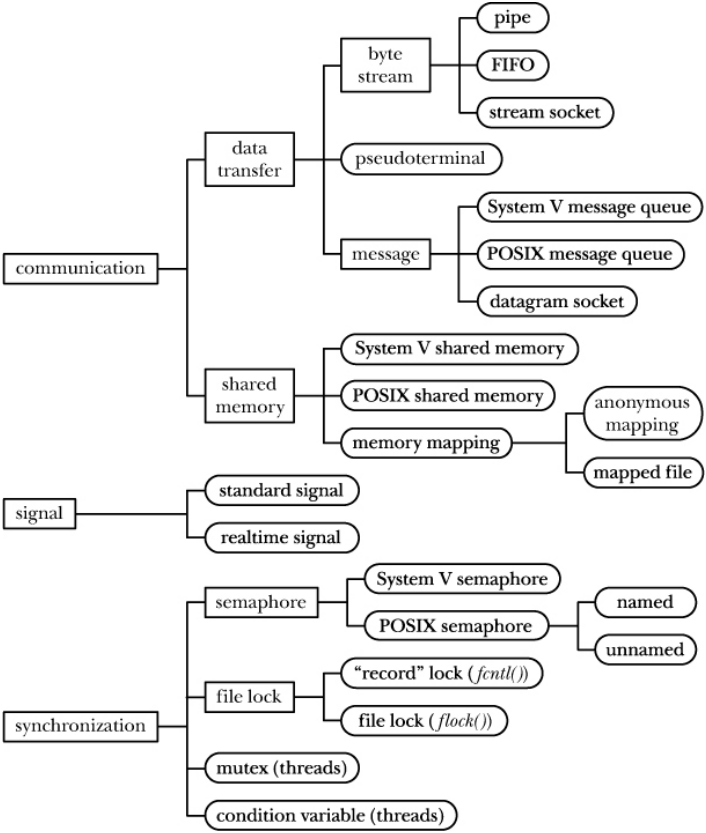

#### Tuberías

Una tubería o *pipe* es un flujo de bytes unidireccional, que se entregan en el mismo orden de envío, entre dos procesos.

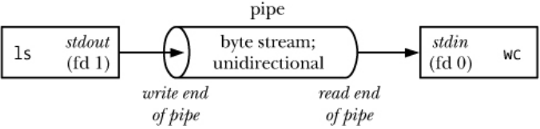

Una tubería es un *buffer* de capacidad limitada en el espacio de direcciones del kernel (podemos verlo haciendo `cat /proc/sys/fs/pipe-max-size`).

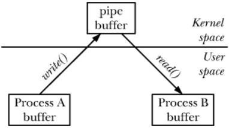

Una lectura con `read()` de una tubería *vacía* se bloquea (si se cierra el extremo izquierdo, `read()` devuelve cero –EOF–). Una escritura con `write()` a una tubería *llena* se bloquea.

#### Servicios POSIX para tuberías

Un allamada a `pipe()` devuelve dos descriptores de fichero, uno para lectura (`filedes[0]`) y otro para escritura (`filedes[1]`).

```c
# include < unistd .h > /* POSIX */
int filedes [2];
if ( pipe ( filedes ) == -1) {
    perror (" pipe ") ;
    exit ( EXIT_FAILURE ) ;
}
```

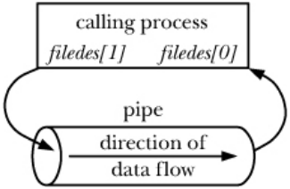

Una tubería puede utilizarse para comunicación/sincronización entre procesos *relacionados* (la tubería fue creada por un ancestro común).

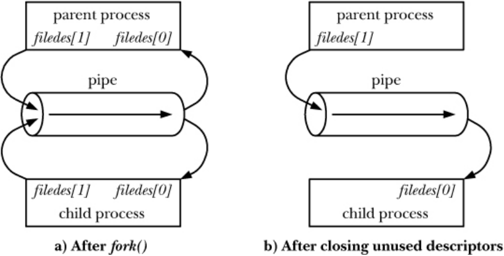

------------------

###### Ejemplo: `ls | wc -l`

En este ejemplo, el padre ya ha ejecutado `pipe(filedes)`.

Código de `ls_pipe.c`:

```c
switch ( fork () ) {
    case -1:
        perror (" fork 1") ;
        exit ( EXIT_FAILURE ) ;
        break ;
    case 0: /* First child : exec ’ls ’ to write to pipe */
        if ( close ( filedes [0]) == -1) { /* Read end is unused */
            perror (" close 1") ;
            exit ( EXIT_FAILURE ) ;
        }
        /* dup2 stdout on write end of pipe ; close duplicated descriptor */
        if ( dup2 ( filedes [1] , STDOUT_FILENO ) == -1) {
            perror (" dup2 1") ;
            exit ( EXIT_FAILURE ) ;
        }
        if ( close ( filedes [1]) == -1) {
            perror (" close 2") ;
            exit ( EXIT_FAILURE ) ;
        }
        execlp ("ls", "ls", ( char *) NULL ) ;        
        perror (" execlp ls") ;
        break ;
    default : /* Parent falls through */
        break ;
}

switch ( fork () ) {
    case -1:
        perror (" fork 2") ;4 exit ( EXIT_FAILURE ) ;
        break ;
    case 0: /* Second child : exec ’wc ’ to read from pipe */
        if ( close ( filedes [1]) == -1) { /* Write end is unused */
            perror (" close 3") ;
            exit ( EXIT_FAILURE ) ;
        }
        /* dup2 stdin on read end of pipe ; close duplicated descriptor */
        if ( dup2 ( filedes [0] , STDIN_FILENO ) == -1) {
            perror (" dup2 2") ;
            exit ( EXIT_FAILURE ) ;
        }
        if ( close ( filedes [0]) == -1) {
            perror (" close 4") ;
            exit ( EXIT_FAILURE ) ;
        }
        execlp ("wc", "wc", "-l", ( char *) NULL ) ;
        perror (" execlp wc") ;
        break ;
    default : /* Parent falls through */
        break ;
}
```

Finalmente, el padre cerrará `filedes[0]` y `filedes[1]`

#### Señales

Una señal es una notificación a un proceso ante un evento (podemos ver las señales pendientes por hilo haciendo: `cat /proc/$$/status | grep ˆSignal: ⇒ SigPnd`):

- **Excepción hardware**: Dirección de memoria inválida (`SIGSEGV`)

- **Evento software**: Un proceso hijo ha terminado (`SIGCHILD`)

- **Notificación de E/S**: Interrupción con CTRL+C (`SIGINT`)

Un proceso puede recibir una señal enviada por otro o por el kernel. Una señal es un entero ≥ 1 definida en `signal.h` como `SIGXXXX`.

Desde que una señal se genera hasta que se entrega está *pendiente*. Una señal pendiente se entrega al proceso en la siguiente transición de modo kernel a modo usuario, es decir, cuando se completa una llamada al sistema o cuando se reanuda su ejecución (*timeslice*).

Un proceso puede bloquear la entrega de una señal de manera indefinida mediante una *máscara de señales* que la deja *bloqueada*.

Por defecto, cuando un proceso recibe una señal, ejecuta la acción por defecto, que puede ser:

- La señal es ignorada

- El proceso es matado (*killed*)

- Se genera un fichero *core* y el proceso es matado

- El proceso se detiene (*stopped*)

- El proceso reanuda su ejecución (*resumed*)

Un proceso puede cambiar la acción por dejecto:

- Ignorando la señal

- Ejecutando un manejador de señales (*signal handler*)

- Restaurando la acción por dejecto

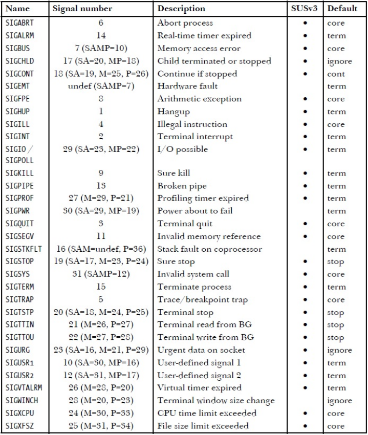

##### Manejador de señales

Un manejador de señales es una función definida por el usuario que realiza acciones apropiadas en respuesta a una señal concreta (La interrupción del timer puede reanudar la ejecución del kernel en cualquier momento. Por tanto, no es posible predecir cuando entrará en acción un manejador de señales cuando el proceso que lo instaló recibe la señal que provoca su ejecución).

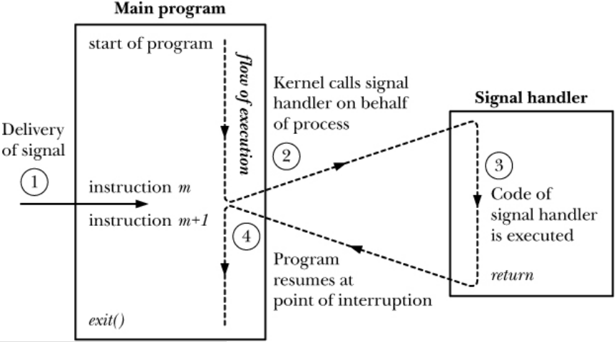

##### Async-signal-safe functions

No todas las llamadas al sistema y funciones de biblioteca se pueden usar de forma *segura* en un manejador de señales (para saber si una llamada es segura basta con ver la sección `ATTRIBUTES` del manual correspondiente).

- Una función es **reentrante** si puede ser ejecutada de forma *segura* por múltiples *threads* dentro del mismo proceso de manera simultánea.

- Una función es **no reentrante** si modifica estructuras de datos globales (`strtok()`), devuelve información en memoria global (`getpwuid()`) o usa estructuras de datos globales internamente.

- Si un manejador de señales actualiza una estructura de datos global, dicho manejador no es reentrante con respecto al programa original.

En general, una llamada al sistema o función de biblioteca es *segura* (*async-signal-safe*) si es reentrante o no puede ser interrumpida.

#### Servicios POSIX para señales

Podemos consultar y modificar la acción por defecto con la siguiente instrucción:

```c
# include < signal .h > /* POSIX */
int sigaction (int sig , const struct sigaction * act , struct sigaction * oldact ) ;

struct sigaction {
    void (* sa_handler ) ( int ) ; /* Address of handler */
    void (* sa_sigaction ) (int , siginfo_t * , void *) ; /* Address of handler */
    sigset_t sa_mask ; /* Signals blocked during handler invocation */
    int sa_flags ; /* Flags controlling handler invocation */
    void (* sa_restorer ) ( void ) ; /* Not for application use */
};
```

Donde:

- `sig` es la señal para la cual se realiza la consulta o modificación.

- `sa_handler` se refiere al manejador de la señal o a las constantes `SIG_IGN` (ignorar la señal) o `SIG_DFL` (restaurar la acción por defecto).

- `sa_mask` define qué señales se bloquearán durante la ejecución del manejador de la señal, además de las ya bloqueadas en la máscara de señales del proceso con `sigprocmask()` (incluida la señal `sig`).

- `sa_flags` es una máscara de bits con opciones que afectan a la ejecución del manejador de la señal, por ejemplo, `SA_RESETHAND` restablece la acción por defecto cuando se ejecuta el manejador y `SA_SIGINFO` permite al manejador obtener información adicional en `siginfo_t` como, por ejemplo, el PID del proceso que envía la señal.

Para consultar y modificar la máscara de bloqueo de señales usaremos:

```c
# include < signal .h > /* POSIX */
int sigprocmask ( int how , const sigset_t * set , sigset_t * oldset ) ;
```

Si `set` es `NULL`, `sigprocmask()` devuelve la máscara de señales del proceso en `oldset`. En caso contrario, `sigprocmask()` modifica la máscara de señales del proceso en función de `how`:

- `SIG_BLOCK` añade `set` a la máscara de señales del proceso

- `SIG_UNBLOCK` elimina `set` de la máscara de señales del proceso

- `SIG_SETMASK` establece la máscara de señales del proceso a `set`

`sigset_t` es un conjunto de señales gestionado con `sigemptyset()`, `sigfillset()`, `sigaddset()`, `sigdelset()` y `sigismember()`.

Por otro lado, `SIGKILL` y `SIGSTOP` no se pueden capturar, bloquear o ignorar.

Para consultar la máscara de señales pendientes de entrega haremos uso de:

```c
# include < signal .h > /* POSIX */
int sigpending ( sigset_t * set ) ;
```

Donde `sigpending()` devuelve el conjunto de señales pendientes para el proceso que realiza la llamada que se consulta con `sigismember()`. El conjunto de señales pendientes es solo una máscara que indica si una señal se ha recibido o no, es decir, si una señal se recibe varias veces mientras está bloqueada, quedará registrada en el conjunto de señales pendientes y solo se entregará una vez que se desbloquee.

Las funciones de envío y recepción de señales son:

```c
#include < signal .h > /* POSIX */
int kill ( pid_t pid , int sig ) ;
int raise (int sig ) ;
#include < stdlib .h > /* POSIX */
void abort ( void ) ;
#include < unistd .h > /* POSIX */
int pause ( void ) ;
```

- `kill()` entega la señal `sig` a uno o más procesos:
  
  - Si `pid` > 0, se entrega la señal al proceso con PID `pid`
  
  - Si  `pid` es -1, se entrega la señal a todos los procesos a los que el proceso que realiza la llamada pueda enviar una señal, excepto a `init` o `systemd`
  
  - Si `sig` es 0, no se envía ninguna señal pero se realiza la comprobación de errores que permite determianr la existencia o no de un proceso

- `raise()` entrega la señal `sig` al proceso que ejecuta la llamada

- `abort()` desbloquea la señal `SIGABRT` y/o restaura su acción por defecto para poder entregarla al proceso que hace la llamada

- `pause()` suspende la ejecución del proceso hasta que se recibe una señal que lo mata o causa la ejecución de un manejador de señal

---------------

###### Ejemplo: signal.c

```c
static void signal_handler (int sig ) {
    /* SIGINT (^C): increase the counter */
    if ( sig == SIGINT ) {
        count ++;
    /* Resume execution at point of interruption */
        return ;
    }

    /* SIGQUIT (^\) : terminate the process */
    /* exit is not an async - signal - safe call */
    _exit ( EXIT_SUCCESS ) ;
}

int main ( int argc , char * argv []) {
    /* Block signal SIGSEGV */
    sigset_t blocked_signals ;
    sigemptyset (& blocked_signals ) ;
    sigaddset (& blocked_signals , SIGSEGV ) ;
    if ( sigprocmask ( SIG_BLOCK , & blocked_signals , NULL ) == -1) {
        perror (" sigprocmask ") ;
        exit ( EXIT_FAILURE ) ;
    }    

    /* Establish same handler for SIGINT and SIGQUIT */
    struct sigaction sa ;
    memset (& sa , 0 , sizeof ( sa ) ) ; /* SIGSEGV !!! */
    sa . sa_handler = signal_handler ;
    sigemptyset (& sa . sa_mask ) ;
    if ( sigaction ( SIGINT , & sa , NULL ) == -1) {
        perror (" sigaction 1") ;
        exit ( EXIT_FAILURE ) ;
    }
    if ( sigaction ( SIGQUIT , & sa , NULL ) == -1) {
        perror (" sigaction 2") ;
        exit ( EXIT_FAILURE ) ;
    }

    sigset_t pending_signals ;
    sigemptyset (& pending_signals ) ;
    while (1) {/* Loop forever , waiting for signals */
        pause () ; /* Block until a signal is caught */
        printf (" Caught SIGINT %d times before SIGQUIT \n", count ) ;
        if ( sigpending (& pending_signals ) == -1) {
            perror (" sigpending ") ;
            exit ( EXIT_FAILURE ) ;
        } else {
            if ( sigismember (& pending_signals , SIGSEGV ) )
                printf (" Pending SIGSEGV \n") ;
        }
    }
    /* The program will never get here ! */
    return EXIT_SUCCESS ;
}
```

-------------

| Terminal 1 | Terminal 2                    |
| ---------- | ----------------------------- |
| `./signal` |                               |
|            | `ps aux \| grep signal ⇒ PID` |
| ¿?         | `kill -s SIGSEGV PID`         |

| Terminal 1 | Terminal 2                    |
| ---------- | ----------------------------- |
| `./signal` |                               |
|            | `ps aux \| grep signal ⇒ PID` |
| ¿?         | `kill -s SIGINT PID`          |
| ¿?         | `kill -s SIGINT PID`          |

| Terminal 1 | Terminal 2                    |
| ---------- | ----------------------------- |
| `./signal` |                               |
|            | `ps aux \| grep signal ⇒ PID` |
| CTRL+Z     |                               |
| ¿?         | `kill -s SIGINT PID`          |
| ¿?         | `kill -s SIGINT PID`          |
| fg         |                               |
| ¿?         | `kill -s SIGINT PID`          |

Solo se puede tener una señal de cada tipo pendiente. Es decir, si un proceso ya tiene el bit de su tabla indicando que ha recibido una señal y está pendiente, el resto de señales de ese tipo que se envíen no quedarán registradas mientras no se procese la pendiente.

Resumiendo:

- Una tubería puede utilizarse para comunicación/sincronización entre procesos *relacionados* (la tubería fue creada por un ancestro común).

- Una señal es una notificación asíncrona que se entrega a un proceso en respuesta a un determinado evento hardware o software.

- Un manejador de señales es una función definida por el usuario que realiza acciones apropiadas en respuesta a una señal concreta.

- No todas las llamadas al sistema y funciones de biblioteca se pueden usar de forma *segura* en un manejador de señales.
