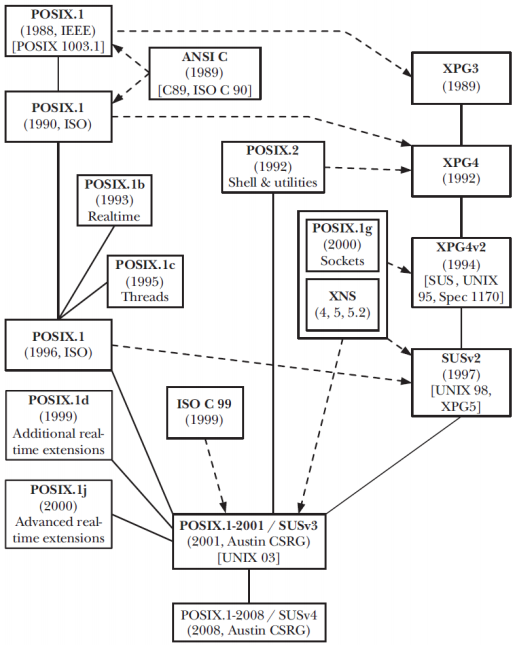

## Índice

- [Introducción](#Punto1)

- [Estándares](#Punto2)

- [Llamadas al sistema y funciones de biblioteca](#Punto3)

- [Servicios POSIX y glibc](#Punto4)
  
  - [Creación y terminación de procesos](#CreacionProcesos)
  
  - [Acceso a sistemas de ficheros](#Ficheros)
  
  - [Gestión de memoria virtual](VM)
  
  - [Gestión de memoria dinámica](DM)
  
  - [Comunicación/sincronización de procesos (IPC)](#IPC)

## Introducción 

> El **Sistema Operativo** es un *software* que gestiona los recursos (procesos, memoria y E/S) del computador.

El *kernel* es el núcleo del sistema y el encargado de:

- [La creación y terminación de los procesos](#CreacionProcesos)

- Gestionar las credenciales de procesos (Identificadores y permisos)

- La planificación de procesos ([*Preemptive multitasking*](https://es.wikipedia.org/wiki/Multitarea_apropiativa#:~:text=La%20multitarea%20apropiativa%20(del%20inglés,múltiples%20procesos%20al%20mismo%20tiempo.&text=Por%20cada%20núcleo%20de%20la,un%20proceso%20en%20cada%20momento.)))

- Gestión de memoria ([*Dynamic memory*](#DM)/[*Virtual memory*](#VM))

- Administración de usuario y grupos (*Virtual private computer*)

- [Acceso al sistema de ficheros (*Virtual File System* o VFS)](#Ficheros)

- [Comunicación y sincronización de procesos (IPC)](#IPC)

- Acceso a dispositivos de E/S

- *Networking*

- *System Call Application Programming Interface* (API)

Junto al kernel hay un conjunto de herramientas que lo acompañan, es el caso del *shell*, la interfaz gráfica, los editores y otras utilidades.

### El intérprete de comandos o *shell*

> El *shell* es un programa informático que procesa las líneas de órdenes tecleadas por el usuario, ejecutando cada comando mediante la *System Call API* del Sistema Operativo.

Dentro del *shell* encontramos comandos internos (`help comando`) y externos (`man comando`). Existen diferentes intérpretes de comandos, siendo los más comunes:

- *Bourne shell* (**sh**)

- *C shell* (**csh**)

- *Korn shell* (**ksh**)

- <u>***Bourne again shell*** (**bash**)</u>

El *shell* está estandarizado (POSIX.2 o 1003.2-1992), tanto **ksh** como **bash** se ajustan a POSIX.2, pero también incluyen algunas extensiones no portables. 

El *shell* por defecto depende del sistema operativo, podemos averiguar el que estamos usando haciendo: `$ echo $SHELL`

## Estándares 

### Lenguaje C

En el año 1989, [ANSI](www.ansi.org/about/introduction#:~:text=The%20American%20National,system.) aprobó el primer estándar de C (C89); en 1990, [ISO/IEC](https://www.iso.org/standard/17782.html) lo aprobó también (C90). Posteriormente, el estándar de C sufrió tres revisiones (C95, C99 y C11), también hubo una revisión C17/C18 que corrigió algunos errores de la C11.

El estándar de C incluye no solo la sintaxis y la semántica de C, sino también su biblioteca estándar ([*The Standard C Library*](es.wikipedia.org/wiki/Biblioteca_estándar_de_C#:~:text=La,cadenas.)).

### UNIX y Linux

De 1969 a 1974 se desarrollaron las cinco primeras versiones de UNIX en [AT&T](es.wikipedia.org/wiki/AT%26T#:~:text=En%201925,logros.), y en 1975 AT&T liberó el código fuente de la sexta. Durante los 80, la Universidad de Berkeley liberó varias versiones de BDS (*Berkeley Software Dirstribution*) basadas en el UNIX de AT&T (FreeBSD, NetBSD y OpenBSD). En paralelo, AT&T había comenzado la comercialización de UNIX como System V (de SVr1 a SVr4).

El 1989 arranca el proyecto [GNU](https://www.gnu.org/home.es.html#:~:text=GNU%20es%20un%20sistema%20operativo%20de%20tipo%20Unix%2C%20lo%20cual,se%20conoce%20como%20Proyecto%20GNU.&text=El%20nombre%20«GNU»%20es%20un,«GNU%20No%20es%20Unix».) de la mano de Richard Stallman, su objetivo era el de crear una implementación libre de UNIX con aplicaciones y utilidades con licencia GPL como `gcc`, `gdb` o `make`. Ante la ausencia de un kernel libre maduro, GNU adopta el núcleo Linux.

En la actualidad siguen comercializándose versiones de UNIX como Solaris (previamente SunOS), basado en SVr4 y Mac OS X, basado en Mach/FreeBSD.

En 1994 se libera la versión 1.0 de Linux con licencia GPL.

Hoy en día, el término genérico *Linux* se refiere a la combinación del kernel con bibliotecas, herramientas e instalación (distribucione).

### Relación entre los estándares C y UNIX

[POSIX](es.wikipedia.org/wiki/POSIX#:~:text=POSIX%20(acrónimo,).) es una familia de estándares para sistemas operativos de [IEEE](www.ieee.org/about/vision-mission.html#:~:text=IEEE%20is,statements.) que regula las interfaces, pero no las implementaciones.

## Llamadas al sistema y funciones de biblioteca 

### Llamadas al sistema

> Las llamadas al sistema o *syscalls* permiten a un proceso de usuario solicitar servicios de diferente naturaleza al Sistema Operativo.

La mayoría de las llamadas al sistema están encapsuladas en funciones de biblioteca que suelen tener el mismo nombre que la *syscall* correspondiente.

Cada llamada al sistema implica un cambio de modo usuario a modo kernel, se identifica mediante un número único y puede requerir un conjunto de argumentos.

Las llamadas son extremadamente importantes por ser un recurso imprescindible, gracias a ellas podemos entender qué hace un programa, cómo lo hace y cuán útil es. Además, determinan la portabilidad de un programa (todos los ejemplos que incluyen la [*feature test macro*](man7.org/linux/man-pages/man7/feature_test_macros.7.html#:~:text=Feature%20test%20macros%20allow,copiled.) `_POSIX_C_SOURCE 200809L` son portables). Por lo tanto, <mark>son parte esencial de la seguridad del sistema</mark>.

**Nota**: Con `strace -c programa` podremos ver las estadísticas de las llamadas al sistema que realiza *programa*.

### Modo usuario y modo kernel

Diapositiva 16.
