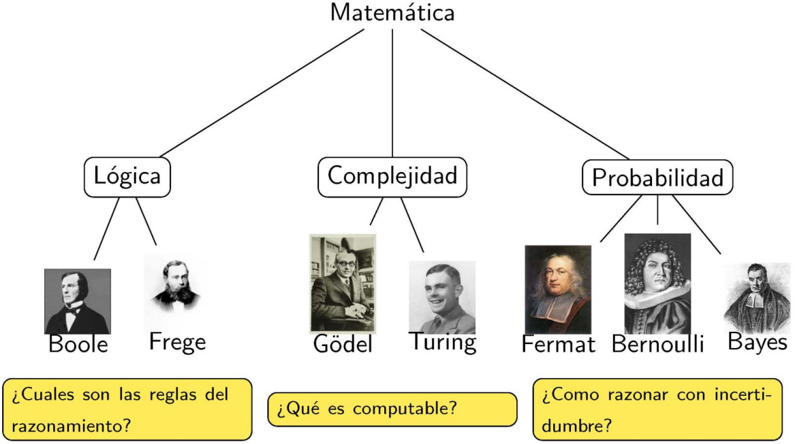

# Tema 1: Introducción a los Sistemas Inteligentes Artificiales

## Índice

- [¿Qué es la Inteligencia Artificial?](#Punto1)

- [Historia de la Inteligencia Artificial](#Punto2)

- [Método de la Inteligencia Artificial](#Punto3)

- [Sistemas Inteligentes](#Punto4)

- [Conclusiones](#Punto5)

## ¿Qué es la Inteligencia Artificial? 

La Inteligencia Artificial es un área de la ciencia y la ingeniería reciente cuyo objetivo es el de expresar las capacidades que consideramos *inteligentes* a través de las máquinas. Es un campo influído por la filosofía, las matemáticas, la psicología, la biología entre otras. La Inteligencia Artificial involucra áreas genéricas como el aprendizaje, la percepción, la resolución de problemas, etc, y áreas específicas como el ajedrez, el diagnóstico de enfermedades y otras muchas.

La *inteligencia* se define según la Real Academia Española como:

> 1. f. Capacidad de entender o comprender.
> 
> 2. f. Capacidad de resolver problemas.
> 
> 3. f. Conocimiento, comprensión, acto de entender.
> 
> 4. f. Sentido en que se puede tomar una proposición, un dicho o una expresión.
> 
> 5. f. Habilidad, destreza y experiencia.

Y la *Inteligencia Artificial* se define como:

> Disciplina científica que se ocupa de crear programas informáticos que ejecutan operaciones comparables a las que realiza la mente humana, como el aprendizaje o el razonamiento lógico.

En 1956, Marvin Minsky y John McCarthy (junto con Shannon y Rochester) organizan una conferencia en el Darmouth College (Hanover-EEUU) a la que acuden entre  otros Arthur Samuel, Allen Newell y Herbert Simon. Este evento se considera el germen de la Inteligencia Artificial.

La Inteligencia Artificial tiene varias definiciones:

- Sistemas que actúan como humanos
  
  > *“El estudio de como hacer computadoras que hagan cosas que, de momento, la gente hace mejor”* (Rich y Knight, 1991)
  
  El modelo es el hombre, el objetivo es construir un sistema que pase por humano. Alan Turing (1912-1954), padre de la computación, ideó el "test de Turing", si un sistema lograba pasarlo, entonces podía considerarse inteligente; aunque el objetivo primordial de la IA no es pasar el test.
  
  Son necesarias capacidades como el procesamiento del lenguaje natural, la representación del conocimiento, el razonamiento, el aprendizaje, etc. En la interacción entre los programas y las personas, es necesario que los programas actúen como humanos.

- Sistemas que piensan como humanos
  
  > *“El esfuerzo por hacer a las computadoras pensar ... máquinas con mentes en el sentido amplio y literal”* (Haugeland, 1985)
  
  El modelo es el funcionamiento de la mente humana. Intentamos establecer una teoría sobre el funcionamiento de la mente (experimentación psicológica) y, a partir de dicha teoría, podemos establecer modelos computaciones (Ciencias Cognitivas).

- Sistemas que piensan racionalmente
  
  > *“El estudio de las facultades mentales a través del estudio de modelos
  > computacionales”* (Charniak y McDermott, 1985)
  
  Las leyes del pensamiento racional se fundamentan en la lógica. La lógica formal está en la base de los programas inteligentes (logicismo), pero se presentan dos obstáculos:
  
  - Es muy difícil formalizar el conocimiento
  
  - Hay un gran salto entre la capacidad teórica de la lógica y se realización práctica

- Sistemas que actúan racionalmente
  
  > *“Un campo de estudio que busca explicar y emular el comportamiento
  > inteligente en términos de procesos computacionales”* (Schalkoff, 1990)
  
  Actuar racionalmente significa conseguir unos objetivos dadas unas creencias. El paradigma es el agente racional: *un agente que percibe su entorno y aplica su conocimiento racional para actuar y conseguir sus objetivos* (Newell, 1982).
  
  Son necesarias capacidades como el procesamiento del lenguaje natural, la representación del conocimiento, el razonamiento, el aprendizaje, adaptación al entorno, etc. Su visión es más general, no está centrada en el modelo humano y usa fuentes de conocimiento adicionales a la lógica.

Con todo, la posibilidad de la inteligencia artificial plantea problemas filosóficos complejos. Es el caso de *La habitación china* (Searle, 1980), en el que se cuestiona si las máquinas pensantes realmente poseen consciencia.

No hay una conclusión definitiva a todo esto, por lo que solo cabe preguntarse:

*¿Es la inteligencia una propiedad emergente de los elementos biológicos que la producen?*

La Inteligencia Artificial tiene bases en campos como la economía (tomar decisiones), la neurociencia (entender cómo procesa el cerebro la información), la psicología (teorías sobre la conducta, bases del comportamiento racional), la computación (herramientas para soportar y desarrollar la IA), teoría de control/cibernética (construcción de sistemas autónomos) y lingüística (Chomsky, lingüística computacional).

## <a href="https://aulavirtual.um.es/access/content/group/1906_G_2021_N_N/TEOR%C3%8DA/Grupo%201-PCEO/Tema%201/Tema-1.pdf#page=12">Historia de la Inteligencia Artificial</a> 

## Método de la Inteligencia Artificial 

> Un método es un modo de realizar con orden la actividad científica y académica en una disciplina según su propia naturaleza.

Para resolver problemas, la IA cuenta con las siguientes herramientas básicas (aspectos metodológicos):

- Heurística y Algorítmica

- Computación Simbólica y Numérica

- Procedimentalismo y Desclarativismo

### Heurística y Algorítmica

> Un algoritmo es un método general de resolución de algún problema tal que su validez no puede ser cuestionada por basarse en principios formalizados, siendo lo único cuestionable su eficiencia.

> Un método heurístico es un método de resolución de problemas que se basa en la intuición o en la experiencia y, sin embargo, en la práctica resuelve problemas de forma correcta.

Los métodos heurísticos con costes más reducidos, o de mayor eficiencia, son mejores que el mejor de los métodos o algoritmos para tal problema.

### Computación Simbólica y Numérica

> Un símbolo es un entidad cuyo valor no pertenece al dominio en el que existe.

La inteligencia está asociada a la posibilidad de representar mediante símbolos. Una aproximación metodológica correcta a un problema debe considerar el problema como un sistema de símbolos que poseen un álgebra específica y nunca considerar a la aritmética como el álgebra principal.

### Procedimentalismo y Desclarativismo

La programación <u>procedimental</u> utiliza una descripción del problema basada en la especificación de un conjunto de órdenes o instrucciones que, ejecutadas en un determinado órden, conducen a la solución.

La programación <u>declarativa</u> realiza una descripción de los problemas en forma de las relaciones lógico-funcionales de los componentes a datos del mismo. La programación declarativa no especifica la forma de alcanzar la solución, sino la relación que debe existir entre esta y los datos, por esta causea una máquina que incorpore la programación declarativa debe realizar una inferencia de la solución a partir de los datos y de las relaciones especificadas.

## Sistemas Inteligentes 

En general, en la Tecnología de la Información, podemos decir que:

>  Un *sistema* se define como un conjunto de elementos o componentes conectados que se organizan para un propósito común.

Como tal, y aunque se habla de ellos en términos de dispositivos, los Sistemas Inteligentes incluyen no solo dispositivos inteligentes, sino también conjuntos interconectados de tales dispositivos. Del mismo modo, los Sistemas Inteligentes incluyen sistemas software basados en Inteligencia Artificial.

Los Sistemas Inteligentes existen a nuestro alrededor en televisores digitales, semáforos, contadores inteligentes, automóviles, señalización digital y controles de aviones, entre muchas otras posibilidades. La inteligencia incorporada es un componente integral en el desarrollo del Internet de las Cosas (IoT).

Según la Real Academia Española, un sistema inteligente es:

> Sistema dotado de inteligencia. Sistema (un edificio, un mecanismo, etc) que está controlado por ordenador y es capaz de responder a cambios del entorno para establecer las condiciones óptimas de funcionamiento sin intervención humana.

## Conclusiones 

Hay mucho por hacer en el campo de los Sistemas Inteligentes y de la Inteligencia Artificial, mucho por investigar e innovar. La historia de la IA (y por tanto de los SSII) es aún muy reciente, tanto como la de la informática.

Algunos aspectos básicos de la IA incluyen la búsqueda, el conocimiento, la planificación y el aprendizaje.

En esta asignatura se estudiarán algunos aspectos básicos de la IA y, por tanto, aspectos para la construcción de sistemas inteligentes.
