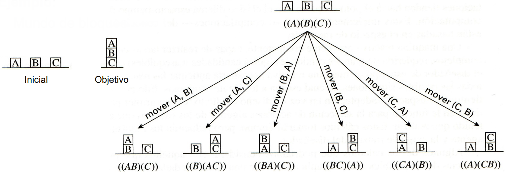
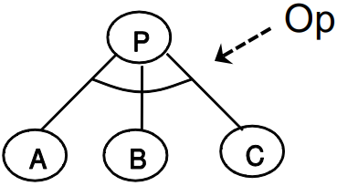
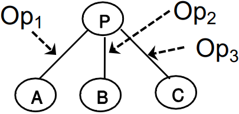
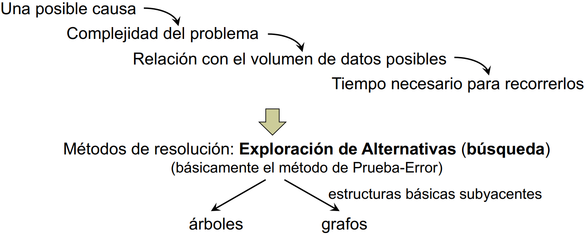
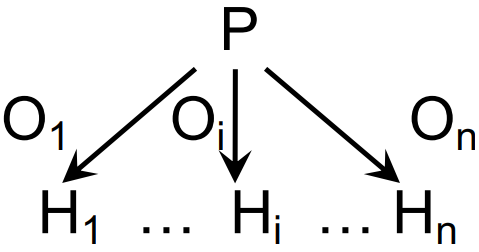
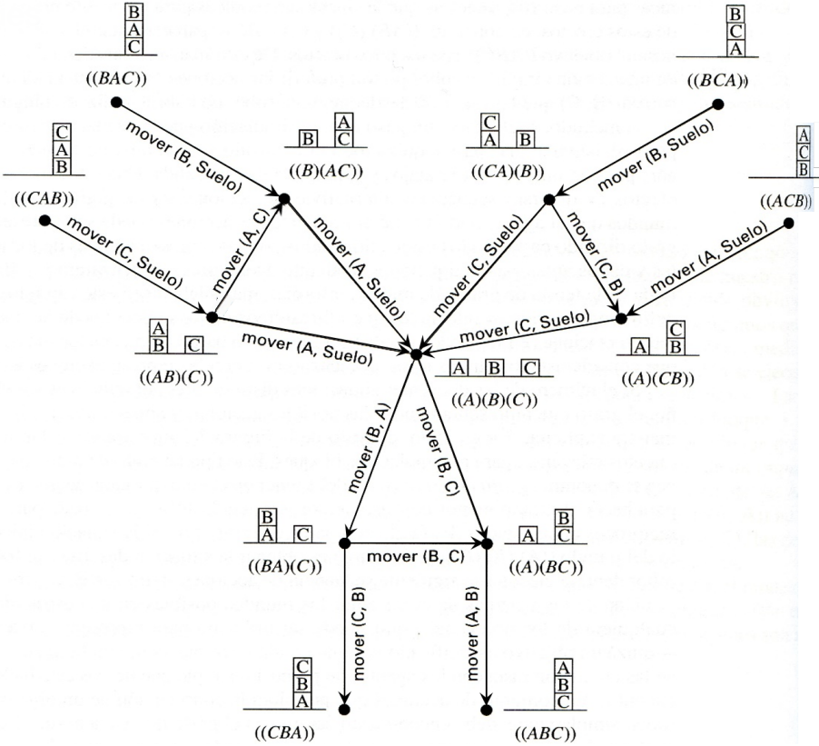
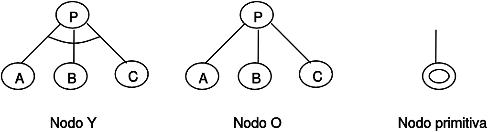
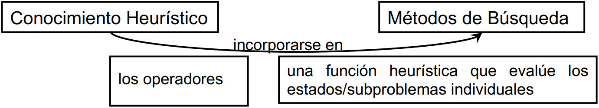

# Tema 2: Los Problemas y los Procesos de Búsqueda

## Índice

- [Problemas, representación y características](#Punto1)
  
  - [Introducción](#Punto1.1)
  
  - [Representación](#Punto1.2)
  
  - [Características de los problemas](#Punto1.3)

- [Características de los procesos de Búsqueda](#Punto2)
  
  - [Búsqueda de la solución. Árboles y Grafos](#Punto2.1)
  
  - [Razonamiento hacia delante y hacía atrás](#Punto2.2)
  
  - [Selección de Operadores](#Punto2.3)
  
  - [Heurísticas. Funciones heurísticas de evaluación](#Punto2.4)

- [La exploración como paradigma de resolución y búsqueda](#Punto3)

## Problemas, representación y características 

### Introducción 

No disponemos de un algoritmo determinista general para resolver problemas porque los problemas son complejos (por ejemplo, el ajedrez), el mundo es cambiante (un robot intenta coger una pieza que cambia de sitio) y el mundo es parcialmente desconocido (un laberinto), etc. Existen técnicas o métodos específicos para la resolución de los problemas, pero nos interesa analizar el conjunto de métodos de resolución de problemas que consideramos más generales (con variantes adecuadas, muy utilizados).

Para aprender a diseñar **Sistemas de Resolución de Problemas** debemos analizar los elementos generales de cualquier sistema que permita encontrar soluciones a problemas, lo cual será útil para abordar nuevos problemas de manera formalizada o sistemática.

Los **elementos principales** de los Sistemas de Resolución de Problemas son:

- **Representación**: *describe* el dominio del problema, el objetivo final que se desea alcanzar y la situación inicial.

- **Operadores**: *transforman* la situación del problema, o dividen un problema en varios subproblemas que tienen una solución más sencilla.

- **Estrategia de Control**: *selecciona*, de entre todos los posibles, el operador a aplicar en cada situación del problema. La aplicación de un operador sobre la representación del problema la transforma en un sentido característico de cada operador.
  La estrategia de control es la responsable de la selección de la secuencia adecuada de operadores. <u>La solución de un problema será una secuencia adecuada de operadores que conduce a su resolución</u>.

**Ejemplo**: [Robot en un mundo dimensional con paredes y obstáculos](https://aulavirtual.um.es/access/content/group/1906_G_2021_N_N/TEOR%C3%8DA/Grupo%201-PCEO/Tema%202/Tema-2.pdf#page=4).

### Representación 

Los métodos de representación de problemas pueden estar basados en:

- Formulación en el **Espacio de Estados**, los problemas se representan como una colección de estados.

- Formulación mediante **Reducción**, los problemas se representan como una jerarquía de subproblemas de diferente complejidad.

#### Representación mediante Espacio de Estados

Tendremos dos clases de entidades:

- Estados: son una representación completa de la situación del problema en un momento dado (contiene información relevante).

- Operadores: son acciones que pueden transformar un estado en otro.

Denominaremos <u>estado inicial</u> a la situación inicial del problema, y <u>estado final</u> (o meta, objetivo) a una configuración determinada que representa el objetivo deseado. Los <u>estados intermedios</u> serán aquellos que se obtienen al aplicar los operadores.

Un problema representado mediante espacio de estados se especifica como la tupla $(S, O, G)$, donde $S$ y $G$ son los conjuntos de estados iniciales y finales, y $O$ es el conjunto de operadores.

Una estrategia define una solución o trayectoria en el espacio de estados que va desde un estado inicial hasta un estado final. La trayectoria equivale a una secuencia de operadores.

**Ejemplo**: Mundo de bloques. 

#### Representación mediante Reducción

Este esquema responde a la posibilidad de que el problema se pueda descomponer en subproblemas más pequeños. El principal elemento es la descripción del problema a resolver y la dinámica de resolución consiste en su descomposición en problemas más simples.

La situación inicial está definida por la formulación del problema y por un conjunto de operadores o transformadores del problema. La descripción inicial del problema se resuelve por aplicación de una secuencia de transformaciones que en el último extremo la convierte en un conjunto de subproblemas cuya resolución sea inmediata.

Un operador puede transformar un problema en:

- Varios subproblemas <u>secundarios</u>: para solucionar el problema principal se deberán resolver todos los problemas hijos.

- Varios subproblemas <u>alternativos</u>: ocurre cuando a un mismo problema se le aplican diferentes operadores, con obtener la solución de un caso ya quedará resuelto el principal.

**Ejemplo**: [Cálculo de una integral](https://aulavirtual.um.es/access/content/group/1906_G_2021_N_N/TEOR%C3%8DA/Grupo%201-PCEO/Tema%202/Tema-2.pdf#page=8).

### Características de los problemas 

Para escoger el método más apropiado (o combinación de métodos) para resolver un problema, es necesario analizar el problema según varias dimensiones clave:

- <u>Problemas Descomponibles</u>: ¿se puede descomponer el problema en un conjunto de sub-problemas independientes más pequeños o más fáciles?

- <u>Problemas Recuperables o Irrecuperables</u>: ¿pueden deshacerse aquellos pasos a la solución que sean poco lógicos?

- <u>Problemas de cualquier o mejor camino</u>: ¿es obvia una buena solución del problema sin necesidad de compararla con todas las otras posibles soluciones?

- <u>Consistencia y Papel del Cocimiento</u>: el conocimiento base que debe usarse para resolver el problema, ¿es consistente?. ¿Es absolutamente necesaria una gran cantidad de conocimiento para resolver el problema o bien el conocimiento sólo es importante para restringir la búsqueda?

## Características de los Procesos de Búsqueda 

Existen muchos problemas para los que no se conoce —o no se puede conocer— un algoritmo, es decir, una trayectoria en el espacio del problema. Buscar consiste en decidir.

Los candidatos que aún no se han explorado se denominan <u>frontera</u>, mientras que los ya explorados se denominan <u>cerrados</u>. Por lo tanto, la búsqueda consiste en decidir de mi frontera lo que debo explorar.

El espacio de estados son todos los posibles estados, mientras que la estructura de búsqueda es lo que yo he buscado. La estructura de búsqueda está compuesta por nodos, que no debe confundirse con los estados.

### Búsqueda de la solución. Árboles y Grafos 

Un espacio de estados puede tratarse como un árbol o un grafo dirigido (o árbol expandido como alternativa) donde los nodos contienen a los estados y los arcos representan a los operadores del problema.

En la notación del árbol/grafo, la solución del problema es un camino desde un nodo inicial hasta un nodo final. El número de operadores determina el grado de ramificación del árbol que representa el problema. El nodo raíz o nodo distinguido se corresponde con el estado inicial.

En la estructura se encuentra algún nodo asociado con el estado final (denominado nodo final, objetivo o meta). Según la presencia del nodo final en la estructura, pueden distinguirse tres casos:

- El nodo final no se encuentra en ella

- El nodo final aparece una vez en ella

- El nodo final aparece múltiples veces (se debe verificar alguna condición para elegir la mejor solución)

El ejemplo *Mundo de bloques* [previamente mostrado]("#MundoBloques") puede representarse como árbol:

O como grafo:

Un grafo difiere de un árbol en que diversos caminos pueden llegar a un mismo nodo.

Un problema está asociado a la <u>búsqueda en un árbol</u> cuando, frecuentemente, se genera el mismo nodo en caminos distintos (es decir, se procesa más de una vez).

Un problema está asociado a la <u>búsqueda en un grafo</u> cuando pueden introducirse ciclos en la búsqueda —un ciclo es un camino a través del grafo en el que un nodo dado aparece más de una vez—. Como consecuencia, es más difícil probar que el método termina.

Realizaremos la búsqueda en un grafo en vez de en un árbol cuando se reduce el esfuerzo que se invierte explorando el <mark>mismo camino varias veces</mark>, y cuando se requiere un esfuerzo adicional cada vez que se genera un nodo para <mark>ver si se ha generado anteriormente</mark>.

La elección depende del problema concreto.

#### Árboles Y/O y grafos Y/O

La representación por reducción también puede tratarse como un árbol o un grafo, pero en esta situación se introduce un tipo de estructura denominada árbol o grafo **Y/O**, definidos en base a las siguientes reglas:

- Cada nodo contiene un problema simple o un conjunto de problemas.

- Un nodo que no se descompone o simplifica es un nodo terminal.

- Un nodo terminal con solución se corresponde con un problema primitivo (decimos que es una primitiva).

- Si por cada posible operador se genera un conjunto de subproblemas de solución alternativa, entonces se produce un nodo O.

- Si la aplicación de un operador genera diversos subproblemas, siendo necesaria la resolución de todos ellos, entonces se porduce un nodo Y.

La resolución de un problema representado en forma de árbol Y/O está asociada con la resolución del nodo raíz.

Un nodo tendrá solución (es resoluble) si se verifica alguna de estas situaciones:

- Es un nodo primitiva

- Es un nodo no terminal del tipo Y y sus sucesores son todos ellos resolubles

- Es un nodo no terminal del tipo O y al menos uno de sus sucesores es resoluble

Un nodo es irresoluble si se verifica alguna de estas condiciones:

- El nodo es terminal, es decir, no tiene sucesores y no es primitiva

- El nodo es no terminal del tipo Y y al menos uno de sus sucesores es irresoluble

- El nodo es no terminal del tipo O y todos sus sucesores son irresolubles

### Razonamiento hacia delante y hacía atrás 

El objetivo de un método de búsqueda es describir un camino a través del espacio del problema desde una configuración inicial a una final. Existen dos tipos de razonamientos:

- <u>Hacia adelante</u> (*forward*, dirigida por datos o *Bottom-Up*): se aplican los operadores a la estructura inicial, provoca una transformación de su representación y se repite. El problema tendrá solución si es posible alcanzar el objetivo.

- <u>Hacia atrás</u> (*backward*, dirigidas por objetivos o *Top-Down*): se parte de la configuración final (meta u objetivo) y se aplican operadores inversos al objetivo. El problema tendrá solución si es posible alcanzar la situación inicial.

Elegiremos uno u otro dependiendo de si existen más estados inicio posibles o estados meta, o dependiendo de la dirección en la que el factor de ramificación sea más grande. Otra posibilidad es seguir una estrategia de búsqueda bidireccional.

### Selección de Operadores 

Usar un proceso de búsqueda para resolver problemas consiste en la aplicación de operadores apropiados. Una búsqueda *inteligente* es aquella en la que esperamos que, a partir de la elección de unos operadores determinados, nos conduzca a una solución.

Denominaremos <u>emparejamiento</u> al acto de determinar los operadores aplicables a la situación actual. Se comprueban las precondiciones de los operadores. Cuando las precondiciones no se definen como descripciones exactas de situaciones particulares, sino que más bien describen propiedades que deben de tener esas situaciones, surgen problemas (<u>emparejamiento con variables</u>).

A menudo, el emparejamiento entre una situación particular y las precondiciones de un operador involucra un proceso importante de búsqueda. Una clase sencilla de emparejamiento no literal que a veces puede requerir de una búsqueda extensiva surge cuando las precondiciones contienen variables.

$$
Libre(x)\ \text y\ Libre(y)\ ➜\ Mover(X,Y)
$$

### Heurísticas. Funciones heurísticas de evaluación 

La <u>heurística</u> se entiende como una estrategia, método o criterio usado para hacer más sencilla la resolución de problemas difíciles.

El <u>conocimiento heurístico</u> es el conocimiento usado por los humanos para resolver problemas complejos.

La <u>técnica heurística</u> es el conjunto de pasos que deben seguirse para identificar una solución de alta calidad con pocos recursos, aunque no podamos garantizar encontrar la solución. Existen técnicas heurísticas de aplicación muy general y otras que representan conocimientos específicos que son relevantes para la solución de un problema.

La <u>función heurística</u> es una estimación de lo próximo que se encuentra un estado/subproblema de un estado objetivo o problema primitivo.

## La exploración como paradigma de resolución y búsqueda 

La **exploración** es un método de resolución de problemas tentativo (basado en el criterio de prueba y error) en el que se exige la selección de alguna opción entre un conjunto de posibilidades; no existe un principio determinista para definir tal elección. Se utiliza la exploración porque muchos problemas presentan propiedades como las siguientes:

- Se desconoce qué posible trayectoria puede conducir a la solución.

- Tales trayectorias no se pueden hallar de una forma sistemática o en muchos problemas su tiempo de cálculo puede exceder lo razonable.

- En el mundo real son resueltos por los seres humanos utilizando principios heurísticos, que por su naturaleza son de difícil justificación.

El principal inconveniente de la exploración es su complejidad computacional, medida como los recursos en tiempo y memoria que una máquina precisa para resolver el problema. En algunos métodos la complejidad crece exponencialmente con el tamaño del problema (problemas NP), lo que da lugar a una [explosión combinatoria](https://es.wikipedia.org/wiki/Explosi%C3%B3n_combinatoria#:~:text=En%20matem%C3%A1ticas,%20una%20explosi%C3%B3n%20combinatoria,la%20intrazabilidad%20de%20ciertos%20problemas.) de posibilidades.

Por otro lado, las ventajas de la exploración son: que constituye un método universal de resolución de problemas, es decir, su falta de especificidad lo hace aplicable a un número muy elevado de problemas; y que se han desarrollado métodos para incorporar el conocimiento heurístico adecuado a los problemas, lo que tiene como consecuencia que aumente su eficacia.

Por estas razones, la exploración de alternativas es, en muchos casos, la única herramienta a utilizar para resolver problemas. Los métodos de exploración o búsqueda pueden ser (en función de la estrategia de control):

- No informada (a ciegas o sin información)

- Heurísticos

Dentro de cada uno distinguimos entre métodos:

- En Espacio de Estados

- Por Reducción del Problema

Un método será completo (**<u>Completitud</u>**) si es capaz de encontrar una solución en caso de haberla. Un método será óptimo (**<u>Optimalidad</u>**) si es capaz de garantizar que encontrará la mejor solución.
