[🏡 Inicio](../../index.html)

# Tema 1: Algunos principios básicos de diseño orientado a objetos

## Índice

- Modelado del software con UML
  
  - [Presentación de UML](#Punto1)
  - [Modelado Estructural: Diagramas de Clases](#Punto2)
  - [Modelado del Comportamiento: Diagramas de Interacción](#Punto3)

- Patrones GRASPS y otros principios básicos orientados a objetos
  
  - [Experto, Creador y Controlador](#Punto4)
  
  - [Principio de Separación Modelo-Vista](#Punto5)
  
  - [Técnicas básicas orientadas a objetos](#Punto6)

- Proceso de desarrollo de software
  
  - [Métodos y técnicas de creación de software](#Punto7)
  
  - [Desarrollo dirigido por el dominio](#Punto8)

## Modelo

> Un modelo es una **representación de la realidad** que es obtenido por medio de un proceso de [*abstracción*](#NotaAbstracción) con el propósito de ayudar a comprender y razonar sobre esa realidad. Un modelo es expresado en un ***lenguaje***.

> <a name="NotaAbstracción">**Abstracción**: </a> Se ignoran los detalles y nos centramos en las características esenciales que nos interesan.

Un modelo de software es una descripción abstracta de algún aspecto de los sistemas software, por ejemplo: los requistos, su estructura, el comportamiento, los datos, etc.


## UML <a name="Punto1"></a>

A mediados de los años noventa existían muchos métodos de análisis y diseño orientado a objectos, sin embargo, solían ser los mismos conceptos expresados con notaciones diferentes, lo cual provocaba una gran confusión. En 1994, Grady Booch, James Rumbaugh e Ivar Jacobson deciden unificar las notaciones de sus métodos, dando así lugar al *Unified Modeling Language* (UML).


Posteriormente, el lenguaje fue sometido a un proceso de estandarización promovido por el OMG (*Object Management Group*), una organización sin fines de lucro que cuida y promueve el uso de tecnología orientada a objetos mediante guías y especificaciones.

Las ventajas de UML son:

    ✅ Eliminar confusión.

    ✅ Proporcionar estabilidad al mercado.

    ✅ Reunir los puntos fuertes de cada método.

    ✅ Añadir mejoras. 

> **UML** es un lenguaje para visualizar, especificar, construir y documentar los ***modelos*** de un sistema software desde una perspectiva orientada a objetos.


*A la izquierda: ejemplo de diagrama de clase UML. A la derecha: ejemplo de diagrama de secuencia UML.*

Los modelos UML son útiles para <u>documentar</u> decisiones de diseño e implementación, para facilitar la <u>comunicación</u> y los <u>razonamientos</u> gracias a su fácil visualización. Incluso pueden servir para la generación de código utilizando ciertas herramientas, pasando de ser modelos para documentar a ser modelos para generar el código.

### Modelo vs. Diagrama

Un **modelo UML** es una <u>especificación</u> de un aspecto del sistema de interés para un grupo de usuarios o desarrolladores.

Un **diagrama UML** <u>representa</u> una parte de la información del modelo en forma gráfica o textual. En el diagrama de clases, por ejemplo, no aparecen todas las clases, atributos, métodos y asociaciones, sino solo aquellas que se consideran relevantes para el propósito.


### Uso del modelado UML

> *Of the 14 million or so software professionals around the world, many
> know of the existence of the UML yet only a modest percent use (about
> 7%) the UML on a daily basis*. (Grady Booch, 2002)

Un [estudio reciente](http://oro.open.ac.uk/35805/8/UMLinpractice8.pdf) reveló que un 30% de profesionales usa UML, aunque lo hacen muy poco a lo largo de un desarrollo.

En palabras de Grady Booch:

> *The UML should be used to reason about alternatives. Put up some
> diagrams. Throw some use cases against it. Throw away those diagrams
> then write some code against you best decision.
> When we began with the UML, we never intended it to become a
> programming language. We never got the notation for collaborations right.
> Component and deployment diagrams needed more maturing. The UML
> metamodel became grossly bloated, because of the drive to model driven
> development. I think that complexity was an unnecessary mistake.
> Seriously, you need about 20% of the UML to do 80% of the kind of design
> you might want to do in a project – agile or not – but use the UML with a very
> light touch: use the notation to reason about a system, to communicate your
> intent to others…and then throw away most of your diagrams.*

Es decir, solo debemos usar diagramas para aquellas cosas sobre las que no se puede razonar sobre el código.

### Modelos UML más usados

- ~~Diagramas de casos de uso para requisitos.~~ (En desuso)

- Modelo de clases del dominio: **Diagramas de clases**

- Máquinas de estado: **Diagramas de estado**

- Diagramas de interacción (principalmente para la documentación)

- Diagramas de actividades (workflows de procesos de negocio, herramientas BPMN)

## Modelado estructural: diagrama de clases <a name="Punto2"></a>

En un modelado estructural se describen los tipos de objetos de un sistema y las relaciones que existen entre ellos.

- Clases, interfaces, relaciones de dependencia, realización, generalización y asociación.

> Un diagrama de clases es una representación gráfica de un modelo estructural.

Exiten diferentes usos para un diagrama de clases: para un modelo <u>conceptual</u>, para un modelo de clases del <u>diseño</u> o de la <u>implementación</u>.

Ejemplos de diagramas de clases:


### Clase

Para representar a una clase dibujaremos un rectángulo con 3 divisiones horizontales. En la primera pondremos el nombre de la clase, el la segunda división pondremos sus atributos, por último, en la tercera pondremos sus operaciones. Además, aquellas clases o métodos que sean abstractos irán en cursiva, mientras que las variables y los métodos de clase irán subrayados.


### Atributos

Para representar a los atributos de una clase, debemos seguir la siguiente notación:

**`[visibilidad] nombre [:tipo] ['['multiplicidad']']`**

Pudiendo ser la visibilidad:

- pública (+) --> Pueden verlo todas las clases

- protegida (#) --> Pueden verlo todas las clases de ese paquete y las clases hijas de la clase a la que pertenece el atributo.

- a nivel de paquete (~) --> Pueden verlo todas las clases de ese paquete

- privada (-) --> Solo puede verlo la clase a la que pertenece el atributo.

### Operaciones

Para representar a las operaciones de una clase, debemos seguir la siguiente notación:

**`[visibilidad] nombre ['('lista_parámetros_')'][:tipo_retorno]`**

Pudiendo representarse la visibilidad de la misma forma que con los atributos. Los parámetros que conforman la lista de parámetros irán separados por comas.

### Ejemplos de Atributos y Operaciones

#### Ejemplo 1:

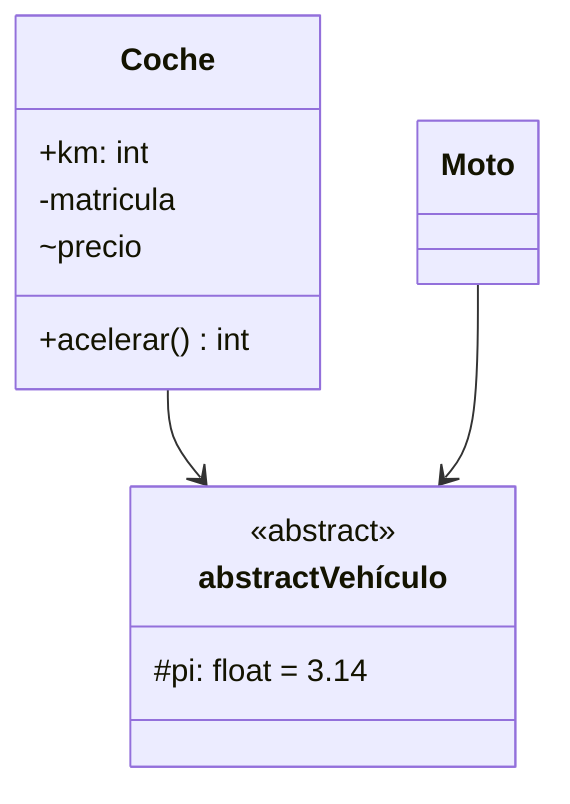

**Nota:** Al ser Coche y Moto hijas de vehículo, ambas flechas pueden combinarse en una sola, es decir, sale una flecha de cada una de las clases, y se unifican todas en una sola que llega a Vehículo.

#### Ejemplo 2:

Código:

```java
public class Canguro implements Saltador{
    public int id;
    private String nombre;

    public Canguro (String n){
        nombre = n;
    }

    public void saltar(){
        System.out.println("SALTO");
    }
}


public interface Saltador{
    public void saltar();
}
```

Diagrama:

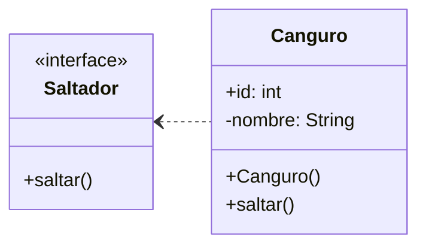

### Relaciones


- **Dependencia**: En este tipo de relaciones, un cambio en la especificación de un elemento afecta a otro elemento. <u>No</u> se utiliza en los diagramas de clases para relacionar objetos del dominio.

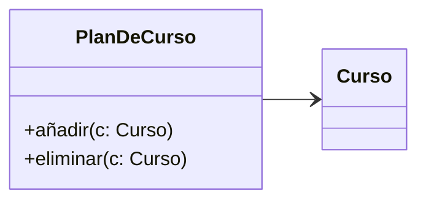

- **Generalización**: Se corresponde con las relaciones *"Es un tipo de..."*. En el caso de un modelo de diseño o implementación, denota una relación de *<u>herencia</u>*.

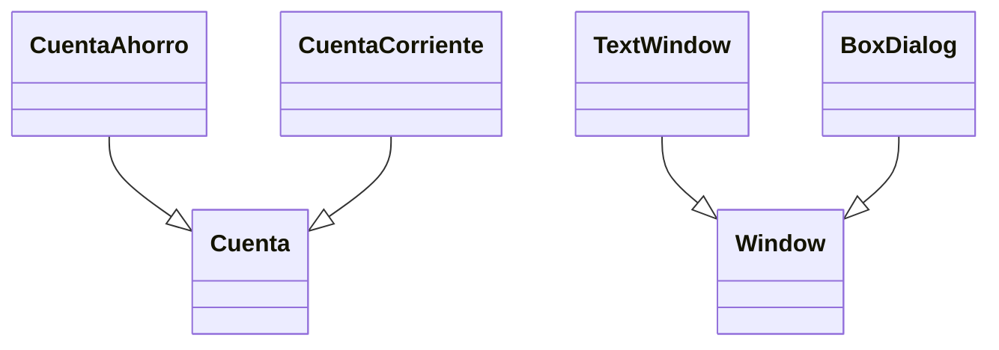

**Nota**: Igual que se ha visto antes, dos o más relaciones con un mismo destino pueden juntarse en una sola línea.

- **Asociación**: Es una relación estructural que especifica que los objetos de un tipo están conectados con los de otro tipo. Este tipo de relación es el que se vió en el [MER](https://es.wikipedia.org/wiki/Modelo_entidad-relación) durante la asignatura del segundo curso: Bases de Datos.
  En la asociación encontramos la <u>multiplicidad</u>, que consiste en representar la cantidad de veces que una entidad puede repetirse en una relación. Se representa `mínimo..máximo`.

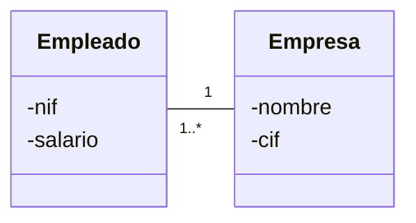

    Las asociaciones son **bidireccionales**, pero es posible restringir la navegación de     una asociación a una sola dirección añadiendo una <u>flecha</u>, de esta manera se     determina si una clase de un extremo de la asociación tiene *conocimiento* de la clase     del otro extremo.
    La asociación se utiliza en diagramas de diseño e implementación.

```java
class Pedido{...
    private ArrayList<ItemPedido> items;
    private Date fecha;
    private boolean esCompleto;
}

class ItemPedido{...
    private Producto producto;
    private int cantidad;
...}

class Producto{...
    private Money precio;
    private String descripcion;
}
```

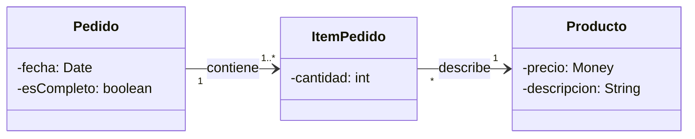

- **Agregación**: Es un caso especial de la asociación que expresa la relación <u>parte-de</u>: *un objeto es parte de otro objeto (agregado)*

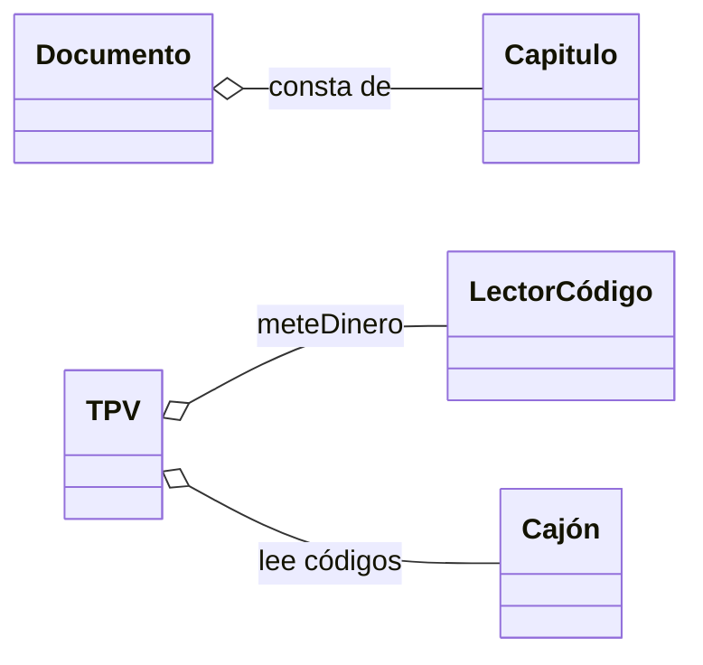

- **Composición**: Es un tipo especial de agregación.
  
  - Una parte pertenece a un único agragado (<u>exclusividad</u>)
  
  - Si se elimina un agregado, se eliminan todas sus partes (<u>dependencia</u>)
  
  Una parte se puede añadir/eliminar en cualquier instante.


- **Realización**: Especifica que una clase implementa una interfaz.

> Una <u>interfaz</u> es una colección de operaciones que especifican los servicios de una clase o componente. Una interfaz permite separar la especificación de la implementación.

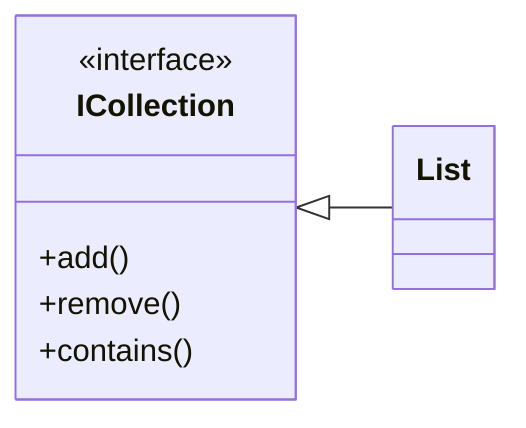

        Las interfaces también pueden representarse haciendo uso de la notación 

        *<u>lollipop</u>*:


## Modelado del comportamiento: Diagramas de Interacción <a name="Punto3"></a>

- Los<u> diagramas de interacción</u> describen cómo los objetos colaboran entre sí para realizar cierta actividad (lo veremos en TDS):
  
  - Diagramas de <mark>Secuencia</mark> y Diagramas de Colaboración o <mark>Comunicación</mark>

- Máquinas de estado (las veremos en PDS):
  
  - Diagramas de estado
  
  - Diagramas de actividades

#### Diagramas de Interacción: Definiciones

- **Interacción**: Se dice del comportamiento que comprende un conjunto de mensajes intercambiados entre un conjunto de <u>líneas de vida</u> (o a través de un <u>enlace</u>) para lograr un propósito.

- **Mensaje**: Consiste en una especificación de una particular comunicación entre líneas de vida de una interacción que transmite información, con la expectativa de desencadenar una actividad.

- **Línea de vida**: Son el objeto y la línea de tiempo que marca su existencia (diagramas de secuencia) o enlace (diagramas de comunicación).


- Un **enlace** es una instancia de una asociación. Es un camino por el cual se envía un mensaje.


El siguiente diagrama de clases:

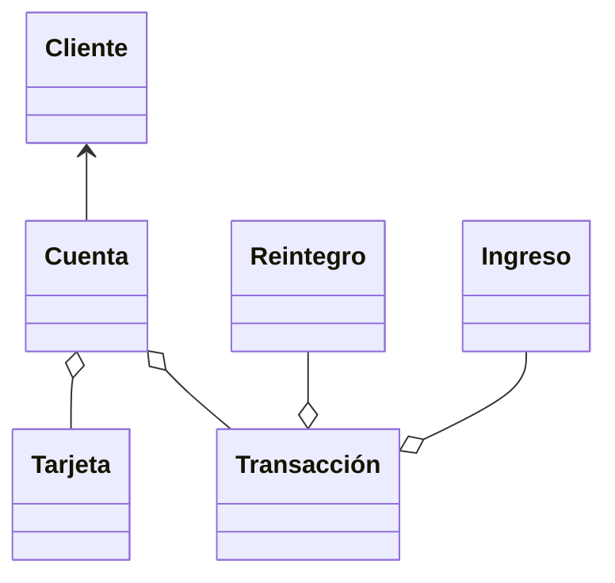

Podría dar lugar al siguiente diagrama de objetos:

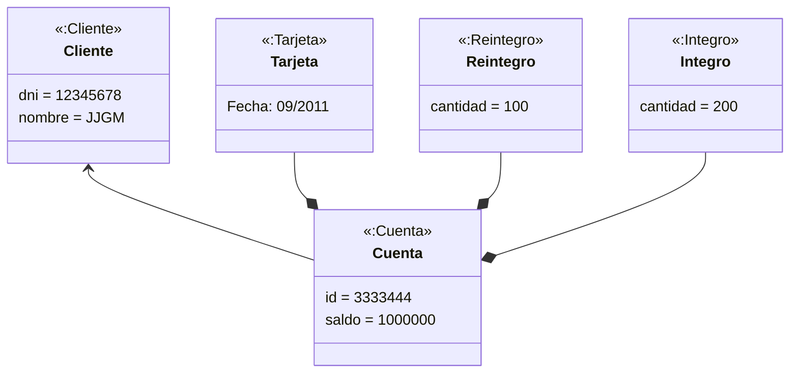

### Diagramas de Secuencia

Están formados por:

- Líneas de vida

- Focos de control o activación

- Mensajes: a instancias o de creación

- Mensaje self

- Información de control: condiciones y marcas de iteración

- Indicar el objeto devuelto por el mensaje: return (añadirlos solo cuando ayuden a clarificar la interacción)


#### Tipos de mensajes

- Simple: metodo(arg). Ej: `preparar()`, `addPedido(p)`

- Creación de objetos: `<<create>>`

- Destrucción de objetos: `<<destroy>>`

- Asignación: v:=método(arg). Ej: `hayStock := eliminar()`

Además, en UML 2.0 se incorporan los siguientes mensajes en diagramas de comunicación:

- Condición: [condicion] metodo(arg). Ej: `[premium] saludo()`

- Iteración: * metodo(arg), [1..n] metodo(arg). Ej: `*enviarPedido()`

La numeración puede ser jerárquica, secuencial, o ninguna.

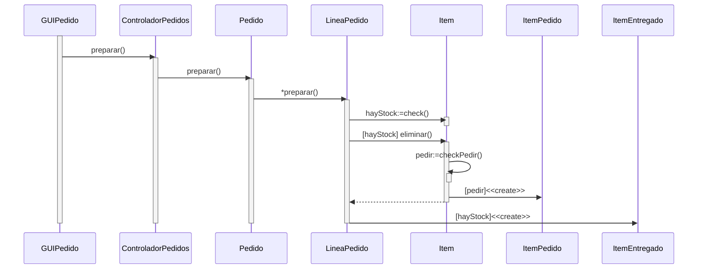

#### Foco de control o activación

El foco de control es un rectángulo que representa el tiempo durante el que un objeto está activo ejecutando una acción:

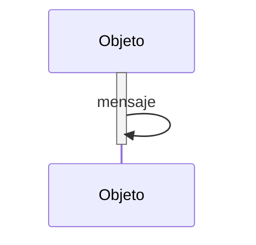

### Diagrama de Colaboración o Comunicación


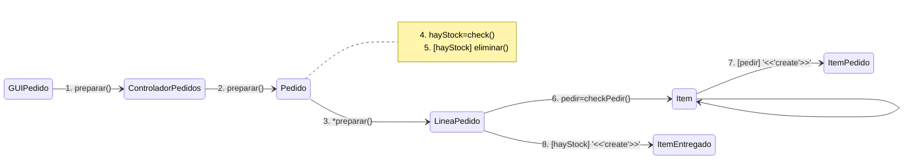


#### Diagrama de Secuencia vs. Diagrama de Colaboración

<u>Sencuencia</u>:


**Nota**: El `<<destroy>>` no lo representaremos dada su inexistencia en Java.

<u>Colaboración</u>:


Utilizaremos el diagrama de secuencia cuando nos interese que se vea de forma sencilla el orden de los mensajes. Si lo que deseamos es ver de forma clara los objetos que participan en la interacción y los mensajes que se envían, entonces interesa usar el diagrama de colaboración.

El punto negativo de los diagramas de secuencia es su longitud, mientras que en los de colaboración es la posible dificultad a la hora de encontrar un mensaje por su numeración.

### Operadores de Control (<span style="color:red">NO</span> recomendado)

En los diagramas de secuencia se pueden usar operadores de control para agrupar trozos de la secuencia:

- Ejecución opcional (opt): El cuerpo se ejecuta si se cumple una condición.

- Ejecución condicional (alt): El cuerpo se divide en varias regiones, cada una con una condición asociada. Se ejecuta el cuerpo de la región cuya condición se satisface.

- Ejecución paralela (par): El cuerpo se divide en varias regiones. Cada región representa una computación paralela. Se ejecuta de forma paralela el cuerpo de cada región.

- Ejecución iterativa (loop): El cuerpo se ejecuta mientras se cumple una condición.

- Ejecución referencia (ref): El cuerpo hace referencia a otra interacción.


<span style="color: red">No se recomienda</span> usarlos porque estaríamos *programando* con UML.

### Numeración secuencial

En los diagramas de comunicación, el uso de la numeración secuencial puede provocar confusión, ya que pueden interpretarse de maneras distintas.

Por ejemplo, el siguiente diagrama:


Podría tener las siguientes interpretaciones como diagrama de secuencia:


**Nota**: Hay un error en esta última imagen, lo correcto es indicar que el flujo de ejecución de m2() abarca también a m3() y m4().

### Numeración jerárquica

La solución es usar una numeración jerárquica:


En la numeración jerárquica agrupan en subgrupos los mensajes: 1, 1.1, 1.2, 2, 2.1, 3...

# 

## Patrones GRASP <a name="Punto4"></a>

Los patrones GRASP describen los principios básicos de asignación de responsabilidades a clases. Distribuir responsabilidades es la parte más difícil del diseño orientado a objetos, es por ello que esta fase es la que consume la mayor parte del tiempo.

Existen los siguientes patrones GRASP:

- <u>Experto, Creador, Controlador</u>

- Bajo Acoplamiento y Alta Cohesión

- Polimorfismo y Proteger variación

### Responsabilidades y Métodos

> Una responsabilidad se implementa mediante uno o más métodos y puede asignarse a varias clases según la granularidad (tamaño).

Cuando se crea una clase, esa clase tiene un contrato u obligación, que puede dividirse en dos categorías:

- Conocer
  
  - Datos encapsulados privados.
  
  - Existencia de objetos conectados.
  
  - Datos derivados o calculados.

- Hacer
  
  - Algo él mismo, como crear un objeto o realizar un cálculo.
  
  - Iniciar una acción en otros objetos.
  
  - Controlar y coordinar actividades en otros objetos.

Los <u>diagramas de interacción</u> muestran elecciones en la asignación de responsabilidades.


### Experto <a name="Experto"></a>

Es el patrón más importante de todos, ya que ayuda a decidir en qué clase debemos colocar cada método.

> ¿Cómo se asignan responsabilidades?
> 
> > *Se debe asignar una responsabilidad a la clase que tiene la información necesaria para cumplimentarla.*

El objetivo es distribuir las responsabilidades de forma homogénea, evitando crear clases *dios* (es decir, una clase que reuna todos los métodos).

Los beneficios de seguir el patrón experto son: la conservación de la encapsulación ([bajo acoplamiento](#bajoAcoplamiento)), y una [alta cohesión](#altaCohesión) (clases más ligeras).

#### Ejemplo 1

Dado el siguiente diagrama de clases, ¿quién es el responsable de conocer el total de una venta?

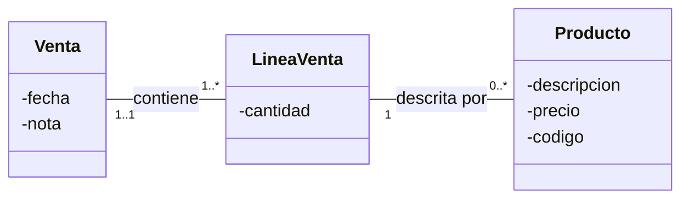

- [ ] Venta

- [ ] LineaVenta

- [ ] Producto

Lo intuitivo tal vez sería programar:

```java
public double getTotal(){
    double total = 0.0;
    for(LineaVenta lv : lineasVenta){
        double cant = lv.getCantidad();
        Producto pr = lv.getProducto();
        total += cant*pr.getPrecio();       
    }
    return total;
}
```

Pero entonces estaríamos violando el patrón experto, representado con un diagrama de secuencia veríamos esto:

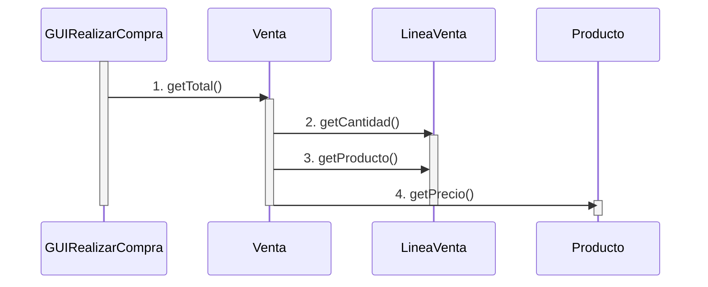

Para no violar el experto, buscamos el siguiente diagrama:

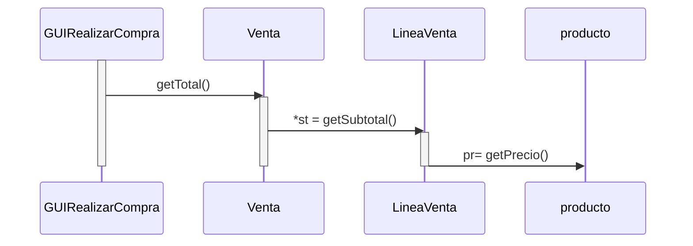

Lo cual se corresponde con el siguiente código, que <u>**no**</u> viola el patrón experto:

```java
class Venta {..

    public double getTotal() {
        double total = 0.0;
        for (LineaVenta lv : lineasVenta)
            total = total + lv.getSubtotal());
        return total;
    }
}

class LineaVenta{..
    private int cantidad;
    private Producto producto;

    public double getSubtotal()
        return cantidad*producto.getPrecio();
}
```

#### Ejemplo 2

¿Quién es el responsable de conocer todos los mensajes recibidos entre dos fechas?

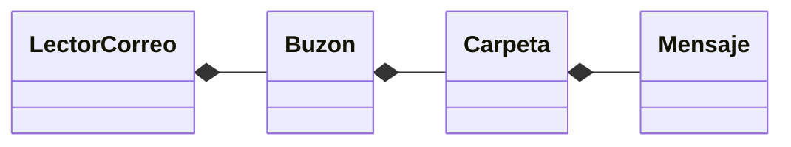

- [ ] LectorCorreo

- [ ] Buzon

- [ ] Carpeta

- [ ] Mensaje

Violando el experto, haríamos esto:

```
para cada mensaje m en cada carpeta c
    si f en rango [f1,f2]
        añadir al conjunto s
return s
```

Que se corresponde con:

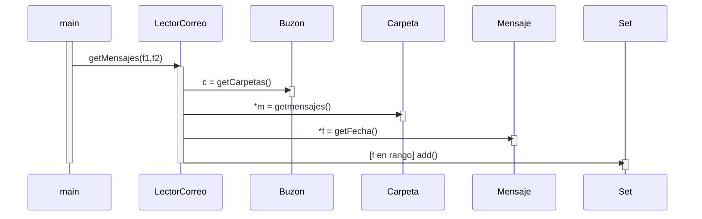

Sin violar el experto haríamos:

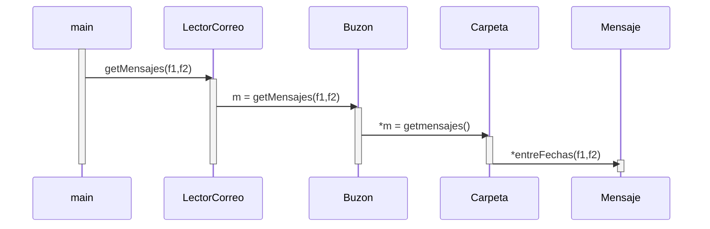

#### Ejemplo 3

¿Quién es el responsable de conocer el número de proyectos de cierto tipo realizados en una universidad en un rango de fechas?

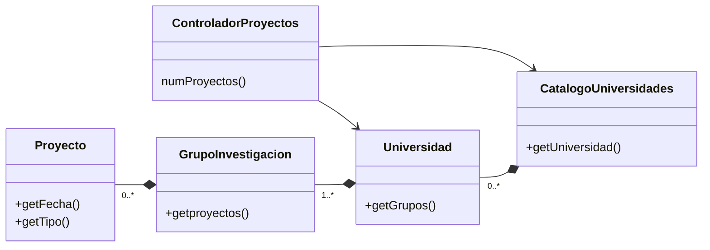

Con violación del experto haríamos:

```java
public class ControladorProyectos {...
    public int numProyectos(int id, int tipo, Date f1, Date f2) {
        int totalProyectos = 0;
        Universidad uni = CatalogoUniversidades.getUniversidad(id);
        Collection<Grupo> grupos = uni.getGrupos();
        for (Grupo grupo: grupos) {
            Collection<Proyecto> proyectos = grupo.getProyectos();
            for (Proyecto proyecto : proyectos){
                fechaProyecto = proyecto.getFecha();
                if((fechaProyecto.before(f2)) &&(fechaProyecto.after(f1))
                      && (tipo == proyecto.getTipo()))
                    totalProyectos= totalProyectos + 1;
                }
        }
        return totalProyectos;
    }
}
```

Lo que daría lugar al siguiente diagrama de colaboración:


Que en diagrama de secuencia sería:

```mermaid
sequenceDiagram
    participant g as GUIResponsable
    participant cp as ControladorProyectos
    participant cu as ControladorUniversidades
    participant u as Universidad
    participant gi as GrupoInvestigacion
    participant p as Proyecto
    
    activate g
    g ->> cp : 1. numProyectos()
    activate cp
    cp ->> cu : 2. getUniversidad()
    activate cu
    deactivate cu
    cp ->> u : 3. getGrupos()
    activate u
    deactivate u
    cp ->> gi : 4. getProyectos()
    activate gi
    deactivate gi
    cp ->> p : 5. getFecha()
    activate p
    cp ->> p : 6. getTipo()
    deactivate p
    deactivate cp
    deactivate g
```

Sin violar el experto:

```java
public class ControladorProyectos {...
    public int numProyectos(int id, int tipo, Date f1, Date f2){
        Universidad uni = CatalogoUniversidades.getUniversidad(id);
        return uni.numProyectos(tipo, f1, f2);
    }
}
public class Universidad {...
    private Collection<GrupoInvestigacion> grupos;
    public int numProyectos(int tipo, Date f1, Date f2) {
        int total = 0;
        for (Grupo grupo: grupos)
            total = total + grupo.numProyectos(tipo, f1, f2);
        return total;
    }
}
public class GrupoInvestigacion {...
    private List<Proyecto> proyectos;
    public int numProyectos(int tipo, Date f1, Date f2) {
        int total = 0;
        for (Proyecto proyecto : proyectos){
            if ((proyecto.esTipo(tipo)) &&
                   (proyecto.estaEntre(f1, f2)))
                total = total + 1;
        }
        return total;
    }
}
public class Proyecto {...
    private Date fecha;
    private int tipo;
    public boolean esTipo(int tipo) {
        return (this.tipo == tipo);
    }
    public boolean estaEntre(Date f1, Date f2) {
        return ((fecha.after(f1)) && (fecha.before(f2)));
    }
}
```

Cuyo diagrama de colaboración es:


Que en diagrama de secuencia sería:

```mermaid
sequenceDiagram
    participant g as GUIResponsable
    participant cp as ControladorProyectos
    participant cu as ControladorUniversidades
    participant u as Universidad
    participant gi as GrupoInvestigacion
    participant p as Proyecto
    
    
    g ->> cp : 1. numProyectos()
    activate g
    activate cp
    cp ->> cu : 2. getUniversidad()
    activate cu
    deactivate cu
    cp ->> u : 3. numProyectos()
    activate u
    u ->> gi : 4. numProyectos()
    activate gi
    gi ->> p : 5. estaEntre()
    activate p
    gi ->> p : 6. esTipo()
    deactivate p
    deactivate gi
    deactivate u
    deactivate cp
    deactivate g
```

### Creador

>  El patrón Creador se pregunta cuál es el responsable de crear una nueva instancia de una cierta clase.

Debemos asignar a las clase B la responsabilidad de crear instancias de una clase A si:

- B es una **agregación** de objetos de A

- B **contiene** objetos de A

- B **registra** instancias de A

- B **hace un uso específico** de los objetos de A

- B **proporciona los datos de inicialización** necesarios para crear un objeto de A

<span style="color:green">Gracias a usar el patrón Creador, conseguiremos un bajo acoplamiento entre nuestras clases.</span>

#### Ejemplo 1

Venta debería crear las instancias de LineaVenta

```mermaid
classDiagram
    class Venta{
        -fecha
        +getTotal()
        +añadirLineaVenta(pr, cant)
    }

    class LineaVenta{
        -unidades
        +getSubTotal()
        +getCantidad()
        +getProducto()
    }

    class Producto{
        -precio
        -descripcion
        +getPrecio()
    }

    class TPV{
        -id
        +iniciar()
        +realizarCompra()
        +realizarPago()
    }

    Venta --> "-lineasVenta 0..*" LineaVenta
    LineaVenta --> "-producto 1" Producto
    Venta "0..1 -ventaActual" <-- TPV
```

¿Pero quién debería crear las instancias de Venta? En este caso está claro que sería el TPV.

#### Ejemplo 2

¿Quién es el responsable de crear una instancia de Puja?

```mermaid
classDiagram
    GUISubastas --> ControladorSubastas
    ControladorSubastas --> "0..1" Cliente
    CatalogoClientes *-- Cliente
    Cliente -- "0..*" Subasta
    CatalogoSubastas *-- Subasta
    Subasta *-- "0..* -pujas" Puja
```

```mermaid
flowchart
    :GUISubastas -- "realizarPuja(subastaActual, cant)" --> :ControladorSubastas
    :ControladorSubastas -- "1.2 realizarPuja(cant)" --> subastaActual:Subasta
    subastaActual:Subasta -- "1.2.1 create" --> puja:Puja
    subastaActual:Subasta -- "1.2.2 add(puja) 0..*" --> pujas:Puja
```

### Controlador

> El patrón Controlador se encarga de asignar la responsabilidad de manejar eventos externos a uno o más objetos controlador que puede representar, por ejemplo, el sistema o una funcionalidad concreto (caso de uso o historia de uso). Es decir, se pregunta acerca de quién es el encargado de atender los eventos del sistema, generalmente una GUI.

Distingue entre la <mark>fachada</mark> entre clases de la capa presentación (GUI) y la capa del dominio. Incluye, al menos, un método por cada operación atendida.

Los beneficios de un controlador son:

- <span style="color:green">La separación <u>modelo-vista</u>.</span>

- <span style="color:green">La posibilidad de capturar información sobre el <u>estado de una sesión</u>.  </span>

##### Patrón arquitectural *Layers*

En la arquitectura lógica organizada en "capas", cada capa reúne clases relacionadas con un mismo aspecto del sistema, por ejemplo: la interfaz de usuario, dominio o almacenamiento. 


Esto tiene dos utilidades:

- <span style="color:green">La separación de aspectos favorece el cambio, la reutilización y el desarrollo en paralelo.</span>

- <span style="color:green">Evita el acoplamiento.</span>

###### Arquitecura lógica organizada en 4-capas


###### Arquitectura de 3 capas (Muy extendida)


## Separación Modelo-Vista <a name="Punto5"></a>

Las clases del modelo (dominio) NO deben *conocer/acceder* a los objetos de la vista (presentación o interfaz).

> Las clases del <u>modelo</u> **encapsulan** la información y el comportamiento relacionado con la lógica del negocio o la aplicación.

Las clases la vista son responsables de la entrada y salida, capturando y manejando los eventos, pero NO encapsulan la lógica del negocio/aplicación. 

> Las clases de la <u>vista</u> delegan en un objeto controlador para comunicarse con el modelo.

No obstante, una clase de la vista sí puede invocar peticiones *get* sobre un objeto del dominio que le ha pasado el Controlador o un catálogo.


Por ejemplo:


La capa **presentación** no debería tener ninguna responsabilidad de la lógica del negocio/aplicación, solo debería ser responsable de las tareas propias de la interfaz de usuario: mostrar ventanas y la captura de eventos. Por lo tanto, debería remitir las responsabilidades propias de la capa del dominio a esa capa, **a través de un <u>controlador</u>**.

La separación Modelo/Vista:

- [x] <span style="color:green">Favorece las clases cohesivas</span>

- [x] <span style="color:green">Permite desarrollar al mismo tiempo las clases vista del dominio.</span>

- [x] <span style="color:green">Minimiza el impacto de los cambios en la interfaz sobre las clases del modelo.</span>

- [x] <span style="color:green">Facilita conectar otras vistas a una capa del dominio existente (**reutilización**).</span>

- [x] <span style="color:green">Premite varias vistas simultáneas sobre un mismo modelo.</span>

- [x] <span style="color:green">Permite que la capa del modelo se ejecute como un proceso independiente a la capa de presentación.</span>

### Volviendo al patrón Controlador...

Las clases de la interfaz delegan en un controlador la realización de las tareas ligadas a cada evento del sistema que procede, normalmente, de la GUI.

> El controlador no es más que una *fachada* entre las clases de la vista y las del dominio. Su función es la de separar la interfaz de usuario de la lógica del dominio o de la aplicación.

El controlador no pertenece a la capa de presentación, sino a la del dominio.


En el siguiente ejemplo no se cumple la separación Modelo/Vista:


Lo cual da lugar a un acoplamiento inadecuado de la capa presentación con la capa del dominio.

Cumpliendo la separación Modelo/Vista:


En este caso sí que hay un acoplamiento adecuado de la capa presentación con la capa del dominio. En *swing*, esto se corresponde con:

```java
public class JFrameProcesarVenta extends JFrame
    private TPV tpv; //objeto controlador
    public JFrameProcesarVenta (TPV _tpv) {
        this.tpv = _tpv;
    }
    private JButton botonAddItem;
    private JButton getBotonAddItem() {..
        botonAddItem.addActionListener(new ActionListener(){..
        public void actionPerformed(ActionEvent ev) {
            ...
            tpv.introducirItem(cant, producto);
        });
        return botonAddItem;
        }
    }
}
```

En las [diapositivas 97...101](https://aulavirtual.um.es/access/content/group/1905_G_2021_N_N/Teoría/TDS-tema1-2021.pdf#page=97) puede encontrarse un ejemplo de ejercicio en el que se deberá modificar el código de una aplicación para no violar ningún patrón GRASP.

## Técnicas básicas orientadas a objetos <a name="Punto6"></a>

### Bajo Acoplamiento

Para reducir las dependencias entre clases, debemos asignar las responsabilidades de manera que se consiga un bajo acoplamiento. No debemos considerarlo de forma independiente, sino junto a los patrones [Experto](#Experto) y [Alta Cohesión](#AltaCohesion).

Beneficios:

- [x] <span style="color:green">Facilita la reutilización.</span>

- [x] <span style="color:green">Facilita la comprensión de las clases.</span>

- [x] <span style="color:green">Facilita el mantenimiento.</span>

Se considera un patrón evaluativo, existe acoplamiento entre una clase A y otra B cuando:

- A posee un atributo o campo de tipo B.

- A tiene un método con un parámetro, una variable local o un valor de retorno de tipo B.

- A es subclase directa o indirecta de B.

- A implementa la interfaz B (Java).

Ejemplo simple de evitar el acoplamiento:


### Alta Cohesión <a name="AltaCohesion"></a>

La alta cohesión comprueba hasta qué punto están relacionadas las responsabilidades de una clase. Busca asignar una responsabilidad de modo que la cohesión siga siendo alta.

> Una clase debería representar una única abstracción bien definida, que tiene un conjuto de métodos muy relacionados funcionalmente.

Se considera baja cohesión:

- <span style="color:red">Clases con responsabilidades que deberían haber delegado en otras.</span>

- <span style="color:red">Las clases *dios* con gran cantidad de métodos en las que se puedan establecer grupos de ellos que no están fuertemente relacionados funcionalmente.</span>

- <span style="color:red">Difíciles de comprender, reutilizar o mantener </span> (que son, de hecho, los <span style="color:green">beneficios</span> de aplicar el patrón).

### Ejemplos de cohesión

- <span style="color:red">Muy baja</span> cohesión:
  
  - Clase que mezcla funcionalidad de acceso a bases de datos con acceso remoto a través de RMI.

- <span style="color:grey">Baja</span> cohesión:
  
  - Una única clase AccesoBD con toda la funcionalidad relacionada con el acceso a una base de datos que tendría muchos métodos (conexiones, sentencias sql, transacciones, etc).

- <span style="color:green">Alta</span> cohesión:
  
  - Clase AccesoBD + Familia de clases relacionadas (JDBC, Hibernate) --> librería o framework de clases.

### Polimorfismo

> Cuando existe un comportamiento que depende de una variación de tipos, se debe asignar la responsabilidad de cada comportamiento al correspondiente tipo.

No es correcto realizar un análisis de casos basado en el tipo de objetos:


Sino aplicar una jerarquía de herencia. Para ello, definiremos una *interfaz* que proporcione los métodos que permitan la interacción sin conocer clases concretas:


Las conexiones hacia la interfaz se denominan **Patrón Adaptador**.

Las interfaces son claves para la *pluggability*, ya que se añaden fácilmente nuevas alternativas y los clientes no conocen las implementaciones concretas que usan.

### Indirección

Para evitar el acoplamiento directo entre dos clases, se asigna la responsabilidad a un **intermediario** que crea una indirección:


Esta situación se produce en muchos patrones de diseño (Adaptador, Observador, proxy, etc).

### Variaciones Protegidas (VP)
